# Apache NiFi 信息流与数据流全景解析

## 数据流与信息流交互详细架构图

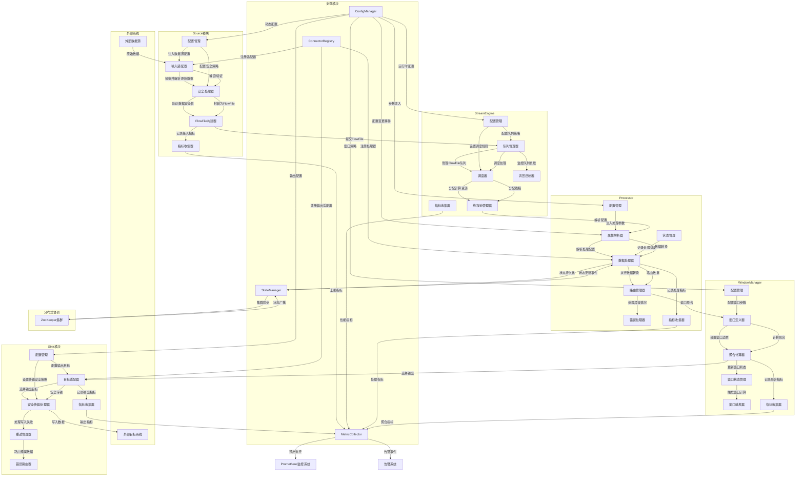

## 模块间交互关系详细说明

### 1. Source模块 → StreamEngine

#### 调用关系
- **FlowFile构建器** 将解析和验证后的数据提交给 **队列管理器**
- **目的**：将原始数据转换为标准化的 FlowFile，并准备进入数据处理流程

#### 关键交互机制
- 数据安全性验证
- 元数据标准化
- 队列调度准备

### 2. StreamEngine → Processor

#### 调用关系
- **调度器** 将 FlowFile 分配给 **线程池管理器**
- **线程池管理器** 触发 **属性解析器**
- **属性解析器** 准备 **数据处理器**

#### 关键交互机制
- 资源动态分配
- 处理任务调度
- 配置动态注入

### 3. Processor → WindowManager

#### 调用关系
- **路由管理器** 将处理后的 FlowFile 传递给 **窗口定义器**
- **窗口定义器** 协调 **聚合计算器**

#### 关键交互机制
- 数据分类路由
- 窗口边界确定
- 聚合策略应用

### 4. WindowManager → Sink

#### 调用关系
- **聚合计算器** 将聚合结果传递给 **目标适配器**
- **目标适配器** 调用 **安全传输处理器**

#### 关键交互机制
- 数据聚合
- 输出目标选择
- 安全传输配置

### 5. 支撑模块间交互

#### ConfigManager 交互
- 向各模块动态注入配置
- 支持运行时配置更新
- 事件驱动的配置变更通知

#### StateManager 交互
- 提供分布式状态持久化
- 通过 ZooKeeper 实现状态同步
- 支持故障恢复和状态重建

#### MetricCollector 交互
- 收集各模块运行时指标
- 聚合和导出性能数据
- 支持实时监控和告警

#### ConnectorRegistry 交互
- 管理组件生命周期
- 支持动态组件注册和加载
- 提供组件版本控制

## 交互流程核心价值

1. **解耦合**：各模块通过标准化接口交互
2. **动态配置**：支持运行时参数调整
3. **高可用**：分布式状态同步
4. **可观测**：全链路指标监控
5. **可扩展**：动态组件管理

## 引言

Apache NiFi 作为一个先进的数据流处理平台，其核心价值在于通过复杂的模块协同，实现高效、可靠的数据集成与处理。本文将深入剖析 NiFi 中数据与信息的流转机制，揭示其背后的系统架构设计哲学。

## 1. 数据与信息流转的底层逻辑

### 1.1 数据载体

#### 主数据载体：FlowFile
`FlowFile` 是 NiFi 中最核心的数据载体，它不仅仅是数据的容器，更是贯穿整个数据处理链路的"通行证"。

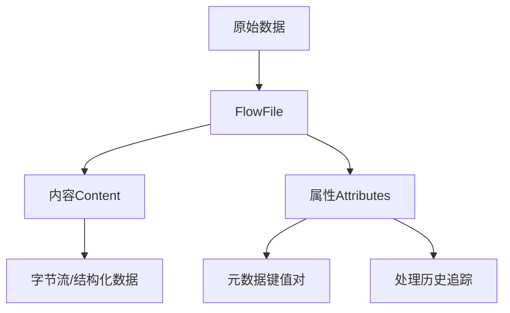

`FlowFile` 的典型结构：
```json
{
    "content": "原始数据字节流",
    "attributes": {
        "filename": "data.log",
        "source": "kafka",
        "mime.type": "text/plain",
        "processing.history": [
            {"processor": "ParseLog", "timestamp": "2023-07-15T10:30:45Z"},
            {"processor": "FilterData", "timestamp": "2023-07-15T10:31:00Z"}
        ]
    }
}
```

#### 控制信息载体

1. **Event（事件）**：模块间通知机制
   - `ConfigChangeEvent`：配置变更事件
   - `StateUpdateEvent`：状态更新事件
   - `ErrorRoutingEvent`：错误路由事件

2. **Metric（指标）**：性能和运行时监控
   - 吞吐量指标
   - 延迟指标
   - 错误率指标

3. **Config（配置）**：系统和组件配置参数
   - 连接地址
   - 超时时间
   - 批处理大小

### 1.2 流转原则

#### 数据流：单向流动


#### 信息流：双向交互
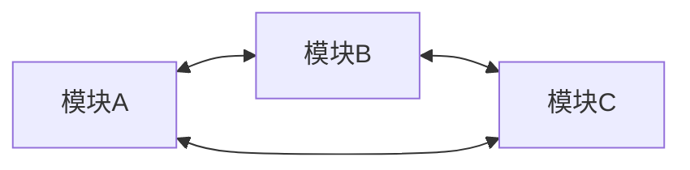

### 1.3 关键触发机制

1. **数据驱动**：`FlowFile` 到达触发下游模块处理
2. **事件驱动**：状态变更/配置更新触发通知
3. **定时触发**：预设周期执行指标采集、窗口聚合

## 2. 模块内部信息与数据流

### 2.1 Source 模块内部流转

#### 内部子组件
- 输入适配器（FileAdapter/KafkaAdapter/HTTPAdapter）
- 安全处理器（TLSHandler/OAuth2Validator）
- 数据封装器（FlowFileBuilder）

#### 内部数据流
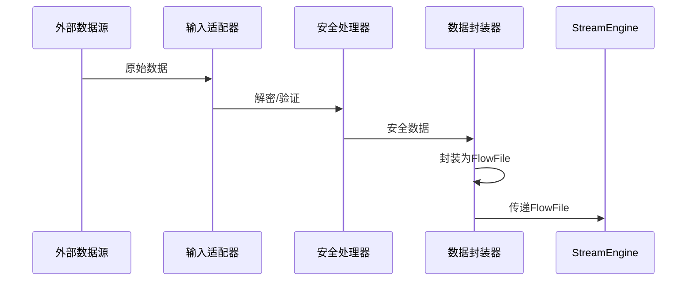

#### 内部信息流
- 配置信息：`ConfigManager` → 输入适配器
- 状态信息：输入适配器 → 状态管理器
- 指标信息：数据封装器 → 内部指标器

### 2.2 StreamEngine 模块内部流转

#### 内部子组件
- 调度器（Scheduler）
- 线程池（ThreadPoolManager）
- 队列管理器（QueueManager）
- 背压控制器（BackPressureHandler）

#### 内部数据流
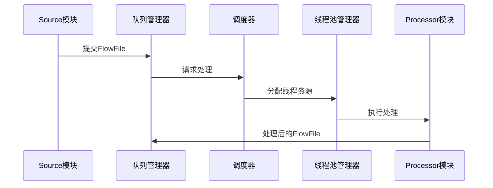

#### 内部信息流
- 调度信息：调度器 → 线程池（`scheduleTask(processor, flowFile)`）
- 队列状态：队列管理器 → 背压控制器（`queue.size=8000`）
- 背压指令：背压控制器 → 上游Source（`pauseInput()`）

### 2.3 Processor 模块内部流转

#### 内部子组件
- 属性解析器（PropertyParser）
- 数据处理器（DataHandler）
- 路由管理器（RelationshipManager）

#### 内部数据流
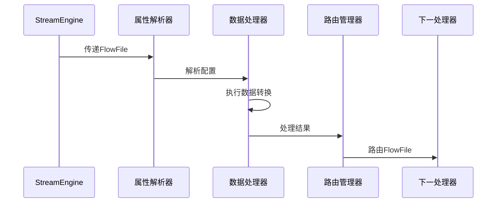

#### 内部信息流
- 配置信息：ConfigManager → 属性解析器（`db.url=jdbc:mysql://...`）
- 状态信息：数据处理器 → StateManager（`processed.offset=1000`）
- 路由决策：数据处理器 → 路由管理器（`routeTo=SUCCESS`）

#### 数据转换示例
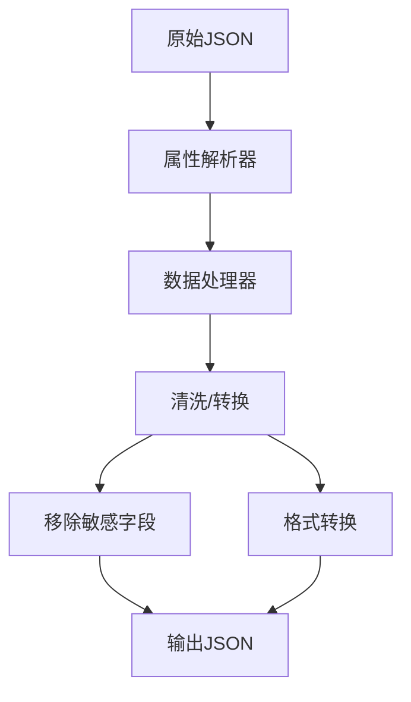

转换前数据：
```json
{
    "user": {
        "id": 12345,
        "name": "张三",
        "password": "sensitive_password",
        "email": "zhangsan@example.com"
    },
    "transaction": {
        "amount": 1000.50,
        "timestamp": "2023-07-15T10:30:45Z"
    }
}
```

转换后数据：
```json
{
    "user": {
        "id": 12345,
        "name": "张三",
        "email": "zhangsan@example.com"
    },
    "transaction": {
        "amount": 1000.50,
        "timestamp": "2023-07-15T10:30:45Z"
    }
}
``` 

### 2.4 Pipeline 模块内部流转

#### 内部子组件
- 流程编排器（FlowDesigner）
- 路由解析器（RouteResolver）
- 版本控制器（VersionController）
- 血缘追踪器（LineageTracker）

#### 内部数据流
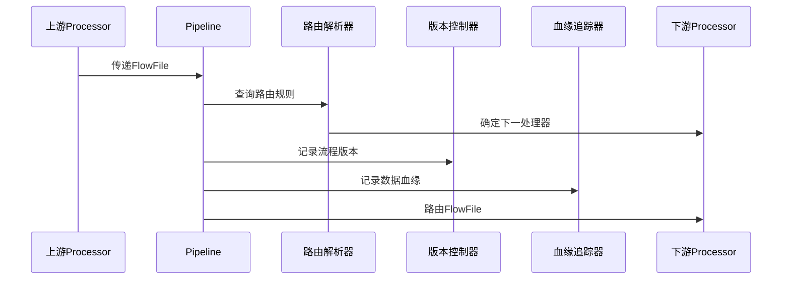

#### 内部信息流
- 路由信息：路由解析器 → 处理器（`nextProcessor=DataCleanProcessor`）
- 版本信息：版本控制器 → ConfigManager（`version=1.2.3`）
- 血缘信息：血缘追踪器 → MetricCollector（`lineage.path=[Source→Processor1→Processor2]`）

### 2.5 WindowManager 模块内部流转

#### 内部子组件
- 窗口定义器（WindowDefiner）
- 聚合计算器（AggregationCalculator）
- 状态管理器（WindowStateManager）
- 触发器（WindowTrigger）

#### 内部数据流
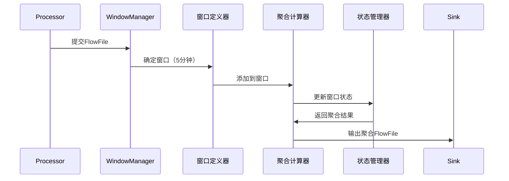

#### 内部信息流
- 窗口配置：ConfigManager → 窗口定义器（`window.size=5min`）
- 状态信息：状态管理器 → StateManager（`window.1.state=aggregating`）
- 聚合指标：聚合计算器 → MetricCollector（`window.records.count=1000`）

#### 窗口聚合示例
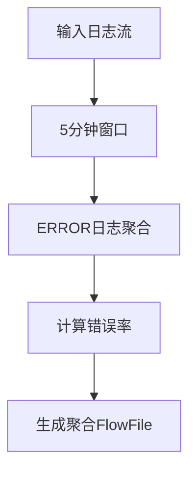

聚合前数据：
```json
[
    {"level": "ERROR", "timestamp": "2023-07-15T10:30:01Z"},
    {"level": "INFO", "timestamp": "2023-07-15T10:31:15Z"},
    {"level": "ERROR", "timestamp": "2023-07-15T10:32:45Z"}
]
```

聚合后数据：
```json
{
    "window_start": "2023-07-15T10:30:00Z",
    "window_end": "2023-07-15T10:35:00Z",
    "total_records": 3,
    "error_records": 2,
    "error_rate": 0.66,
    "error_details": [
        {"timestamp": "2023-07-15T10:30:01Z"},
        {"timestamp": "2023-07-15T10:32:45Z"}
    ]
}
```

### 2.6 Sink 模块内部流转

#### 内部子组件
- 目标适配器（TargetAdapter）
- 安全传输处理器（SecureTransferHandler）
- 重试管理器（RetryManager）
- 错误路由器（ErrorRouter）

#### 内部数据流
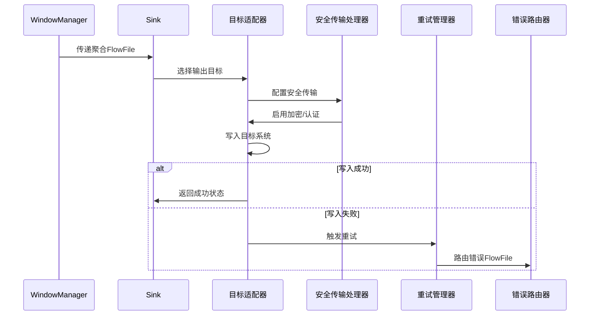

#### 内部信息流
- 目标配置：ConfigManager → 目标适配器（`elasticsearch.url=https://...`）
- 安全信息：安全传输处理器 → ConfigManager（`tls.enabled=true`）
- 重试指标：重试管理器 → MetricCollector（`sink.retry.count=3`）

#### 多目标输出示例
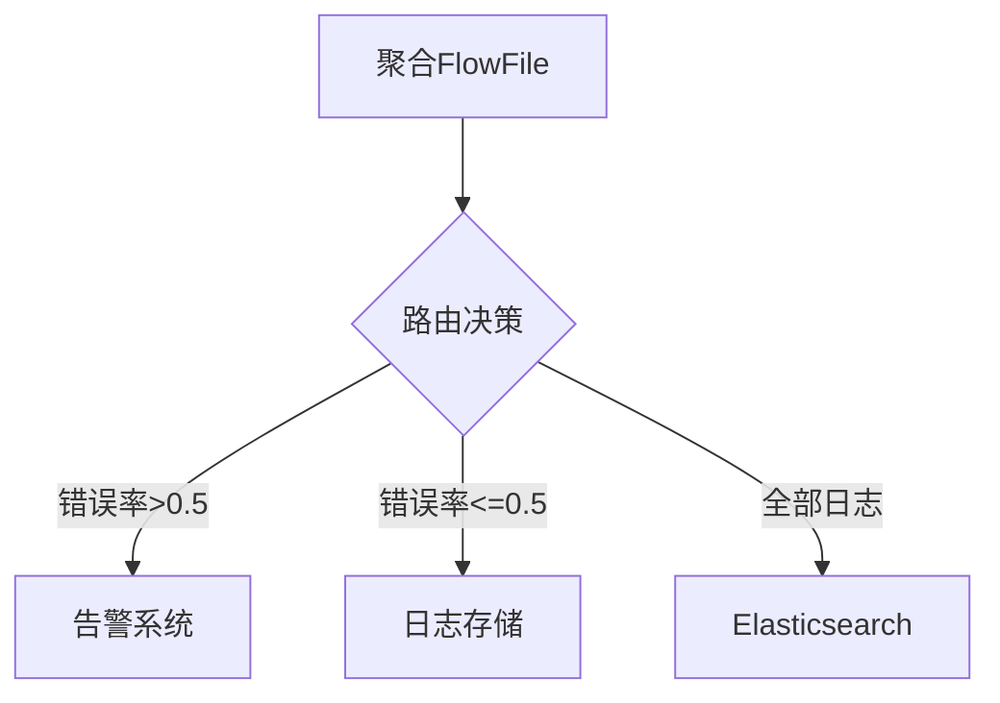

输出目标数据：
```json
{
    "destinations": [
        {
            "target": "alert_system",
            "condition": "error_rate > 0.5",
            "data": {
                "error_rate": 0.66,
                "alert_level": "high"
            }
        },
        {
            "target": "elasticsearch",
            "condition": "always",
            "data": {
                "window_start": "2023-07-15T10:30:00Z",
                "window_end": "2023-07-15T10:35:00Z",
                "total_records": 3,
                "error_records": 2
            }
        }
    ]
}
``` 

### 2.7 StateManager 模块内部流转

#### 内部子组件
- 本地状态提供者（LocalStateProvider）
- 分布式状态提供者（DistributedStateProvider）
- 状态同步器（StateSynchronizer）
- 状态恢复管理器（StateRecoveryManager）

#### 内部数据流
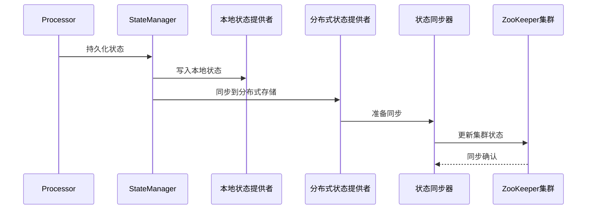

#### 内部信息流
- 状态更新：Processor → 本地状态提供者（`processed.offset=1000`）
- 集群同步：分布式状态提供者 → ZooKeeper（`/nifi/state/processor/last_offset`）
- 恢复信息：状态恢复管理器 → MetricCollector（`state.recovery.count=1`）

#### 状态管理示例
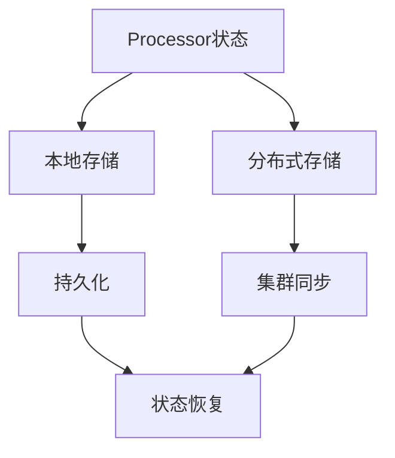

状态数据结构：
```json
{
    "processor_id": "log-parser-001",
    "last_processed_offset": 1000,
    "processed_records": 5000,
    "error_count": 10,
    "last_updated": "2023-07-15T10:35:00Z"
}
```

### 2.8 ConfigManager 模块内部流转

#### 内部子组件
- 配置加载器（ConfigLoader）
- 敏感数据加密器（SensitivePropertyEncryptor）
- 配置变更通知器（ConfigChangeNotifier）
- 环境变量注入器（EnvironmentVariableInjector）

#### 内部数据流
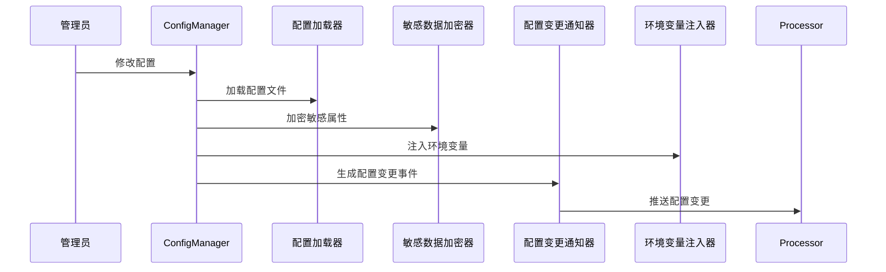

#### 内部信息流
- 配置加载：配置加载器 → ConfigManager（`nifi.properties`）
- 加密信息：敏感数据加密器 → KeyStore（`encrypted.password`）
- 变更通知：配置变更通知器 → 所有模块（`config.change.event`）

#### 配置管理示例
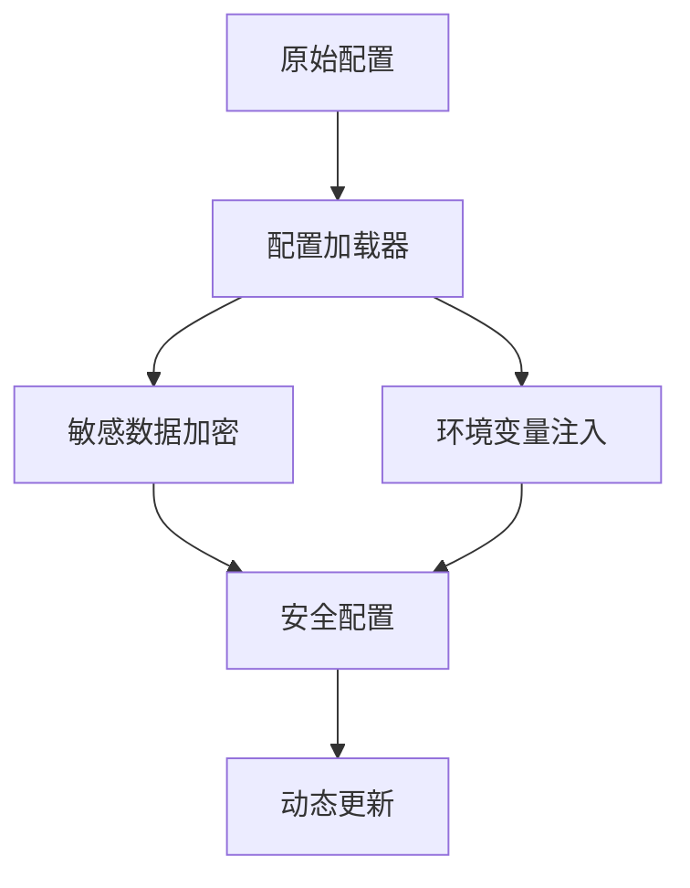

配置变更数据：
```json
{
    "event_type": "config_change",
    "timestamp": "2023-07-15T10:40:00Z",
    "changes": [
        {
            "key": "processor.batch.size",
            "old_value": "100",
            "new_value": "200",
            "affected_processors": ["log-parser", "data-transformer"]
        },
        {
            "key": "database.connection.url",
            "old_value": "jdbc:mysql://old-host",
            "new_value": "jdbc:mysql://new-host",
            "sensitive": true
        }
    ]
}
```

### 2.9 MetricCollector 模块内部流转

#### 内部子组件
- 指标记录器（MetricRecorder）
- 指标聚合器（MetricAggregator）
- 指标导出器（MetricExporter）
- 血缘追踪器（LineageTracker）

#### 内部数据流
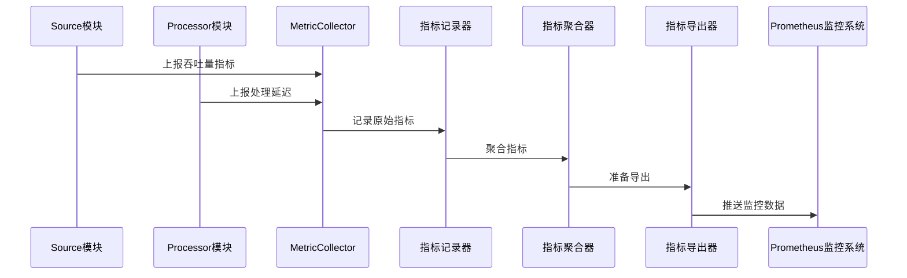

#### 内部信息流
- 原始指标：各模块 → 指标记录器（`source.throughput=1000records/s`）
- 聚合信息：指标聚合器 → 指标导出器（`avg_latency=50ms`）
- 血缘信息：血缘追踪器 → 指标记录器（`lineage.path.length=3`）

#### 指标采集示例
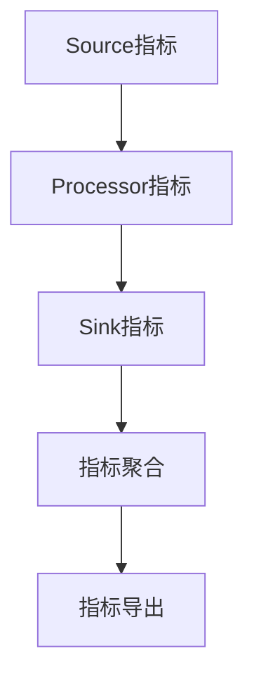

指标数据结构：
```json
{
    "timestamp": "2023-07-15T10:45:00Z",
    "system_metrics": {
        "source": {
            "throughput": 1000,
            "records_received": 5000
        },
        "processor": {
            "latency": {
                "avg": 50,
                "max": 200,
                "min": 10
            },
            "error_rate": 0.01
        },
        "sink": {
            "records_written": 4950,
            "success_rate": 0.99
        }
    },
    "lineage_metrics": {
        "path_length": 3,
        "unique_processors": 4
    }
}
```

### 2.10 ConnectorRegistry 模块内部流转

#### 内部子组件
- NAR包管理器（NARPackageManager）
- 组件注册器（ComponentRegistrar）
- 版本控制器（VersionController）
- 安全验证器（SecurityValidator）

#### 内部数据流
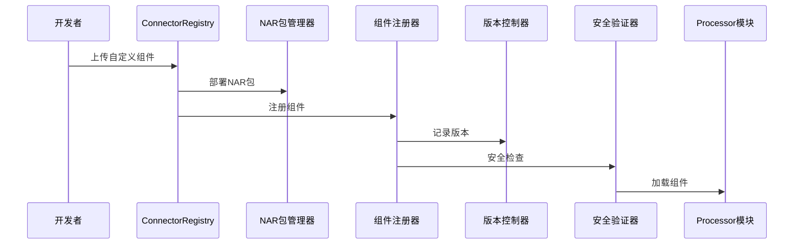

#### 内部信息流
- NAR包信息：NAR包管理器 → 组件注册器（`bundle.id=custom-processor-1.0.0`）
- 版本信息：版本控制器 → ConfigManager（`component.version=1.0.0`）
- 安全信息：安全验证器 → MetricCollector（`security.check.result=passed`）

#### 组件注册示例
```mermaid
graph TD
    A[开发者] --> B[自定义组件]
    B --> C[NAR包]
    C --> D[组件注册]
    D --> E[版本控制]
    D --> F[安全验证]
    E --> G[组件发布]
    F --> G
```

组件注册数据：
```json
{
    "bundle_id": "custom-log-processor",
    "version": "1.0.0",
    "type": "PROCESSOR",
    "developer": "张三",
    "security_check": {
        "status": "PASSED",
        "timestamp": "2023-07-15T10:50:00Z"
    },
    "compatibility": {
        "nifi_version": "1.15.x",
        "java_version": "11+"
    },
    "metadata": {
        "description": "高级日志解析处理器",
        "tags": ["log", "parsing", "advanced"]
    }
}
``` 

## 3. 跨模块信息与数据流详细分析

### 3.1 核心数据链路：从Source到Sink的全流程

#### 数据流全景图
```mermaid
graph LR
    A[外部系统] --> B[Source]
    B --> C[StreamEngine]
    C --> D[Pipeline]
    D --> E[Processor]
    E --> F[WindowManager]
    F --> G[Sink]
    G --> H[外部目标系统]
```

#### 跨模块数据流序列图
```mermaid
sequenceDiagram
    participant External as 外部系统
    participant Source as Source模块
    participant StreamEngine as StreamEngine
    participant Pipeline as Pipeline
    participant Processor as Processor
    participant WindowManager as WindowManager
    participant Sink as Sink模块
    participant Target as 外部目标系统

    External ->> Source: 原始数据（日志文件）
    Source ->> Source: 封装为FlowFile
    Source ->> StreamEngine: 提交FlowFile
    StreamEngine ->> Pipeline: 路由FlowFile
    Pipeline ->> Processor: 触发处理
    Processor ->> Processor: 数据清洗/转换
    Processor ->> WindowManager: 提交处理后FlowFile
    WindowManager ->> WindowManager: 5分钟窗口聚合
    WindowManager ->> Sink: 传递聚合结果
    Sink ->> Target: 写入目标系统
```

#### 关键信息交互

1. **配置信息流**
```mermaid
graph LR
    A[ConfigManager] --> B[Source]
    A --> C[StreamEngine]
    A --> D[Processor]
    A --> E[WindowManager]
    A --> F[Sink]
```

2. **状态同步信息流**
```mermaid
graph LR
    A[Processor] --> B[StateManager]
    B --> C[ZooKeeper集群]
    C --> D[其他Processor节点]
```

3. **指标信息流**
```mermaid
graph LR
    A[Source] --> B[MetricCollector]
    C[Processor] --> B
    D[WindowManager] --> B
    E[Sink] --> B
    B --> F[Prometheus]
```

### 3.2 控制信息交互链路

#### 配置信息流转序列
```mermaid
sequenceDiagram
    participant Admin as 管理员
    participant ConfigManager as ConfigManager
    participant Processor as Processor
    participant MetricCollector as MetricCollector

    Admin ->> ConfigManager: 修改batch.size=200
    ConfigManager ->> Processor: 推送配置变更事件
    Processor ->> Processor: 应用新配置
    Processor ->> MetricCollector: 上报配置变更指标
```

#### 状态同步交互（集群模式）
```mermaid
sequenceDiagram
    participant Node1 as Node1
    participant StateManager as StateManager
    participant ZooKeeper as ZooKeeper
    participant Node2 as Node2

    Node1 ->> StateManager: 更新状态
    StateManager ->> ZooKeeper: 同步状态
    ZooKeeper ->> Node2: 推送状态变更
    Node2 ->> StateManager: 更新本地状态
```

#### 指标采集与导出
```mermaid
sequenceDiagram
    participant Source as Source模块
    participant Processor as Processor模块
    participant MetricCollector as MetricCollector
    participant Prometheus as Prometheus

    Source ->> MetricCollector: 上报吞吐量
    Processor ->> MetricCollector: 上报处理延迟
    MetricCollector ->> Prometheus: 导出指标
```

### 3.3 典型跨模块场景案例

#### 场景1：实时日志聚合与告警

**模块交互**：
```mermaid
graph LR
    A[Source: ListenHTTP] --> B[Processor: ParseLog]
    B --> C[WindowManager: 5分钟窗口]
    C --> D[Sink: PutElasticsearch]
    C --> E[Sink: AlertSink]
```

**数据流程**：
1. Source接收HTTP日志
2. Processor解析并结构化日志
3. WindowManager按5分钟窗口聚合ERROR级别日志
4. 写入Elasticsearch
5. 超过阈值触发告警

#### 场景2：数据库增量同步

**模块交互**：
```mermaid
graph LR
    A[Source: QueryDatabaseTable] --> B[Processor: FilterNewData]
    B --> C[StateManager: 记录同步点]
    B --> D[Sink: PutKafka]
```

**数据流程**：
1. Source查询数据库增量数据
2. Processor过滤新增记录
3. StateManager记录最后同步ID
4. Sink写入Kafka

### 3.4 信息流转的关键技术纽带

#### FlowFile：数据传递的核心载体
```mermaid
graph TD
    A[原始数据] --> B[FlowFile]
    B --> C[内容Content]
    B --> D[属性Attributes]
    D --> E[处理历史]
    D --> F[元数据]
```

#### 事件驱动：模块间解耦的关键机制
```mermaid
graph TD
    A[事件源] --> B[事件]
    B --> C[事件处理器1]
    B --> D[事件处理器2]
    B --> E[事件处理器3]
```

#### 分布式状态同步：ZooKeeper的协调作用
```mermaid
graph TD
    A[StateManager节点1] --> B[ZooKeeper]
    C[StateManager节点2] --> B
    D[StateManager节点3] --> B
```

## 4. 总结与展望

### 4.1 NiFi 信息流与数据流的核心特征

1. **数据驱动**：以 FlowFile 为载体的单向数据流
2. **事件解耦**：基于事件的模块间通信机制
3. **状态一致**：分布式状态的实时同步
4. **配置动态**：运行时的配置热更新
5. **指标透明**：全链路的实时性能监控

### 4.2 未来发展方向

1. 更智能的数据路由算法
2. 机器学习增强的处理能力
3. 更细粒度的性能优化
4. 云原生和边缘计算支持
5. 更安全的分布式协同机制 