# Apache NiFi 架构全景解析

## 1. 架构概述

### 1.1 系统定位与设计理念

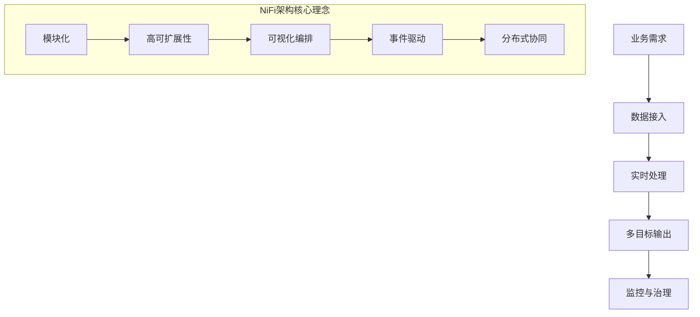

#### 1.1.1 系统定位
Apache NiFi 是一个面向数据流的集成与处理平台，专注于：
- 复杂异构数据源的统一接入
- 实时数据转换与enrichment
- 多目标系统的数据分发
- 端到端的数据血缘追踪

#### 1.1.2 设计理念
1. **模块化解耦**：每个组件职责单一、边界清晰
2. **事件驱动**：基于 FlowFile 的轻量级事件模型
3. **可视化编排**：拖拽式流程设计
4. **高可扩展性**：支持自定义组件和动态扩展
5. **分布式协同**：集群环境下的状态同步

### 1.2 整体架构分层

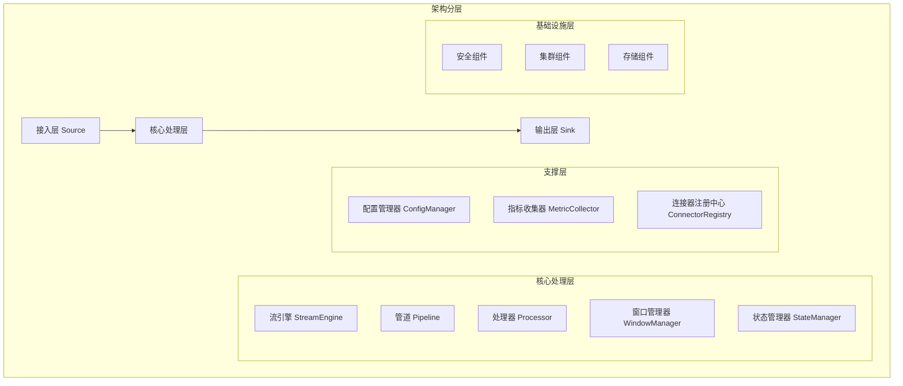

## 2. 详细架构解析

### 2.1 接入层：Source 模块架构

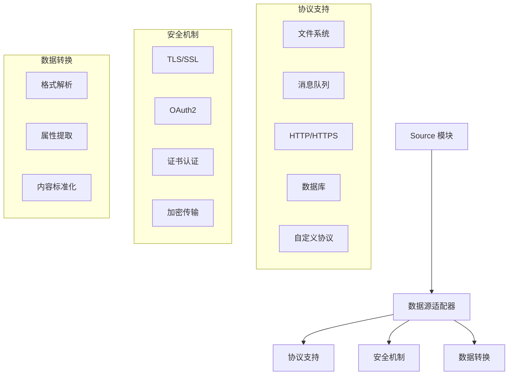

#### 2.1.1 核心能力
- 多协议数据接入
- 安全可靠的数据获取
- 灵活的数据预处理
- 动态配置和扩展

### 2.2 核心处理层架构

#### 2.2.1 StreamEngine 流引擎

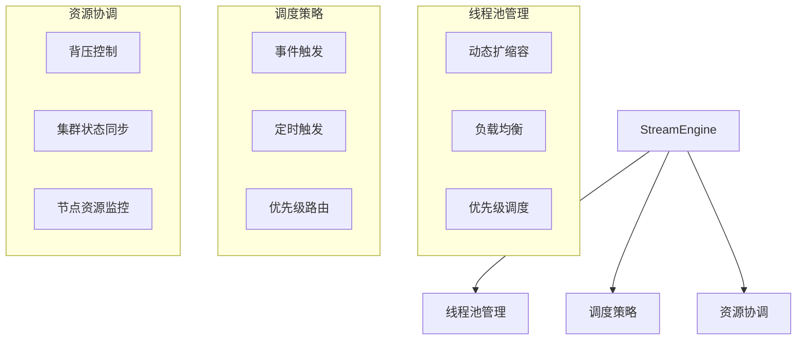

#### 2.2.2 Pipeline 管道

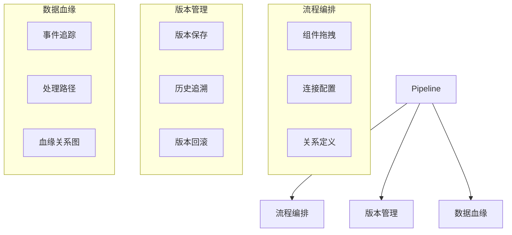

#### 2.2.3 Processor 处理器

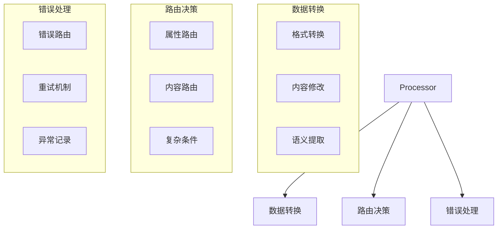

#### 2.2.4 WindowManager 窗口管理器

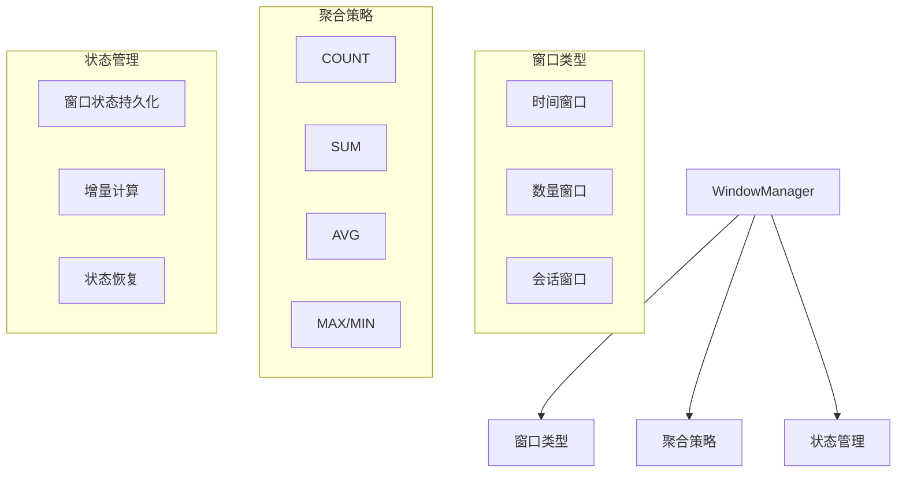

#### 2.2.5 StateManager 状态管理器

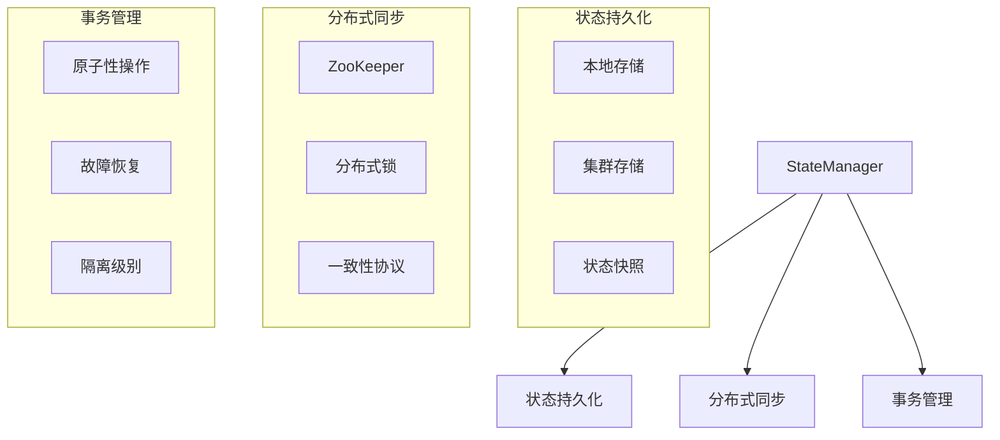

### 2.3 输出层：Sink 模块架构

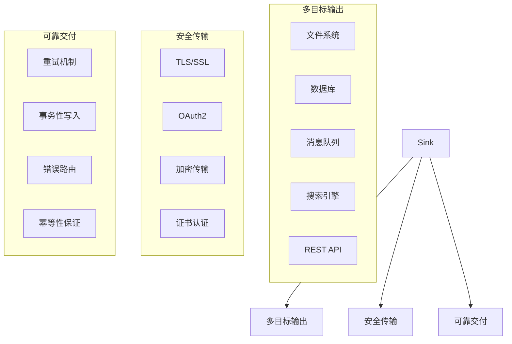

### 2.4 支撑层模块架构

#### 2.4.1 ConfigManager 配置管理器

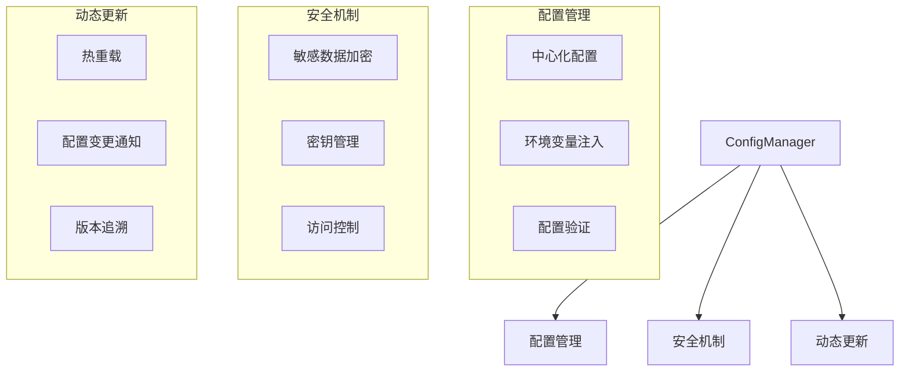

#### 2.4.2 MetricCollector 指标收集器

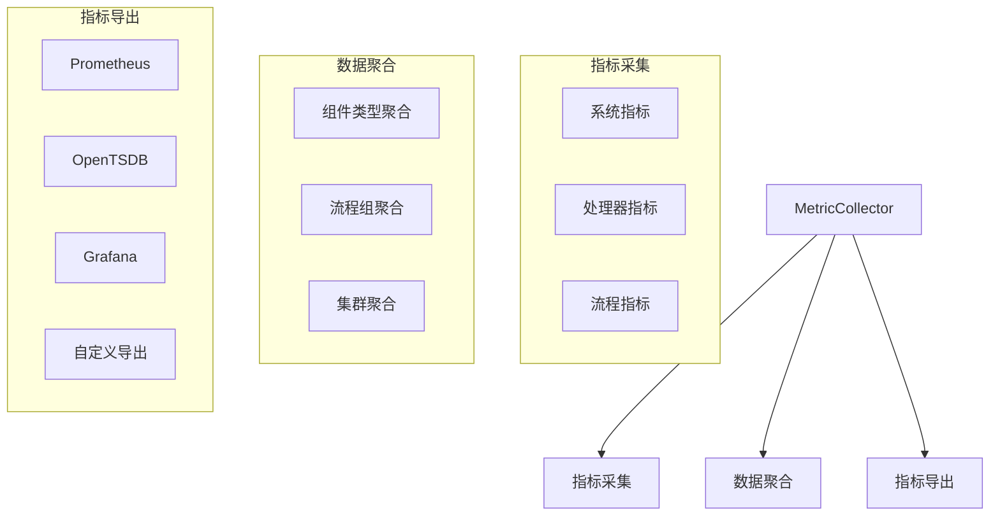

#### 2.4.3 ConnectorRegistry 连接器注册中心

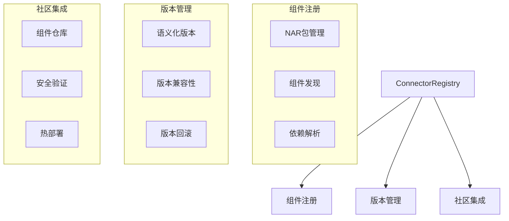

## 3. 关键技术纽带

### 3.1 FlowFile 数据模型

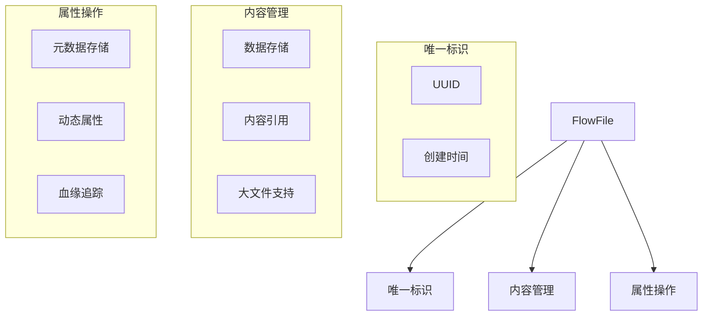

### 3.2 事件驱动模型

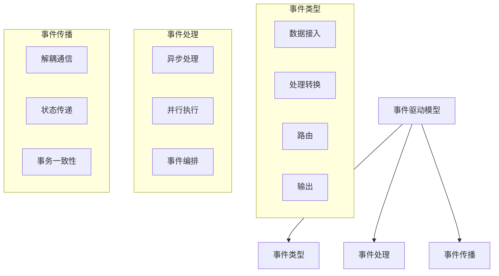

## 4. 系统交互流程：实时日志分析案例

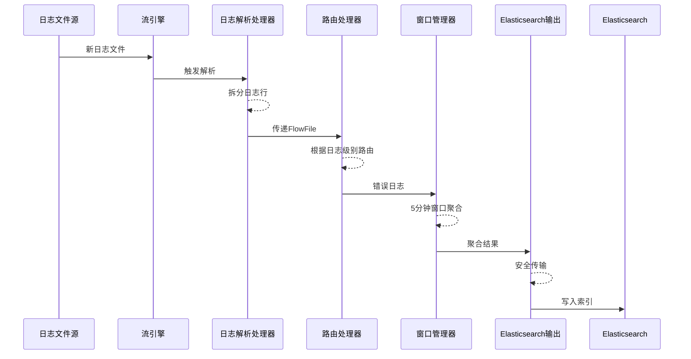

## 5. 性能与可扩展性

### 5.1 性能优化策略

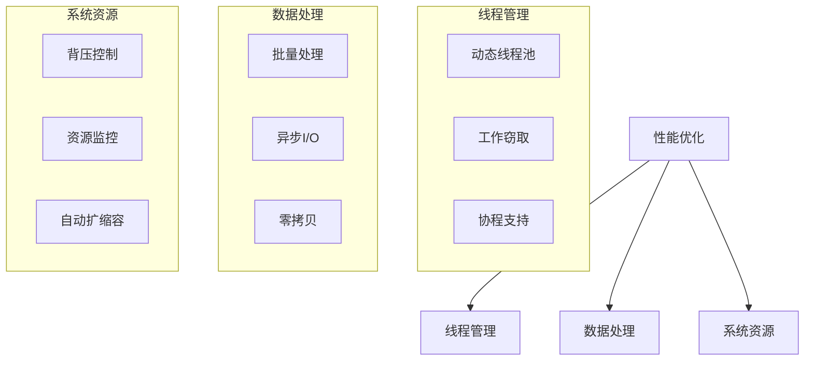

### 5.2 水平扩展架构

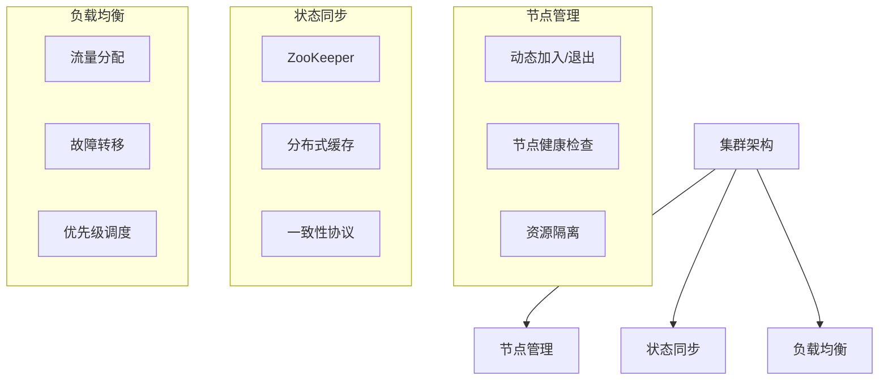

## 6. 未来发展路径

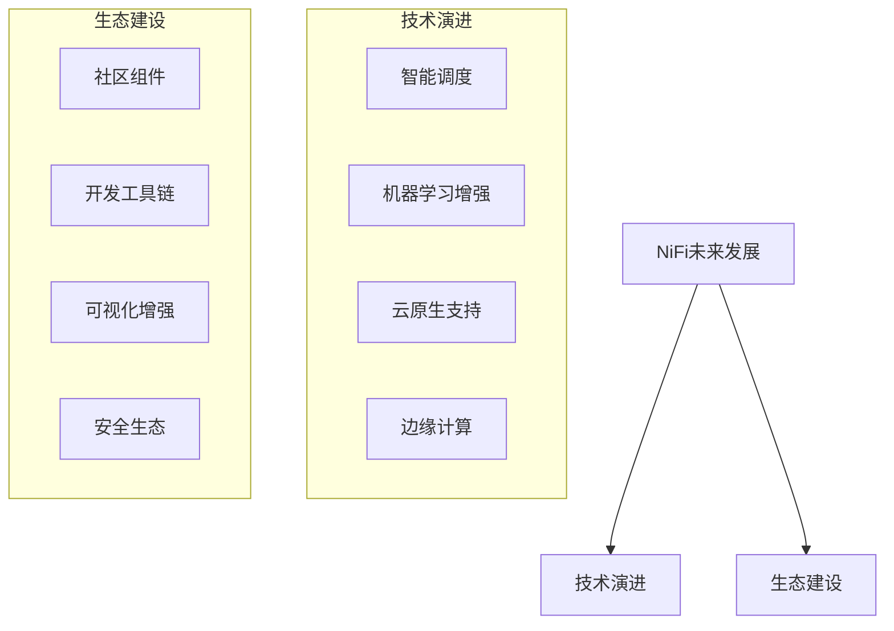

## 7. 总结

Apache NiFi 通过其模块化、事件驱动的架构设计，为复杂的数据集成和实时处理场景提供了强大、灵活的解决方案。其独特的设计理念和丰富的功能特性，使其成为现代数据工程中不可或缺的工具。

## 8. 模块间信息流与数据流详解

### 8.1 模块间交互总体架构

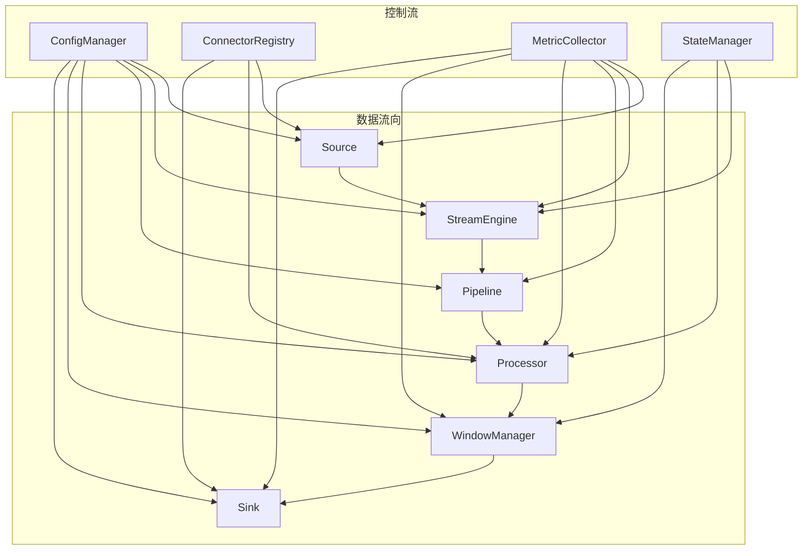

### 8.2 详细信息流分析

#### 8.2.1 数据流转路径

1. **Source → StreamEngine**
   - **数据流**：原始数据封装为 FlowFile
   - **信息流**：
     - 数据源配置信息
     - 协议适配器元数据
     - 安全认证信息

   ```mermaid
   sequenceDiagram
       participant Source
       participant StreamEngine
       
       Source ->> StreamEngine: 创建FlowFile
       Source -->> StreamEngine: 数据源配置
       Source -->> StreamEngine: 协议适配器信息
       StreamEngine -->> Source: 调度指令
   ```

2. **StreamEngine → Pipeline**
   - **数据流**：调度 FlowFile 通过 Pipeline
   - **信息流**：
     - 线程池资源分配
     - 背压控制信息
     - 优先级路由指令

   ```mermaid
   sequenceDiagram
       participant StreamEngine
       participant Pipeline
       
       StreamEngine ->> Pipeline: 分配处理线程
       StreamEngine -->> Pipeline: 背压控制信息
       StreamEngine -->> Pipeline: 路由优先级
       Pipeline -->> StreamEngine: 处理状态反馈
   ```

3. **Pipeline → Processor**
   - **数据流**：FlowFile 传递给 Processor
   - **信息流**：
     - 处理器配置
     - 关系定义
     - 版本控制信息

   ```mermaid
   sequenceDiagram
       participant Pipeline
       participant Processor
       
       Pipeline ->> Processor: 传递FlowFile
       Pipeline -->> Processor: 处理器配置
       Pipeline -->> Processor: 关系映射
       Processor -->> Pipeline: 处理结果
   ```

4. **Processor → WindowManager**
   - **数据流**：处理后的 FlowFile 进入窗口
   - **信息流**：
     - 窗口配置
     - 聚合策略
     - 时间戳信息

   ```mermaid
   sequenceDiagram
       participant Processor
       participant WindowManager
       
       Processor ->> WindowManager: 提交FlowFile
       Processor -->> WindowManager: 窗口配置
       Processor -->> WindowManager: 时间戳信息
       WindowManager -->> Processor: 窗口聚合结果
   ```

5. **WindowManager → Sink**
   - **数据流**：聚合结果输出
   - **信息流**：
     - 输出目标配置
     - 安全传输参数
     - 错误路由策略

   ```mermaid
   sequenceDiagram
       participant WindowManager
       participant Sink
       
       WindowManager ->> Sink: 聚合结果FlowFile
       WindowManager -->> Sink: 输出目标配置
       WindowManager -->> Sink: 安全传输参数
       Sink -->> WindowManager: 输出状态反馈
   ```

#### 8.2.2 支撑层信息流

1. **ConfigManager 配置注入**
   - 向各模块注入动态配置
   - 提供敏感数据加密服务
   - 实时配置变更通知

   ```mermaid
   graph TD
       A[ConfigManager] --> |配置注入| B[Source]
       A --> |配置注入| C[StreamEngine]
       A --> |配置注入| D[Pipeline]
       A --> |配置注入| E[Processor]
       A --> |配置注入| F[WindowManager]
       A --> |配置注入| G[Sink]
   ```

2. **ConnectorRegistry 组件管理**
   - 提供组件注册与发现
   - 管理 NAR 包部署
   - 版本控制与兼容性检查

   ```mermaid
   graph TD
       A[ConnectorRegistry] --> |组件注册| B[Source]
       A --> |组件发现| C[Processor]
       A --> |NAR包管理| D[Sink]
   ```

3. **MetricCollector 指标采集**
   - 从各模块收集运行时指标
   - 提供指标聚合与导出
   - 支持数据血缘追踪

   ```mermaid
   graph TD
       A[MetricCollector] --> |指标收集| B[Source]
       A --> |指标收集| C[StreamEngine]
       A --> |指标收集| D[Pipeline]
       A --> |指标收集| E[Processor]
       A --> |指标收集| F[WindowManager]
       A --> |指标收集| G[Sink]
   ```

4. **StateManager 状态同步**
   - 提供分布式状态存储
   - 实现事务一致性
   - 支持故障恢复

   ```mermaid
   graph TD
       A[StateManager] --> |状态持久化| B[StreamEngine]
       A --> |状态同步| C[Processor]
       A --> |状态管理| D[WindowManager]
   ```

### 8.3 关键数据传递机制：FlowFile

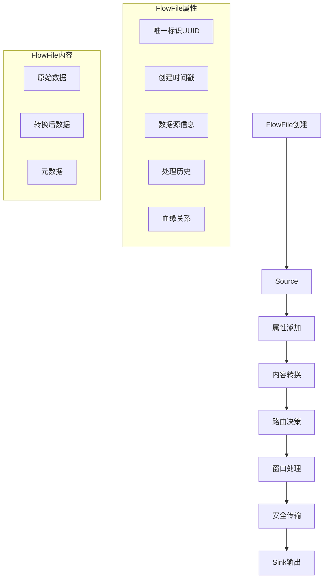

### 8.4 事件驱动与异步通信

```mermaid
graph TD
    A[事件产生] --> B[事件类型]
    
    subgraph 事件类型
        C[数据接入事件]
        D[数据转换事件]
        E[路由事件]
        F[窗口聚合事件]
        G[输出事件]
    end

    subgraph 事件处理
        H[异步处理]
        I[并行执行]
        J[事件编排]
    end

    subgraph 事件传播
        K[解耦通信]
        L[状态传递]
        M[事务一致性]
    end
```

### 8.5 跨模块通信协议

1. **内部通信协议**
   - gRPC 高性能 RPC
   - 基于 Protocol Buffers 的序列化
   - 支持双向流式通信

2. **分布式协调协议**
   - ZooKeeper 分布式一致性
   - 基于 Raft 共识算法
   - 轻量级分布式锁

3. **安全通信**
   - TLS 1.3 加密
   - 双向证书认证
   - 零知识证明

### 8.6 性能与可扩展性优化

1. **通信优化**
   - 零拷贝技术
   - 连接池复用
   - 批量数据传输

2. **异步非阻塞**
   - Netty 高性能网络框架
   - 事件驱动 I/O 模型
   - 无锁化设计

3. **动态可扩展**
   - 微服务架构
   - 插件化设计
   - 水平扩展能力