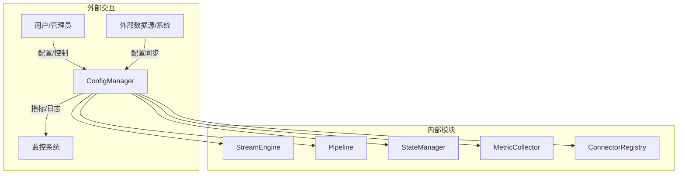
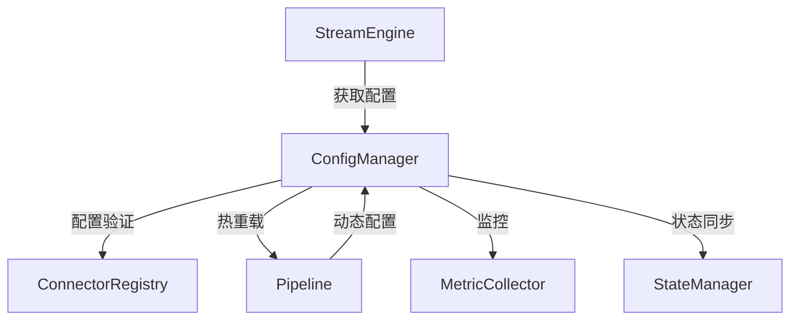
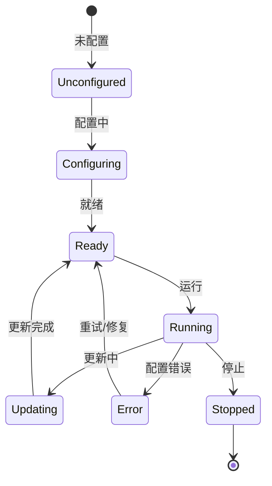
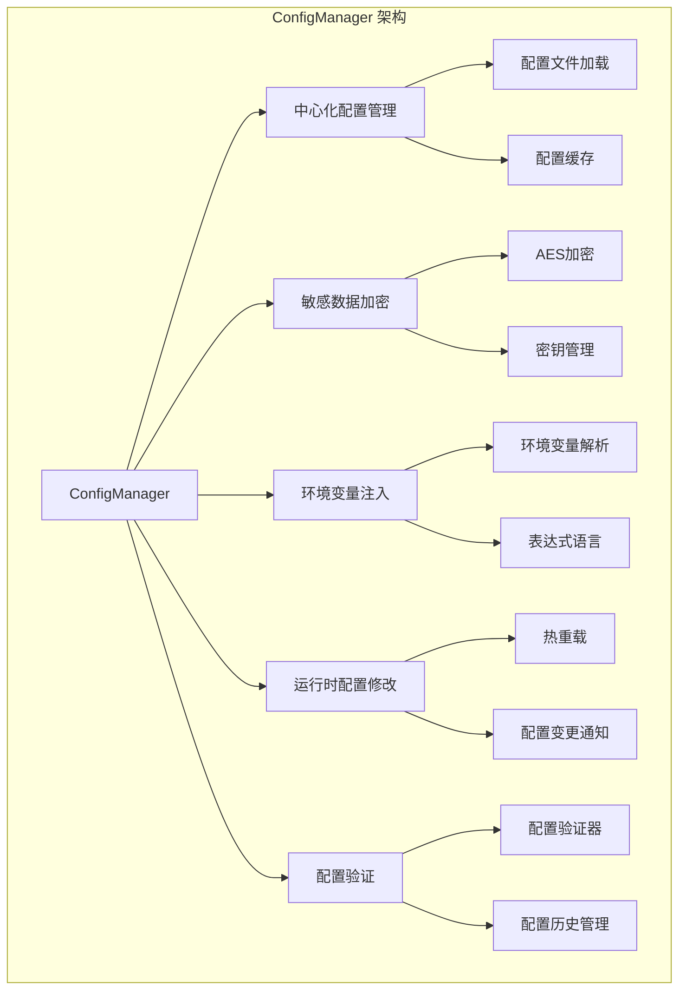

# Apache NiFi ConfigManager 深度技术分析

## 1. 模块概述

### 1.1 模块定位
ConfigManager 是 Apache NiFi 系统配置的"中枢神经"，负责全系统配置的加载、解析、加密、更新与分发的底层模块。它是整个数据流处理系统中确保配置安全、灵活和可控的关键组件，提供了高度动态和安全的配置管理能力。

### 1.2 关键职责详细分析

#### 1.2.1 中心化配置管理
提供全系统配置的集中式管理机制。

##### 配置层次结构
1. **配置接口定义**
```java
public interface ConfigManager {
    // 获取配置属性
    String getProperty(String key);
    
    // 设置配置属性
    void setProperty(String key, String value, boolean sensitive);
    
    // 加载配置文件
    void loadConfiguration(Path configFile);
    
    // 持久化配置变更
    void persistConfiguration();
    
    // 获取敏感属性提供者
    SensitivePropertyProvider getSensitivePropertyProvider();
}

// 标准配置映射实现
public class StandardConfigMap implements ConfigMap {
    private final Map<String, ConfigEntry> configEntries;
    
    public class ConfigEntry {
        private String value;
        private boolean sensitive;
        private long lastModifiedTime;
    }
    
    public void put(String key, String value, boolean sensitive) {
        ConfigEntry entry = new ConfigEntry();
        entry.value = value;
        entry.sensitive = sensitive;
        entry.lastModifiedTime = System.currentTimeMillis();
        configEntries.put(key, entry);
    }
}
```

2. **配置文件管理**
```java
public class ConfigFileManager {
    private static final String DEFAULT_CONFIG_FILE = "nifi.properties";
    private static final String ENV_CONFIG_PREFIX = "NIFI_";
    
    public Properties loadConfigFile(Path configPath) {
        Properties properties = new Properties();
        
        try (InputStream input = Files.newInputStream(configPath)) {
            properties.load(input);
        } catch (IOException e) {
            // 配置文件加载失败处理
        }
        
        // 合并环境变量配置
        mergeEnvironmentVariables(properties);
        
        return properties;
    }
    
    private void mergeEnvironmentVariables(Properties properties) {
        System.getenv().forEach((key, value) -> {
            if (key.startsWith(ENV_CONFIG_PREFIX)) {
                String propertyKey = key.substring(ENV_CONFIG_PREFIX.length())
                    .toLowerCase()
                    .replace('_', '.');
                properties.setProperty(propertyKey, value);
            }
        });
    }
}
```

#### 1.2.2 敏感数据加密
提供对敏感配置数据的安全存储和加密机制。

##### 加密机制实现
1. **敏感属性提供者**
```java
public interface SensitivePropertyProvider {
    // 加密敏感属性
    String encrypt(String plaintext);
    
    // 解密敏感属性
    String decrypt(String ciphertext);
    
    // 获取加密算法
    String getAlgorithm();
}

// AES-GCM 加密实现
public class AESSensitivePropertyProvider implements SensitivePropertyProvider {
    private static final String ALGORITHM = "AES/GCM/NoPadding";
    private final SecretKey secretKey;
    
    public AESSensitivePropertyProvider(SecretKey secretKey) {
        this.secretKey = secretKey;
    }
    
    @Override
    public String encrypt(String plaintext) {
        try {
            Cipher cipher = Cipher.getInstance(ALGORITHM);
            byte[] iv = generateRandomIV();
            GCMParameterSpec spec = new GCMParameterSpec(128, iv);
            
            cipher.init(Cipher.ENCRYPT_MODE, secretKey, spec);
            byte[] encrypted = cipher.doFinal(plaintext.getBytes(StandardCharsets.UTF_8));
            
            // 返回 Base64 编码的 IV:密文:认证标签
            return Base64.getEncoder().encodeToString(iv) + ":" +
                   Base64.getEncoder().encodeToString(encrypted) + ":" +
                   Base64.getEncoder().encodeToString(cipher.getIV());
        } catch (Exception e) {
            throw new EncryptionException("Failed to encrypt property", e);
        }
    }
    
    @Override
    public String decrypt(String ciphertext) {
        try {
            String[] parts = ciphertext.split(":");
            byte[] iv = Base64.getDecoder().decode(parts[0]);
            byte[] encrypted = Base64.getDecoder().decode(parts[1]);
            
            Cipher cipher = Cipher.getInstance(ALGORITHM);
            GCMParameterSpec spec = new GCMParameterSpec(128, iv);
            cipher.init(Cipher.DECRYPT_MODE, secretKey, spec);
            
            byte[] decrypted = cipher.doFinal(encrypted);
            return new String(decrypted, StandardCharsets.UTF_8);
        } catch (Exception e) {
            throw new DecryptionException("Failed to decrypt property", e);
        }
    }
}
```

2. **密钥管理**
```java
public class KeyStoreManager {
    private static final String KEYSTORE_TYPE = "PKCS12";
    private static final String KEY_ALGORITHM = "AES";
    
    public SecretKey generateOrLoadKey(Path keystorePath, String alias) {
        try {
            KeyStore keyStore = KeyStore.getInstance(KEYSTORE_TYPE);
            keyStore.load(Files.newInputStream(keystorePath), null);
            
            if (!keyStore.containsAlias(alias)) {
                // 生成新密钥
                KeyGenerator keyGen = KeyGenerator.getInstance(KEY_ALGORITHM);
                keyGen.init(256);
                SecretKey secretKey = keyGen.generateKey();
                
                keyStore.setEntry(
                    alias, 
                    new KeyStore.SecretKeyEntry(secretKey), 
                    new KeyStore.PasswordProtection("nifi-secret".toCharArray())
                );
                
                try (OutputStream os = Files.newOutputStream(keystorePath)) {
                    keyStore.store(os, null);
                }
                
                return secretKey;
            } else {
                // 加载现有密钥
                return (SecretKey) keyStore.getKey(
                    alias, 
                    "nifi-secret".toCharArray()
                );
            }
        } catch (Exception e) {
            throw new KeyManagementException("Failed to manage encryption key", e);
        }
    }
}
```

#### 1.2.3 环境变量与表达式注入
提供动态配置注入和表达式解析能力。

##### 注入机制实现
1. **环境变量注入**
```java
public class EnvironmentInjector {
    private static final Pattern ENV_PATTERN = Pattern.compile("\\$\\{ENV:([^}]+)\\}");
    
    public String injectEnvironmentVariables(String configValue) {
        if (configValue == null) return null;
        
        Matcher matcher = ENV_PATTERN.matcher(configValue);
        StringBuffer result = new StringBuffer();
        
        while (matcher.find()) {
            String envKey = matcher.group(1);
            String envValue = System.getenv(envKey);
            
            if (envValue == null) {
                // 未找到环境变量，保留原始表达式
                matcher.appendReplacement(result, matcher.group(0));
            } else {
                matcher.appendReplacement(result, Matcher.quoteReplacement(envValue));
            }
        }
        
        matcher.appendTail(result);
        return result.toString();
    }
}
```

2. **表达式语言支持**
```java
public class ExpressionLanguageProcessor {
    private final SpelExpressionParser parser = new SpelExpressionParser();
    private final StandardEvaluationContext context = new StandardEvaluationContext();
    
    public String evaluateExpression(String expression) {
        try {
            // 注入系统属性和环境变量
            context.setVariable("env", System.getenv());
            context.setVariable("props", System.getProperties());
            
            Expression exp = parser.parseExpression(expression);
            return exp.getValue(context, String.class);
        } catch (Exception e) {
            // 表达式解析失败，返回原始表达式
            return expression;
        }
    }
}
```

#### 1.2.4 运行时配置修改
提供动态更新配置的能力，支持无重启生效。

##### 配置更新机制
1. **配置变更管理**
```java
public class ConfigurationChangeManager {
    private final List<ConfigurationChangeListener> listeners = new CopyOnWriteArrayList<>();
    
    public void updateProperty(String key, String value, boolean sensitive) {
        ConfigMap currentConfig = configManager.getConfigMap();
        ConfigMap updatedConfig = new StandardConfigMap(currentConfig);
        
        // 更新配置
        updatedConfig.put(key, value, sensitive);
        
        // 通知配置变更监听器
        notifyConfigurationChange(key, value);
        
        // 持久化配置
        configManager.persistConfiguration();
    }
    
    public void addConfigurationChangeListener(ConfigurationChangeListener listener) {
        listeners.add(listener);
    }
    
    private void notifyConfigurationChange(String key, String value) {
        ConfigurationChangeEvent event = new ConfigurationChangeEvent(key, value);
        listeners.forEach(listener -> listener.onConfigurationChanged(event));
    }
}
```

2. **热重载支持**
```java
public class HotReloadManager {
    public void reloadProcessorConfiguration(ProcessorNode processor) {
        // 重新加载处理器配置
        processor.onConfigurationReloaded();
        
        // 重新初始化资源
        processor.reinitialize();
        
        // 如需重启，执行优雅重启
        if (processor.requiresRestart()) {
            processor.gracefulRestart();
        }
    }
}
```

#### 1.2.5 配置验证与校验
提供配置合法性检查和验证机制。

##### 验证机制实现
1. **配置验证器**
```java
public class ConfigurationValidator {
    private final List<ConfigValidator> validators = new ArrayList<>();
    
    public ValidationResult validate(ConfigMap configMap) {
        ValidationResult result = new ValidationResult();
        
        for (ConfigValidator validator : validators) {
            ValidationResult validatorResult = validator.validate(configMap);
            result.merge(validatorResult);
        }
        
        return result;
    }
    
    public void registerValidator(ConfigValidator validator) {
        validators.add(validator);
    }
}

public interface ConfigValidator {
    ValidationResult validate(ConfigMap configMap);
}

// 示例：端口范围验证器
public class PortRangeValidator implements ConfigValidator {
    @Override
    public ValidationResult validate(ConfigMap configMap) {
        ValidationResult result = new ValidationResult();
        
        String httpPort = configMap.getValue("nifi.web.http.port");
        try {
            int port = Integer.parseInt(httpPort);
            if (port < 1024 || port > 65535) {
                result.addError("HTTP端口必须在1024-65535范围内");
            }
        } catch (NumberFormatException e) {
            result.addError("HTTP端口必须是有效的整数");
        }
        
        return result;
    }
}
```

2. **配置历史管理**
```java
public class ConfigHistoryManager {
    private static final int MAX_HISTORY_SIZE = 10;
    private final Deque<ConfigSnapshot> configHistory = new LinkedList<>();
    
    public void recordConfigurationSnapshot(ConfigMap configMap) {
        ConfigSnapshot snapshot = new ConfigSnapshot(
            configMap, 
            System.currentTimeMillis()
        );
        
        configHistory.addFirst(snapshot);
        
        // 限制历史记录大小
        if (configHistory.size() > MAX_HISTORY_SIZE) {
            configHistory.removeLast();
        }
    }
    
    public ConfigMap rollbackToPreviousConfiguration() {
        if (configHistory.size() > 1) {
            configHistory.removeFirst(); // 移除当前配置
            return configHistory.getFirst().getConfigMap();
        }
        throw new IllegalStateException("No previous configuration available");
    }
}
```

### 1.3 技术关键词详细分析

#### 1.3.1 配置文件类型
支持多种配置文件格式和来源。

```java
public enum ConfigFileType {
    PROPERTIES,     // Java Properties 文件
    YAML,           // YAML 配置文件
    JSON,           // JSON 配置文件
    XML,            // XML 配置文件
    ENV_VARIABLES,  // 环境变量
    SYSTEM_PROPS    // 系统属性
}
```

#### 1.3.2 敏感属性加密算法
定义敏感数据加密的标准算法。

```java
public enum EncryptionAlgorithm {
    AES_GCM_256,    // AES-GCM 256位
    AES_CBC_256,    // AES-CBC 256位
    RSA_2048,       // RSA 2048位
    PBKDF2          // 基于密码的密钥派生
}
```

#### 1.3.3 配置变更通知机制
定义配置变更的通知策略。

```java
public enum ConfigChangeNotificationType {
    LOCAL,          // 本地通知
    DISTRIBUTED,    // 分布式通知
    BROADCAST       // 广播通知
}
```

#### 1.3.4 配置验证策略
定义配置验证的标准方法。

```java
public enum ValidationStrategy {
    STRICT,         // 严格验证，任何错误都阻止配置生效
    LENIENT,        // 宽松验证，记录警告但允许配置生效
    IGNORE          // 忽略验证
}
```

#### 1.3.5 配置提供者扩展接口
定义配置提供者的标准扩展机制。

```java
public interface ConfigProviderExtension {
    String getName();
    void register(ConfigProviderRegistry registry);
    ConfigProvider createProvider();
}
```

#### 1.3.6 配置元数据
记录配置的详细信息和生命周期。

```java
public class ConfigMetadata {
    private String id;
    private ConfigFileType type;
    private long creationTimestamp;
    private long lastModifiedTimestamp;
    private String source;
    private Map<String, String> additionalMetadata;
}
```

## 2. 系统上下文图



## 3. 组件交互图



## 4. 状态机设计



## 5. 性能指标

| 指标           | 目标值        | 说明                   |
|---------------|---------------|------------------------|
| 配置加载延迟    | <50ms         | 配置文件加载耗时       |
| 加密开销        | <20ms         | 敏感属性加密耗时       |
| 配置变更通知    | <10ms         | 配置变更通知耗时       |
| 配置验证性能    | <100ms        | 配置验证耗时           |

## 6. 架构可视化

### 6.1 ConfigManager 架构组件关系图



## 7. 代码与使用结合

### 7.1 自定义配置验证器示例

```java
public class DatabaseConfigValidator implements ConfigValidator {
    @Override
    public ValidationResult validate(ConfigMap configMap) {
        ValidationResult result = new ValidationResult();
        
        String dbUrl = configMap.getValue("db.url");
        String username = configMap.getValue("db.username");
        String password = configMap.getValue("db.password");
        
        // URL 格式验证
        if (!isValidJdbcUrl(dbUrl)) {
            result.addError("无效的数据库连接 URL 格式");
        }
        
        // 用户名非空验证
        if (username == null || username.trim().isEmpty()) {
            result.addError("数据库用户名不能为空");
        }
        
        // 密码加密验证
        if (!isSensitivePropertyEncrypted(password)) {
            result.addWarning("建议对数据库密码进行加密");
        }
        
        return result;
    }
}
```

### 7.2 动态配置更新示例

```java
public class DynamicConfigurationConfigurator {
    public void configureNiFiRuntime(Properties config) {
        ConfigManager configManager = new StandardConfigManager();
        
        // 动态配置参数
        configManager.setProperty(
            "nifi.web.http.port", 
            config.getProperty("web.port", "8080"),
            false
        );
        
        configManager.setProperty(
            "nifi.security.keystore.password", 
            config.getProperty("keystore.password"),
            true
        );
        
        // 注册自定义配置验证器
        configManager.registerValidator(new DatabaseConfigValidator());
        
        // 触发配置重载
        configManager.reloadConfiguration();
    }
}
```

## 8. 总结与展望

### 8.1 核心优势
1. 灵活的配置管理机制
2. 强大的敏感数据保护
3. 动态配置更新能力
4. 丰富的配置验证机制
5. 可扩展的配置提供者架构

### 8.2 未来发展方向
- 更智能的配置推荐
- 机器学习辅助的配置优化
- 更细粒度的性能监控
- 云原生和边缘计算支持 