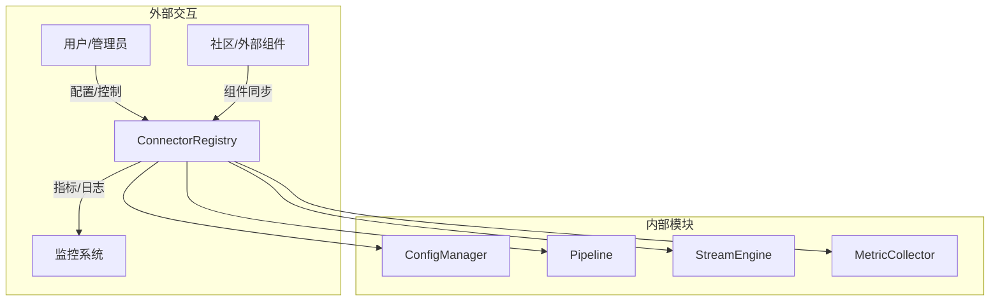
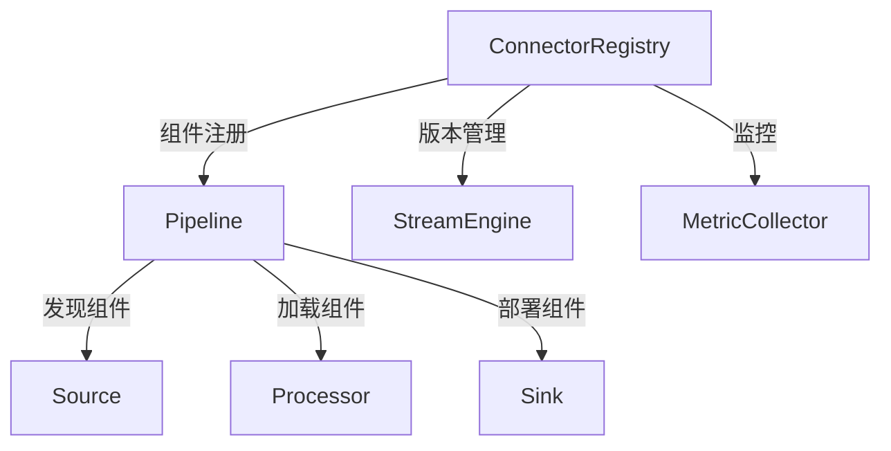
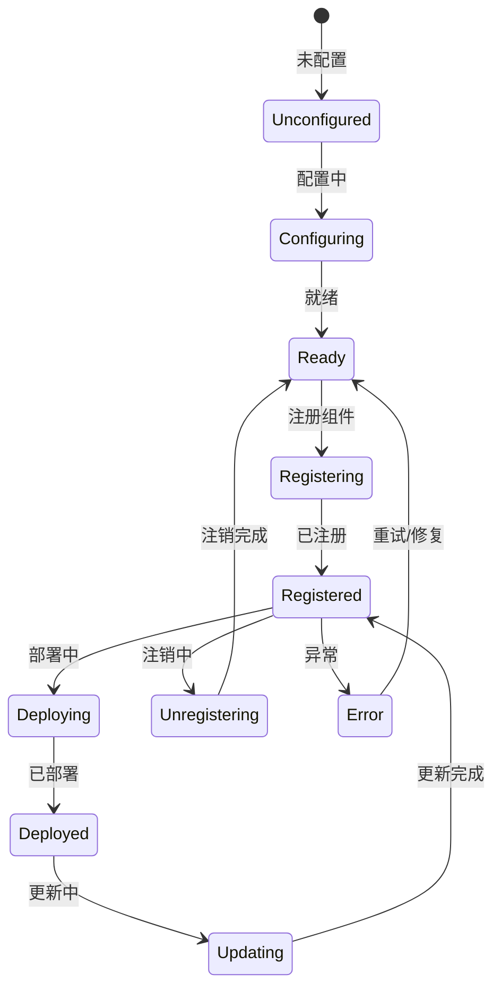
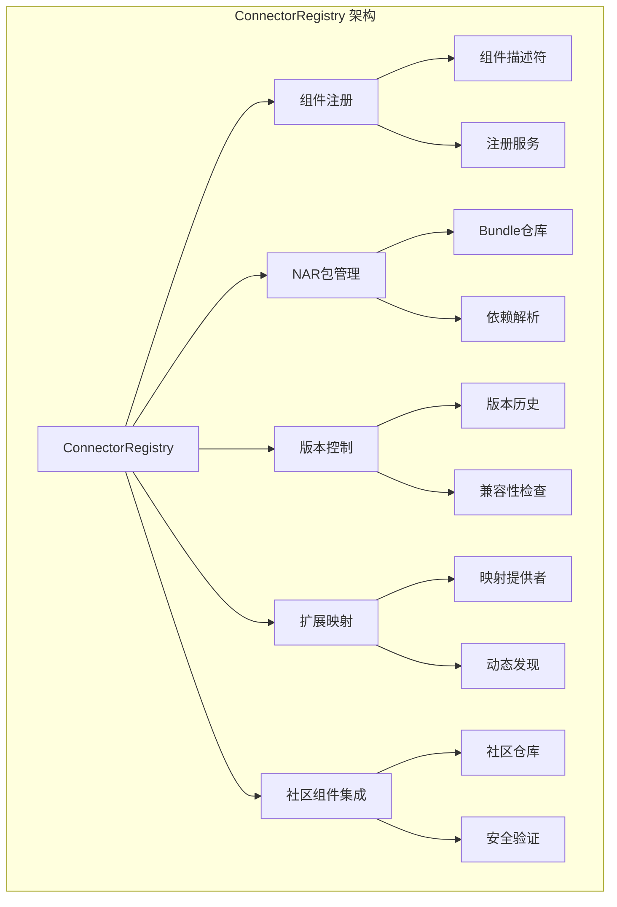

# Apache NiFi ConnectorRegistry 深度技术分析

## 1. 模块概述

### 1.1 模块定位
ConnectorRegistry 是 Apache NiFi 系统的"组件商店"与"版本控制中枢"，负责管理 Processor、ControllerService 等组件的生命周期。它是整个数据流处理系统中确保组件可扩展、可管理和可追溯的关键模块，提供了高度灵活和安全的组件注册、发现和版本管理能力。

### 1.2 关键职责详细分析

#### 1.2.1 组件注册与发现
提供对各类组件的注册、查询和管理机制。

##### 注册机制实现
1. **组件描述符定义**
```java
public interface ConnectorDescriptor {
    // 获取组件唯一标识
    String getIdentifier();
    
    // 获取组件名称
    String getName();
    
    // 获取组件类型
    ComponentType getType();
    
    // 获取组件版本
    String getVersion();
    
    // 获取组件描述
    String getDescription();
}

// NAR包形式的连接器描述符
public class NarBundleConnectorDescriptor implements ConnectorDescriptor {
    private final Bundle bundle;
    private final String identifier;
    private final ComponentType type;
    
    @Override
    public String getIdentifier() {
        return identifier;
    }
    
    @Override
    public ComponentType getType() {
        return type;
    }
    
    public Bundle getBundle() {
        return bundle;
    }
}

// 枚举组件类型
public enum ComponentType {
    PROCESSOR,          // 数据处理器
    CONTROLLER_SERVICE, // 控制服务
    REPORTING_TASK,     // 报告任务
    FLOW_CONTROLLER     // 流程控制器
}
```

2. **组件注册服务**
```java
public class StandardConnectorRegistry implements ConnectorRegistry {
    private final Map<String, ConnectorDescriptor> registeredConnectors = new ConcurrentHashMap<>();
    private final BundleRepository bundleRepository;
    
    @Override
    public void registerConnector(ConnectorDescriptor descriptor) {
        // 验证连接器是否已存在
        if (registeredConnectors.containsKey(descriptor.getIdentifier())) {
            throw new ConnectorAlreadyExistsException(descriptor.getIdentifier());
        }
        
        // 注册连接器
        registeredConnectors.put(descriptor.getIdentifier(), descriptor);
        
        // 如果是 NAR 包形式的连接器，部署到仓库
        if (descriptor instanceof NarBundleConnectorDescriptor) {
            NarBundleConnectorDescriptor narDescriptor = (NarBundleConnectorDescriptor) descriptor;
            bundleRepository.deployBundle(narDescriptor.getBundle());
        }
        
        // 触发注册事件
        notifyConnectorRegistered(descriptor);
    }
    
    @Override
    public ConnectorDescriptor getConnector(String identifier) {
        return registeredConnectors.get(identifier);
    }
    
    @Override
    public List<ConnectorDescriptor> listConnectors() {
        return new ArrayList<>(registeredConnectors.values());
    }
}
```

#### 1.2.2 NAR 包管理
提供 NAR（NiFi Archive）包的部署、版本管理和依赖处理。

##### NAR 包管理机制
1. **Bundle 仓库**
```java
public interface BundleRepository {
    // 部署 NAR 包
    void deployBundle(Bundle bundle);
    
    // 卸载 NAR 包
    void undeployBundle(String bundleId, String version);
    
    // 获取特定版本的 NAR 包
    Bundle getBundle(String bundleId, String version);
    
    // 列出所有已部署的 NAR 包
    List<Bundle> listBundles();
}

// 文件系统 NAR 包仓库实现
public class FileSystemBundleRepository implements BundleRepository {
    private final Path repositoryPath;
    
    @Override
    public void deployBundle(Bundle bundle) {
        Path bundlePath = repositoryPath.resolve(
            bundle.getGroup() + "/" + 
            bundle.getArtifact() + "/" + 
            bundle.getVersion()
        );
        
        // 解压 NAR 包
        unzipNarBundle(bundle.getFile(), bundlePath);
        
        // 生成元数据文件
        generateBundleMetadata(bundle, bundlePath);
    }
    
    private void generateBundleMetadata(Bundle bundle, Path bundlePath) {
        Path metadataFile = bundlePath.resolve("bundle.json");
        JSONObject metadata = new JSONObject();
        metadata.put("group", bundle.getGroup());
        metadata.put("artifact", bundle.getArtifact());
        metadata.put("version", bundle.getVersion());
        
        // 写入元数据文件
        Files.write(metadataFile, metadata.toString().getBytes());
    }
}
```

2. **依赖管理**
```java
public class BundleDependencyResolver {
    public void resolveDependencies(Bundle bundle) {
        // 解析 NAR 包依赖
        List<Dependency> dependencies = bundle.getDependencies();
        
        for (Dependency dependency : dependencies) {
            // 检查依赖是否已部署
            if (!isBundleDeployed(dependency)) {
                // 自动下载并部署依赖
                downloadAndDeployDependency(dependency);
            }
            
            // 验证依赖版本兼容性
            validateDependencyVersion(dependency);
        }
    }
    
    private void validateDependencyVersion(Dependency dependency) {
        Bundle existingBundle = bundleRepository.getBundle(
            dependency.getGroup(), 
            dependency.getArtifact()
        );
        
        if (!isVersionCompatible(existingBundle.getVersion(), dependency.getVersion())) {
            throw new DependencyVersionConflictException(
                "版本不兼容：" + existingBundle.getVersion() + " vs " + dependency.getVersion()
            );
        }
    }
}
```

#### 1.2.3 版本控制
提供组件版本的管理、追踪和回滚能力。

##### 版本控制机制
1. **版本控制服务**
```java
public interface VersionControlService {
    // 创建新版本
    void createVersion(String componentId, FlowSnapshot snapshot);
    
    // 更新特定版本
    void updateVersion(String componentId, String version, FlowSnapshot snapshot);
    
    // 获取特定版本
    FlowSnapshot getVersion(String componentId, String version);
    
    // 列出组件的所有版本
    List<String> listVersions(String componentId);
    
    // 回滚到指定版本
    void rollbackToVersion(String componentId, String version);
}

// 标准版本控制服务实现
public class StandardVersionControlService implements VersionControlService {
    private final Map<String, Map<String, FlowSnapshot>> versionHistory = new ConcurrentHashMap<>();
    
    @Override
    public void createVersion(String componentId, FlowSnapshot snapshot) {
        // 生成语义化版本号
        String version = generateSemanticVersion(snapshot);
        
        // 存储版本快照
        versionHistory.computeIfAbsent(componentId, k -> new ConcurrentHashMap<>())
            .put(version, snapshot);
    }
    
    @Override
    public FlowSnapshot getVersion(String componentId, String version) {
        return versionHistory.getOrDefault(componentId, Collections.emptyMap())
            .get(version);
    }
    
    private String generateSemanticVersion(FlowSnapshot snapshot) {
        // 基于快照内容生成版本号
        // 使用 SHA-256 哈希值作为版本标识
        return DigestUtils.sha256Hex(snapshot.serialize());
    }
}
```

2. **版本兼容性检查**
```java
public class VersionCompatibilityChecker {
    public boolean isCompatible(String currentVersion, String newVersion) {
        // 语义化版本比较
        SemanticVersion current = SemanticVersion.parse(currentVersion);
        SemanticVersion newVer = SemanticVersion.parse(newVersion);
        
        // 主版本号不同，不兼容
        if (current.getMajor() != newVer.getMajor()) {
            return false;
        }
        
        // 次版本号更高，兼容
        return newVer.getMinor() >= current.getMinor();
    }
}
```

#### 1.2.4 扩展映射
提供组件类型与 NAR 包的映射关系管理。

##### 扩展映射机制
1. **扩展映射提供者**
```java
public interface ExtensionMappingProvider {
    // 获取 NAR 包的扩展映射
    ExtensionMapping getExtensionMapping(String bundleId);
    
    // 更新扩展映射
    void updateExtensionMapping(String bundleId, ExtensionMapping mapping);
    
    // 注册组件类型与 NAR 包的映射关系
    void registerExtension(String componentType, String bundleId);
}

// 基于 JSON 的扩展映射实现
public class JsonExtensionMappingProvider implements ExtensionMappingProvider {
    private final Map<String, ExtensionMapping> mappings = new ConcurrentHashMap<>();
    private final Path mappingStoragePath;
    
    @Override
    public void registerExtension(String componentType, String bundleId) {
        ExtensionMapping mapping = new ExtensionMapping(componentType, bundleId);
        mappings.put(bundleId, mapping);
        
        // 持久化映射关系
        persistMappingToFile(mapping);
    }
    
    private void persistMappingToFile(ExtensionMapping mapping) {
        JSONObject mappingJson = new JSONObject();
        mappingJson.put("componentType", mapping.getComponentType());
        mappingJson.put("bundleId", mapping.getBundleId());
        
        Path mappingFile = mappingStoragePath.resolve(mapping.getBundleId() + ".json");
        Files.write(mappingFile, mappingJson.toString().getBytes());
    }
}
```

2. **动态组件发现**
```java
public class DynamicComponentDiscovery {
    private final ExtensionMappingProvider mappingProvider;
    private final ClassLoader extensionClassLoader;
    
    public List<Class<?>> discoverComponents(String bundleId) {
        ExtensionMapping mapping = mappingProvider.getExtensionMapping(bundleId);
        
        // 使用专用的类加载器加载组件
        List<Class<?>> components = new ArrayList<>();
        ServiceLoader<?> serviceLoader = ServiceLoader.load(
            Class.forName(mapping.getComponentType()), 
            extensionClassLoader
        );
        
        for (Object component : serviceLoader) {
            components.add(component.getClass());
        }
        
        return components;
    }
}
```

#### 1.2.5 社区组件集成
提供社区组件的发现、下载和集成机制。

##### 社区组件集成机制
1. **社区组件仓库**
```java
public class CommunityComponentRegistry {
    private final List<ComponentRepository> repositories = new ArrayList<>();
    
    public void addRepository(ComponentRepository repository) {
        repositories.add(repository);
    }
    
    public List<ConnectorDescriptor> searchComponents(String keyword) {
        List<ConnectorDescriptor> results = new ArrayList<>();
        
        for (ComponentRepository repo : repositories) {
            results.addAll(repo.search(keyword));
        }
        
        return results;
    }
    
    public void downloadAndInstallComponent(ConnectorDescriptor descriptor) {
        for (ComponentRepository repo : repositories) {
            try {
                Bundle bundle = repo.downloadBundle(descriptor);
                bundleRepository.deployBundle(bundle);
                break;
            } catch (DownloadException ignored) {}
        }
    }
}

// GitHub 社区组件仓库实现
public class GitHubComponentRepository implements ComponentRepository {
    @Override
    public List<ConnectorDescriptor> search(String keyword) {
        // 调用 GitHub API 搜索组件
        GitHubSearchResponse response = githubClient.searchRepositories(keyword);
        return convertToConnectorDescriptors(response);
    }
    
    @Override
    public Bundle downloadBundle(ConnectorDescriptor descriptor) {
        // 从 GitHub Release 下载 NAR 包
        URL downloadUrl = generateDownloadUrl(descriptor);
        return downloadAndCreateBundle(downloadUrl);
    }
}
```

2. **组件安全验证**
```java
public class ComponentSecurityValidator {
    public boolean validateComponent(Bundle bundle) {
        // 验证签名
        if (!verifyDigitalSignature(bundle)) {
            throw new SecurityException("组件签名验证失败");
        }
        
        // 扫描安全漏洞
        List<SecurityVulnerability> vulnerabilities = 
            securityScanner.scanBundle(bundle);
        
        if (!vulnerabilities.isEmpty()) {
            logVulnerabilities(vulnerabilities);
            return false;
        }
        
        return true;
    }
    
    private boolean verifyDigitalSignature(Bundle bundle) {
        // 使用 PGP 验证签名
        PGPSignatureVerifier verifier = new PGPSignatureVerifier();
        return verifier.verify(bundle.getSignatureFile());
    }
}
```

### 1.3 技术关键词详细分析

#### 1.3.1 组件类型
定义系统支持的组件类型。

```java
public enum ComponentType {
    PROCESSOR,          // 数据处理器
    CONTROLLER_SERVICE, // 控制服务
    REPORTING_TASK,     // 报告任务
    FLOW_CONTROLLER,    // 流程控制器
    SOURCE,             // 数据源
    SINK                // 数据接收器
}
```

#### 1.3.2 NAR 包结构
定义 NAR 包的标准结构。

```java
public class NarBundleStructure {
    private static final String[] REQUIRED_DIRECTORIES = {
        "META-INF/services",     // SPI 服务定义
        "lib/",                  // 依赖库
        "classes/"               // 组件类文件
    };
    
    private static final String[] METADATA_FILES = {
        "bundle.json",           // 包元数据
        "MANIFEST.MF",           // 清单文件
        "dependencies.properties" // 依赖描述
    };
}
```

#### 1.3.3 版本控制策略
定义组件版本控制的标准方法。

```java
public enum VersionControlStrategy {
    SEMANTIC_VERSIONING,  // 语义化版本
    HASH_BASED,           // 基于内容哈希
    TIMESTAMP_BASED       // 基于时间戳
}
```

#### 1.3.4 组件发现机制
定义组件发现的标准接口。

```java
public interface ComponentDiscoveryStrategy {
    List<Class<?>> discoverComponents(ClassLoader loader);
    void registerDiscoveryListener(ComponentDiscoveryListener listener);
}
```

#### 1.3.5 依赖管理
定义组件依赖管理的标准机制。

```java
public class DependencyManagementPolicy {
    public enum ResolutionStrategy {
        STRICT,          // 严格匹配
        COMPATIBLE,      // 兼容版本
        LATEST           // 使用最新版本
    }
}
```

#### 1.3.6 组件元数据
记录组件的详细信息和生命周期。

```java
public class ComponentMetadata {
    private String id;
    private ComponentType type;
    private String version;
    private long registrationTimestamp;
    private String author;
    private Map<String, String> additionalProperties;
}
```

## 2. 系统上下文图



## 3. 组件交互图



## 4. 状态机设计



## 5. 性能指标

| 指标           | 目标值        | 说明                   |
|---------------|---------------|------------------------|
| 组件注册延迟    | <50ms         | 组件注册耗时           |
| 版本控制开销    | <100ms        | 版本管理耗时           |
| 依赖解析性能    | <200ms        | 依赖包解析耗时         |
| 组件发现速度    | <300ms        | 组件动态发现耗时       |

## 6. 架构可视化

### 6.1 ConnectorRegistry 架构组件关系图



## 7. 代码与使用结合

### 7.1 自定义组件开发示例

```java
public class CustomDataTransformProcessor implements Processor {
    @Override
    public void initialize(ProcessorInitializationContext context) {
        // 初始化处理器
    }
    
    @Override
    public void onTrigger(ProcessContext context, ProcessSession session) {
        // 数据转换逻辑
    }
}

// 打包为 NAR
public class CustomProcessorNarPackager {
    public void createNarPackage() {
        // 创建 NAR 包目录结构
        // 生成 META-INF/services 文件
        // 打包依赖库
    }
}
```

### 7.2 通过 REST API 管理组件

```java
public class ConnectorManagementController {
    @POST
    @Path("/connectors")
    public Response registerConnector(ConnectorDescriptor descriptor) {
        connectorRegistry.registerConnector(descriptor);
        return Response.ok().build();
    }
    
    @GET
    @Path("/connectors/{id}/versions")
    public Response listVersions(@PathParam("id") String componentId) {
        List<String> versions = versionControlService.listVersions(componentId);
        return Response.ok(versions).build();
    }
}
```

## 8. 总结与展望

### 8.1 核心优势
1. 灵活的组件注册机制
2. 强大的版本控制能力
3. 安全的社区组件集成
4. 动态的扩展映射
5. 可靠的依赖管理

### 8.2 未来发展方向
- 更智能的组件推荐
- 机器学习辅助的组件匹配
- 更细粒度的性能监控
- 云原生和边缘计算支持 