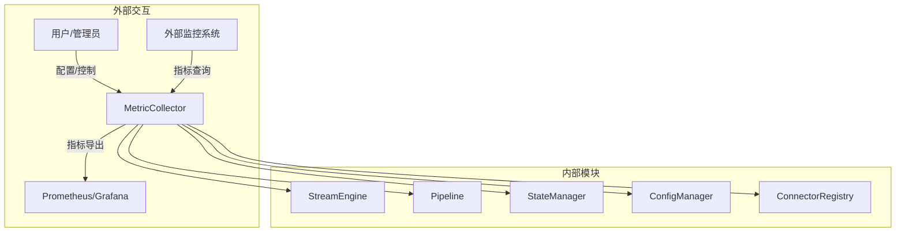
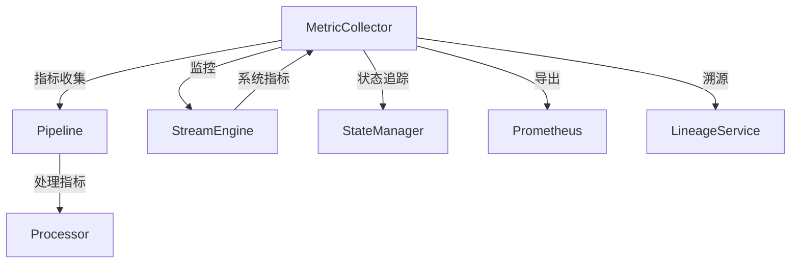
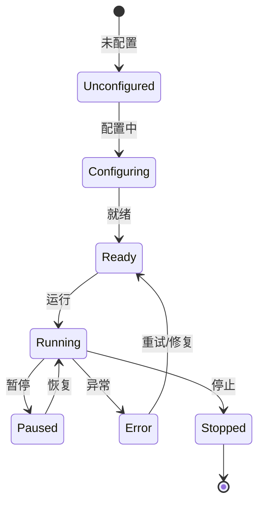
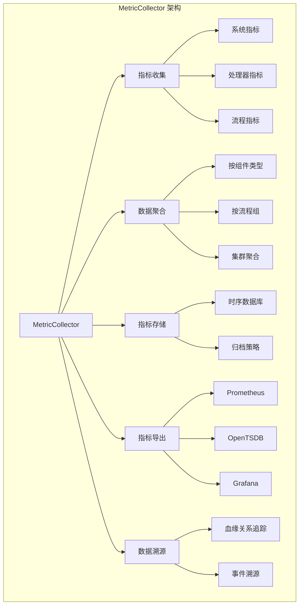

# Apache NiFi MetricCollector 深度技术分析

## 1. 模块概述

### 1.1 模块定位
MetricCollector 是 Apache NiFi 系统的"监控中枢"，负责采集、聚合、存储和展示系统运行时的关键指标数据。它是整个数据流处理系统中提供实时性能洞察和系统健康状况监控的关键模块，提供了全面、灵活和可扩展的指标收集能力。

### 1.2 关键职责详细分析

#### 1.2.1 实时指标收集
提供对系统运行时各个层面的实时指标采集机制。

##### 指标采集机制
1. **指标类型定义**
```java
public interface MetricCollector {
    // 注册 Gauge 指标（瞬时值）
    <T extends Number> Gauge<T> registerGauge(String name, Supplier<T> supplier);
    
    // 注册 Counter 指标（累计值）
    Counter registerCounter(String name);
    
    // 注册 Histogram 指标（数值分布）
    Histogram registerHistogram(String name);
    
    // 注册 Timer 指标（耗时统计）
    Timer registerTimer(String name);
    
    // 获取指标快照
    MetricsSnapshot getMetricsSnapshot();
}

// 标准指标实现
public class StandardMetricCollector implements MetricCollector {
    private final MetricRegistry metricRegistry;
    
    @Override
    public <T extends Number> Gauge<T> registerGauge(String name, Supplier<T> supplier) {
        Gauge<T> gauge = () -> supplier.get();
        metricRegistry.register(name, gauge);
        return gauge;
    }
    
    @Override
    public Counter registerCounter(String name) {
        return metricRegistry.counter(name);
    }
}
```

2. **指标采集策略**
```java
public class MetricCollectionStrategy {
    // 采集频率配置
    private static final long DEFAULT_COLLECTION_INTERVAL = 30_000; // 30秒
    
    // 采集范围
    public enum CollectionScope {
        SYSTEM,         // 系统级指标
        PROCESSOR,      // 处理器级指标
        CONNECTION,     // 连接级指标
        FLOW            // 流程级指标
    }
    
    public void configureCollection(CollectionScope scope, long interval) {
        switch (scope) {
            case SYSTEM:
                collectSystemMetrics(interval);
                break;
            case PROCESSOR:
                collectProcessorMetrics(interval);
                break;
            // 其他作用域的采集配置
        }
    }
    
    private void collectSystemMetrics(long interval) {
        // 收集 JVM 内存、CPU 利用率等系统指标
        metricCollector.registerGauge(
            "jvm.memory.used", 
            () -> Runtime.getRuntime().totalMemory() - Runtime.getRuntime().freeMemory()
        );
    }
}
```

#### 1.2.2 多维数据聚合
提供对不同维度和层次的指标聚合能力。

##### 聚合机制实现
1. **聚合策略**
```java
public class MetricsAggregator {
    // 按组件类型聚合
    public Map<String, AggregatedMetrics> aggregateByProcessorType() {
        Map<String, AggregatedMetrics> aggregations = new HashMap<>();
        
        for (ProcessorNode processor : processorRegistry.getAllProcessors()) {
            String processorType = processor.getType();
            AggregatedMetrics typeMetrics = aggregations.computeIfAbsent(
                processorType, 
                k -> new AggregatedMetrics()
            );
            
            typeMetrics.addMetrics(processor.getMetrics());
        }
        
        return aggregations;
    }
    
    // 按流程组聚合
    public Map<String, AggregatedMetrics> aggregateByProcessGroup() {
        Map<String, AggregatedMetrics> aggregations = new HashMap<>();
        
        for (ProcessGroup group : processGroupRegistry.getAllGroups()) {
            AggregatedMetrics groupMetrics = new AggregatedMetrics();
            
            for (ProcessorNode processor : group.getProcessors()) {
                groupMetrics.addMetrics(processor.getMetrics());
            }
            
            aggregations.put(group.getName(), groupMetrics);
        }
        
        return aggregations;
    }
}

// 聚合结果封装
public class AggregatedMetrics {
    private double totalProcessingTime;
    private long totalProcessedRecords;
    private Map<String, Object> aggregatedValues = new HashMap<>();
    
    public void addMetrics(Map<String, Metric> metrics) {
        metrics.forEach((name, metric) -> {
            if (metric instanceof Timer) {
                totalProcessingTime += ((Timer) metric).getCount();
            }
            // 其他指标聚合逻辑
        });
    }
}
```

2. **集群环境聚合**
```java
public class ClusterMetricsAggregator {
    public ClusterMetricsSnapshot aggregateClusterMetrics() {
        List<NodeMetrics> nodeMetricsList = new ArrayList<>();
        
        for (NiFiNode node : clusterManager.getAllNodes()) {
            NodeMetrics nodeMetrics = collectNodeMetrics(node);
            nodeMetricsList.add(nodeMetrics);
        }
        
        return new ClusterMetricsSnapshot(
            calculateClusterAverages(nodeMetricsList),
            nodeMetricsList
        );
    }
    
    private Map<String, Object> calculateClusterAverages(List<NodeMetrics> nodeMetricsList) {
        Map<String, Object> clusterAverages = new HashMap<>();
        
        // 计算集群级别的平均指标
        clusterAverages.put(
            "cluster.avg.processing.time", 
            nodeMetricsList.stream()
                .mapToDouble(NodeMetrics::getProcessingTime)
                .average()
                .orElse(0.0)
        );
        
        return clusterAverages;
    }
}
```

#### 1.2.3 自定义指标扩展
提供灵活的指标注册和自定义指标开发机制。

##### 扩展机制实现
1. **自定义指标接口**
```java
public interface CustomMetricProvider {
    // 注册自定义指标
    void registerMetrics(MetricCollector collector);
    
    // 获取指标描述
    Map<String, String> getMetricDescriptions();
}

// 示例：数据库连接池指标提供者
public class DatabaseConnectionPoolMetricProvider implements CustomMetricProvider {
    private final DataSource dataSource;
    
    @Override
    public void registerMetrics(MetricCollector collector) {
        // 注册连接池活跃连接数
        collector.registerGauge(
            "database.connection.active", 
            () -> ((HikariDataSource) dataSource).getHikariPoolMXBean().getActiveConnections()
        );
        
        // 注册连接池等待连接数
        collector.registerGauge(
            "database.connection.waiting", 
            () -> ((HikariDataSource) dataSource).getHikariPoolMXBean().getThreadsAwaitingConnection()
        );
    }
    
    @Override
    public Map<String, String> getMetricDescriptions() {
        return Map.of(
            "database.connection.active", "当前活跃的数据库连接数",
            "database.connection.waiting", "等待获取连接的线程数"
        );
    }
}
```

2. **指标注册管理**
```java
public class CustomMetricRegistry {
    private final List<CustomMetricProvider> providers = new ArrayList<>();
    
    public void registerProvider(CustomMetricProvider provider) {
        providers.add(provider);
        
        // 自动注册提供者的指标
        MetricCollector collector = getDefaultCollector();
        provider.registerMetrics(collector);
    }
    
    public Map<String, String> getAllMetricDescriptions() {
        Map<String, String> descriptions = new HashMap<>();
        
        for (CustomMetricProvider provider : providers) {
            descriptions.putAll(provider.getMetricDescriptions());
        }
        
        return descriptions;
    }
}
```

#### 1.2.4 指标持久化存储
提供指标数据的持久化和长期存储机制。

##### 存储机制实现
1. **指标存储接口**
```java
public interface MetricsRepository {
    // 存储指标快照
    void storeSnapshot(MetricsSnapshot snapshot);
    
    // 查询历史指标
    List<MetricsSnapshot> queryHistoricalMetrics(
        String metricName, 
        long startTime, 
        long endTime
    );
    
    // 清理过期指标
    void purgeExpiredMetrics(long retentionPeriod);
}

// 基于时序数据库的实现
public class TimeSeriesMetricsRepository implements MetricsRepository {
    private final TimeSeriesDatabase database;
    
    @Override
    public void storeSnapshot(MetricsSnapshot snapshot) {
        Map<String, Object> metrics = new HashMap<>();
        
        snapshot.getGauges().forEach((name, gauge) -> 
            metrics.put(name, gauge.getValue())
        );
        
        database.write(
            "nifi_metrics", 
            metrics, 
            snapshot.getTimestamp()
        );
    }
    
    @Override
    public List<MetricsSnapshot> queryHistoricalMetrics(
        String metricName, 
        long startTime, 
        long endTime
    ) {
        return database.query(
            "nifi_metrics", 
            metricName, 
            startTime, 
            endTime
        );
    }
}
```

2. **指标归档策略**
```java
public class MetricsArchivalStrategy {
    private static final long DEFAULT_RETENTION_PERIOD = 30L * 24 * 60 * 60 * 1000; // 30天
    
    public void archiveMetrics(MetricsRepository repository) {
        // 按不同精度归档
        archiveHighResolutionMetrics(repository);
        archiveLowResolutionMetrics(repository);
    }
    
    private void archiveHighResolutionMetrics(MetricsRepository repository) {
        // 保留最近7天的高精度指标
        repository.purgeExpiredMetrics(7L * 24 * 60 * 60 * 1000);
    }
    
    private void archiveLowResolutionMetrics(MetricsRepository repository) {
        // 长期保留低精度聚合指标
        repository.purgeExpiredMetrics(DEFAULT_RETENTION_PERIOD);
    }
}
```

#### 1.2.5 指标导出与可视化
提供多种指标导出和可视化的机制。

##### 导出机制实现
1. **Reporting Task**
```java
public abstract class AbstractMetricsReportingTask implements ReportingTask {
    @Override
    public void onTrigger(ReportingContext context) {
        MetricsSnapshot snapshot = context.getMetricCollector().getMetricsSnapshot();
        
        // 导出到目标系统
        exportMetrics(snapshot);
    }
    
    protected abstract void exportMetrics(MetricsSnapshot snapshot);
}

// Prometheus 导出实现
public class PrometheusReportingTask extends AbstractMetricsReportingTask {
    @Override
    protected void exportMetrics(MetricsSnapshot snapshot) {
        PrometheusTextFormat format = new PrometheusTextFormat();
        
        snapshot.getCounters().forEach((name, counter) -> {
            format.addMetricFamily(
                MetricFamilySamples.builder()
                    .name(name)
                    .type(Type.COUNTER)
                    .help("NiFi Counter Metric")
                    .addSample(name, counter.getCount())
                    .build()
            );
        });
        
        // 通过 HTTP 端点暴露指标
        prometheusServer.expose(format);
    }
}
```

2. **数据溯源服务**
```java
public class LineageService {
    public LineageResult traceFlowFile(UUID flowFileId) {
        List<LineageEvent> events = provenanceRepository.findEventsByFlowFileId(flowFileId);
        
        return new LineageResult(
            flowFileId,
            events,
            calculateProcessingPath(events)
        );
    }
    
    private List<ProcessorNode> calculateProcessingPath(List<LineageEvent> events) {
        return events.stream()
            .map(LineageEvent::getProcessor)
            .distinct()
            .collect(Collectors.toList());
    }
}
```

### 1.3 技术关键词详细分析

#### 1.3.1 指标类型
定义系统支持的指标类型。

```java
public enum MetricType {
    GAUGE,          // 瞬时值
    COUNTER,        // 累计值
    HISTOGRAM,      // 数值分布
    TIMER,          // 耗时统计
    METER           // 速率统计
}
```

#### 1.3.2 采集范围
定义指标采集的作用域。

```java
public enum MetricScope {
    SYSTEM,         // 系统级指标
    CLUSTER,        // 集群级指标
    FLOW,           // 流程级指标
    PROCESSOR,      // 处理器级指标
    CONNECTION      // 连接级指标
}
```

#### 1.3.3 导出协议
定义指标导出的标准协议。

```java
public enum MetricExportProtocol {
    PROMETHEUS,     // Prometheus 格式
    OPENTSDB,       // OpenTSDB 格式
    GRAPHITE,       // Graphite 格式
    JMX,            // JMX 协议
    CSV             // CSV 文件
}
```

#### 1.3.4 数据溯源事件
定义数据处理过程中的关键事件类型。

```java
public enum LineageEventType {
    CREATE,         // 创建
    RECEIVE,        // 接收
    SEND,           // 发送
    ROUTE,          // 路由
    CLONE,          // 克隆
    MODIFY,         // 修改
    DROP,           // 丢弃
    EXPIRE          // 过期
}
```

#### 1.3.5 指标提供者扩展接口
定义指标提供者的标准扩展机制。

```java
public interface MetricProviderExtension {
    String getName();
    void register(CustomMetricRegistry registry);
    CustomMetricProvider createProvider();
}
```

#### 1.3.6 指标元数据
记录指标的详细信息和生命周期。

```java
public class MetricMetadata {
    private String id;
    private MetricType type;
    private long creationTimestamp;
    private long lastUpdatedTimestamp;
    private MetricScope scope;
    private Map<String, String> tags;
}
```

## 2. 系统上下文图



## 3. 组件交互图



## 4. 状态机设计



## 5. 性能指标

| 指标           | 目标值        | 说明                   |
|---------------|---------------|------------------------|
| 指标收集延迟    | <10ms         | 指标采集耗时           |
| 导出性能        | <50ms         | 指标导出耗时           |
| 存储开销        | <100ms        | 指标持久化耗时         |
| 查询性能        | <200ms        | 历史指标查询耗时       |

## 6. 架构可视化

### 6.1 MetricCollector 架构组件关系图



## 7. 代码与使用结合

### 7.1 自定义指标提供者示例

```java
public class NetworkTrafficMetricProvider implements CustomMetricProvider {
    private final NetworkMonitor networkMonitor;
    
    @Override
    public void registerMetrics(MetricCollector collector) {
        // 注册网络入流量指标
        collector.registerGauge(
            "network.bytes.in", 
            () -> networkMonitor.getIncomingBytesPerSecond()
        );
        
        // 注册网络出流量指标
        collector.registerGauge(
            "network.bytes.out", 
            () -> networkMonitor.getOutgoingBytesPerSecond()
        );
    }
    
    @Override
    public Map<String, String> getMetricDescriptions() {
        return Map.of(
            "network.bytes.in", "每秒网络入流量（字节）",
            "network.bytes.out", "每秒网络出流量（字节）"
        );
    }
}
```

### 7.2 通过 REST API 查询数据溯源

```java
public class LineageQueryController {
    @GET
    @Path("/lineage/{flowFileId}")
    public Response traceFlowFile(@PathParam("flowFileId") String flowFileId) {
        LineageResult result = lineageService.traceFlowFile(UUID.fromString(flowFileId));
        
        return Response.ok()
            .entity(convertToJson(result))
            .build();
    }
}
```

## 8. 总结与展望

### 8.1 核心优势
1. 全面的指标收集能力
2. 灵活的数据聚合机制
3. 可扩展的指标提供者架构
4. 强大的数据溯源功能
5. 多样化的指标导出支持

### 8.2 未来发展方向
- 更智能的指标异常检测
- 机器学习辅助的性能优化
- 更细粒度的性能监控
- 云原生和边缘计算支持 