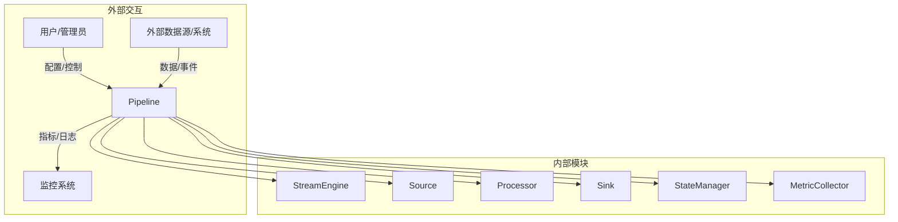
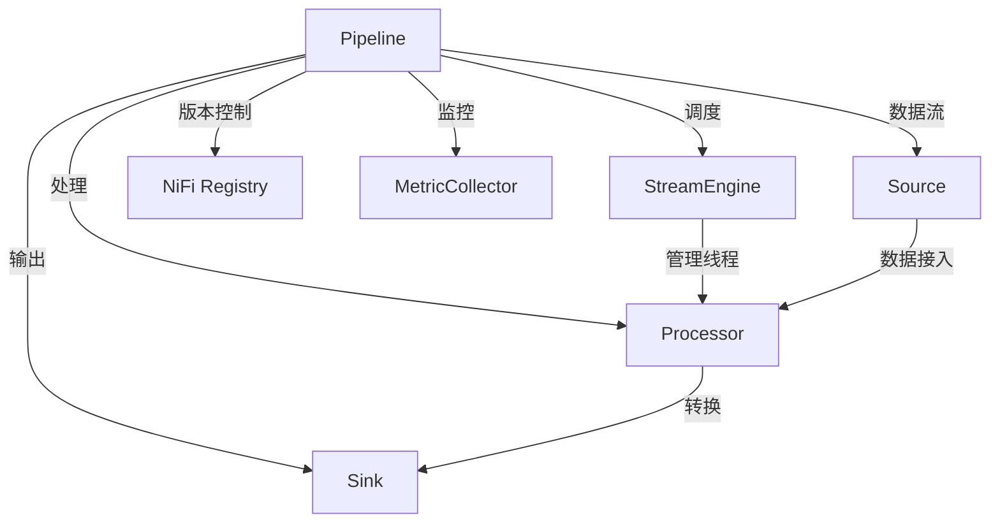
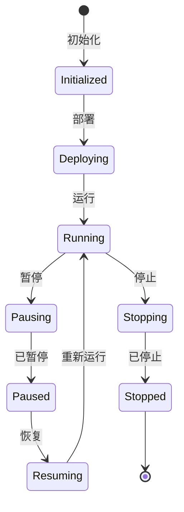
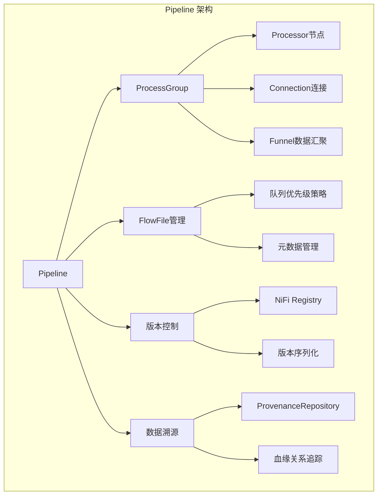

# Apache NiFi Pipeline 深度技术分析

## 1. 模块概述

### 1.1 模块定位
Pipeline 是 Apache NiFi 数据处理流程的"全链路载体"，是连接数据源、处理器和接收器的核心模块。它提供了数据流的可视化设计、版本管理、监控和溯源能力，是 NiFi 系统的神经中枢。

### 1.2 关键职责详细分析

#### 1.2.1 流程设计与编排
Pipeline 提供了高度灵活和直观的数据流程设计机制。

##### 设计核心机制
1. **组件抽象**
   - Processor：数据处理节点
   - Connection：数据传输通道
   - ProcessGroup：流程组，支持嵌套和模块化
   - Funnel：数据汇聚点

2. **可视化设计**
   ```java
   public class PipelineDesigner {
       public ProcessGroup createProcessGroup(String name) {
           ProcessGroup group = new StandardProcessGroup(name);
           return group;
       }
       
       public void addProcessor(ProcessGroup group, ProcessorDTO processorConfig) {
           Processor processor = processorFactory.createProcessor(processorConfig.getType());
           ProcessorNode node = new StandardProcessorNode(processor, processorConfig.getId());
           group.addProcessor(node);
       }
       
       public void createConnection(ProcessGroup group, ConnectionDTO connectionConfig) {
           Connection connection = new StandardConnection(
               group.getProcessor(connectionConfig.getSourceId()),
               group.getProcessor(connectionConfig.getDestinationId()),
               connectionConfig.getPrioritizer()
           );
           group.addConnection(connection);
       }
   }
   ```

#### 1.2.2 数据流转管控
管理数据在流程中的传输、路由和处理。

##### 数据流转关键机制
1. **FlowFile 抽象**
   ```java
   public class FlowFile {
       private final UUID uuid;
       private final Map<String, String> attributes;
       private final long size;
       
       public void addAttribute(String key, String value) {
           attributes.put(key, value);
       }
       
       public byte[] getContent() {
           // 获取文件内容
       }
   }
   ```

2. **Connection 队列管理**
   ```java
   public class ConnectionQueue {
       private final Queue<FlowFile> queue;
       private final QueuePrioritizer prioritizer;
       
       public void enqueue(FlowFile flowFile) {
           queue.offer(flowFile);
       }
       
       public FlowFile dequeue() {
           return prioritizer.selectNext(queue);
       }
   }
   ```

#### 1.2.3 版本管理
提供流程配置的版本控制和追溯能力。

##### 版本控制机制
```java
public class PipelineVersionController {
    private final NiFiRegistry registry;
    
    public void saveVersion(ProcessGroup group, String comment) {
        VersionedFlow versionedFlow = serializeProcessGroup(group);
        registry.saveVersion(versionedFlow, comment);
    }
    
    public void rollbackToVersion(String versionId) {
        VersionedFlow previousVersion = registry.getVersion(versionId);
        deserializeAndRestoreProcessGroup(previousVersion);
    }
}
```

#### 1.2.4 全链路监控与溯源
提供数据处理全流程的监控和追踪能力。

##### 数据溯源机制
```java
public class ProvenanceTracker {
    private final ProvenanceRepository repository;
    
    public void recordEvent(FlowFile flowFile, ProvenanceEventType eventType) {
        ProvenanceEvent event = new ProvenanceEvent(
            flowFile.getUuid(),
            eventType,
            System.currentTimeMillis()
        );
        repository.store(event);
    }
    
    public List<ProvenanceEvent> traceFlowFile(UUID flowFileId) {
        return repository.findEventsByFlowFileId(flowFileId);
    }
}
```

### 1.3 技术关键词详细分析

#### 1.3.1 可视化编排
提供拖拽式的流程设计界面，支持组件的灵活组合。

```java
public interface PipelineUIDesigner {
    void addProcessor(ProcessorType type, Position position);
    void createConnection(Processor source, Processor destination);
    void configureProcessorProperties(Processor processor, Map<String, String> properties);
}
```

#### 1.3.2 FlowFile
数据流转的基本单元，携带数据内容和元数据。

```java
public class FlowFileBuilder {
    private UUID uuid;
    private Map<String, String> attributes = new HashMap<>();
    private byte[] content;
    
    public FlowFile build() {
        return new FlowFile(uuid, attributes, content);
    }
    
    public FlowFileBuilder withAttribute(String key, String value) {
        attributes.put(key, value);
        return this;
    }
}
```

#### 1.3.3 ProcessGroup
支持流程组的嵌套和模块化管理。

```java
public class ProcessGroup {
    private final String id;
    private final List<Processor> processors;
    private final List<Connection> connections;
    private final List<ProcessGroup> childGroups;
    
    public void addProcessor(Processor processor) {
        processors.add(processor);
    }
    
    public void addChildGroup(ProcessGroup childGroup) {
        childGroups.add(childGroup);
    }
}
```

#### 1.3.4 数据 Lineage
记录数据从源头到目的地的完整处理路径。

```java
public class DataLineageTracker {
    public DataLineage trace(FlowFile flowFile) {
        List<ProcessorNode> path = new ArrayList<>();
        // 追踪 FlowFile 经过的处理器路径
        return new DataLineage(path);
    }
}
```

#### 1.3.5 版本化存储
将流程配置以可版本控制的方式存储。

```java
public class VersionedFlowSerializer {
    public String serialize(ProcessGroup group) {
        return new XMLSerializer().toXml(group);
    }
    
    public ProcessGroup deserialize(String xml) {
        return new XMLDeserializer().fromXml(xml);
    }
}
```

#### 1.3.6 队列优先级
定义数据处理的优先级策略。

```java
public interface QueuePrioritizer {
    FlowFile selectNext(Queue<FlowFile> queue);
}

public class OldestFirstPrioritizer implements QueuePrioritizer {
    @Override
    public FlowFile selectNext(Queue<FlowFile> queue) {
        return queue.stream()
            .min(Comparator.comparing(FlowFile::getTimestamp))
            .orElse(null);
    }
}
```

## 2. 系统上下文图



## 3. 组件交互图



## 4. 状态机设计



## 5. 性能指标

| 指标           | 目标值        | 说明                   |
|---------------|---------------|------------------------|
| 流程设计响应时间 | <100ms        | UI操作响应速度         |
| 数据路由延迟    | <10ms         | FlowFile 传输耗时      |
| 版本控制开销    | <50ms         | 版本保存和回滚时间     |
| 溯源查询性能    | <200ms        | 追踪数据处理路径       |

## 6. 架构可视化

### 6.1 Pipeline 架构组件关系图



## 7. 代码与使用结合

### 7.1 自定义 Pipeline 示例

```java
public class LogProcessingPipeline {
    public ProcessGroup createLogProcessingFlow() {
        ProcessGroup group = new ProcessGroup("log-processing");
        
        // 添加 GetFile 处理器
        Processor getFile = processorFactory.create("GetFile");
        getFile.setProperty("Input Directory", "/var/log");
        group.addProcessor(getFile);
        
        // 添加 SplitText 处理器
        Processor splitText = processorFactory.create("SplitText");
        splitText.setProperty("Line Split Count", "100");
        group.addProcessor(splitText);
        
        // 添加 PutKafka 处理器
        Processor putKafka = processorFactory.create("PutKafka");
        putKafka.setProperty("Kafka Topic", "log-events");
        group.addProcessor(putKafka);
        
        // 创建连接
        group.createConnection(getFile, splitText, new OldestFirstPrioritizer());
        group.createConnection(splitText, putKafka);
        
        return group;
    }
}
```

## 8. 总结与展望

### 8.1 核心优势
1. 可视化流程设计
2. 灵活的数据流转机制
3. 强大的版本控制
4. 精细的数据溯源能力
5. 高度可扩展的架构

### 8.2 未来发展方向
- 更智能的流程推荐
- 机器学习辅助的流程优化
- 更细粒度的性能监控
- 云原生和边缘计算支持 