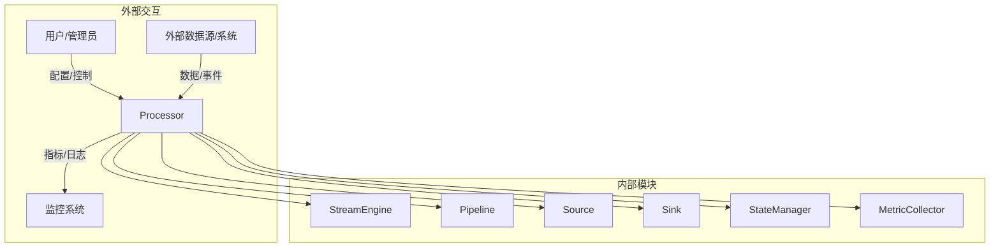
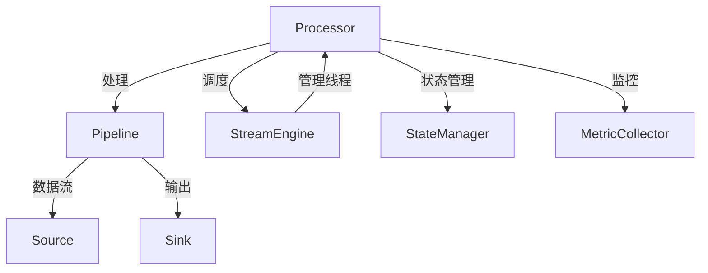
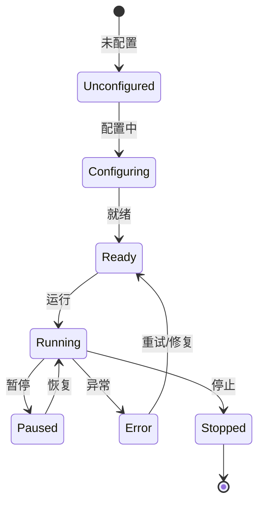
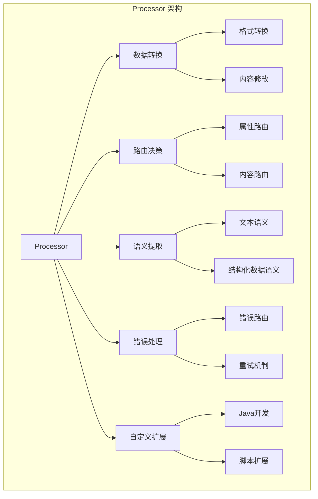

# Apache NiFi Processor 深度技术分析

## 1. 模块概述

### 1.1 模块定位
Processor 是 Apache NiFi 数据处理的"功能单元"，负责对 FlowFile 进行转换、路由、聚合等操作的核心组件。它是数据流处理系统中最灵活和强大的模块，提供了丰富的数据处理能力和高度可扩展的架构。

### 1.2 关键职责详细分析

#### 1.2.1 数据转换
提供多样化的数据格式转换和内容处理能力。

##### 转换机制实现
1. **格式转换接口**
```java
public interface DataTransformer {
    // 通用数据转换方法
    FlowFile transform(FlowFile input, ProcessContext context);
    
    // 特定格式转换
    FlowFile convertFormat(FlowFile input, String sourceFormat, String targetFormat);
    
    // 内容修改
    FlowFile modifyContent(FlowFile input, ContentModificationStrategy strategy);
}

// 具体实现示例
public class RecordTransformer implements DataTransformer {
    @Override
    public FlowFile transform(FlowFile input, ProcessContext context) {
        RecordReader reader = context.getProperty(RECORD_READER);
        RecordWriter writer = context.getProperty(RECORD_WRITER);
        
        // 读取记录
        List<Record> records = reader.readRecords(input);
        
        // 转换记录
        List<Record> transformedRecords = records.stream()
            .map(this::applyTransformations)
            .collect(Collectors.toList());
        
        // 写入新的 FlowFile
        return writer.writeRecords(transformedRecords);
    }
}
```

2. **内容处理策略**
```java
public enum ContentModificationStrategy {
    REPLACE,        // 完全替换内容
    APPEND,         // 追加内容
    PREPEND,        // 前置内容
    REGEX_REPLACE,  // 正则替换
    TRANSFORM       // 自定义转换
}
```

#### 1.2.2 路由决策
根据数据属性和内容进行智能路由。

##### 路由机制设计
1. **路由规则定义**
```java
public class RouteRule {
    private String attributeName;
    private String condition;
    private Relationship targetRelationship;
    
    public boolean evaluate(FlowFile flowFile) {
        String attributeValue = flowFile.getAttribute(attributeName);
        return matchCondition(attributeValue);
    }
}

public class RouteProcessor extends AbstractProcessor {
    public static final Relationship SUCCESS = new Relationship.Builder()
        .name("success")
        .description("Successful routing")
        .build();
    
    public static final Relationship FAILURE = new Relationship.Builder()
        .name("failure")
        .description("Failed routing")
        .build();
    
    @Override
    public void onTrigger(ProcessContext context, ProcessSession session) {
        FlowFile flowFile = session.get();
        if (flowFile == null) return;
        
        List<RouteRule> rules = context.getProperty(ROUTING_RULES);
        
        for (RouteRule rule : rules) {
            if (rule.evaluate(flowFile)) {
                session.transfer(flowFile, rule.getTargetRelationship());
                return;
            }
        }
        
        // 默认路由
        session.transfer(flowFile, FAILURE);
    }
}
```

2. **复杂路由策略**
```java
public class AdvancedRouteProcessor {
    public void routeByMultipleCriteria(FlowFile flowFile) {
        // 多维度路由决策
        boolean isHighValue = evaluateHighValueCriteria(flowFile);
        boolean isUrgent = evaluateUrgencyCriteria(flowFile);
        
        if (isHighValue && isUrgent) {
            transferToHighPriorityQueue(flowFile);
        } else if (isHighValue) {
            transferToStandardQueue(flowFile);
        } else {
            transferToLowPriorityQueue(flowFile);
        }
    }
}
```

#### 1.2.3 语义提取
从非结构化数据中提取关键信息。

##### 语义提取机制
1. **文本语义提取**
```java
public class TextSemanticExtractor {
    public Map<String, String> extractSemantics(String text) {
        Map<String, String> semantics = new HashMap<>();
        
        // 身份证号提取
        semantics.put("idCard", extractIdCard(text));
        
        // 电话号码提取
        semantics.put("phoneNumber", extractPhoneNumber(text));
        
        // 邮箱提取
        semantics.put("email", extractEmail(text));
        
        return semantics;
    }
    
    private String extractIdCard(String text) {
        Pattern pattern = Pattern.compile("\\d{17}[\\dX]");
        Matcher matcher = pattern.matcher(text);
        return matcher.find() ? matcher.group() : null;
    }
}
```

2. **JSON/XML语义提取**
```java
public class StructuredDataSemanticExtractor {
    public Map<String, Object> extractJsonSemantics(String jsonContent) {
        JSONObject json = new JSONObject(jsonContent);
        
        return new HashMap<String, Object>() {{
            put("userId", json.optString("user.id"));
            put("transactionAmount", json.optDouble("transaction.amount"));
            put("timestamp", json.optLong("transaction.timestamp"));
        }};
    }
}
```

#### 1.2.4 错误处理
提供灵活的错误捕获、路由和恢复机制。

##### 错误处理策略
1. **错误路由**
```java
public class ErrorHandlingProcessor extends AbstractProcessor {
    public static final Relationship SUCCESS = new Relationship.Builder()
        .name("success")
        .build();
    
    public static final Relationship FAILURE = new Relationship.Builder()
        .name("failure")
        .build();
    
    public static final Relationship RETRY = new Relationship.Builder()
        .name("retry")
        .build();
    
    @Override
    public void onTrigger(ProcessContext context, ProcessSession session) {
        FlowFile flowFile = session.get();
        if (flowFile == null) return;
        
        try {
            // 处理逻辑
            processFlowFile(flowFile);
            session.transfer(flowFile, SUCCESS);
        } catch (TransientException e) {
            // 可恢复的临时错误，进入重试队列
            session.transfer(flowFile, RETRY);
        } catch (PermanentException e) {
            // 不可恢复的永久性错误
            flowFile = session.putAttribute(flowFile, "error.message", e.getMessage());
            session.transfer(flowFile, FAILURE);
        }
    }
}
```

2. **重试机制**
```java
public class RetryStrategy {
    private static final int MAX_RETRIES = 3;
    private static final long BASE_DELAY = 1000; // 1秒
    
    public long calculateRetryDelay(int retryCount) {
        // 指数退避策略
        return BASE_DELAY * (long) Math.pow(2, retryCount);
    }
    
    public boolean shouldRetry(int retryCount, Throwable error) {
        return retryCount < MAX_RETRIES && isRetryableError(error);
    }
}
```

#### 1.2.5 自定义处理器开发
提供灵活的处理器扩展机制。

##### 扩展开发机制
1. **处理器开发接口**
```java
public abstract class AbstractCustomProcessor extends AbstractProcessor {
    // 定义属性描述符
    protected List<PropertyDescriptor> descriptors;
    
    // 定义输出关系
    protected Set<Relationship> relationships;
    
    @Override
    protected void init(ProcessorInitializationContext context) {
        // 初始化属性和关系
        descriptors = new ArrayList<>();
        relationships = new HashSet<>();
        
        // 添加自定义属性
        descriptors.add(new PropertyDescriptor.Builder()
            .name("Custom Property")
            .description("A custom processor property")
            .required(false)
            .build());
        
        // 添加输出关系
        relationships.add(new Relationship.Builder()
            .name("success")
            .description("Successful processing")
            .build());
    }
    
    @Override
    public Set<Relationship> getRelationships() {
        return relationships;
    }
    
    @Override
    public List<PropertyDescriptor> getSupportedPropertyDescriptors() {
        return descriptors;
    }
}
```

2. **动态脚本处理**
```java
public class ScriptedProcessor extends AbstractProcessor {
    private ScriptEngine scriptEngine;
    
    @Override
    public void onTrigger(ProcessContext context, ProcessSession session) {
        String scriptContent = context.getProperty("script.content");
        String scriptLanguage = context.getProperty("script.language");
        
        scriptEngine = new ScriptEngineManager().getEngineByName(scriptLanguage);
        scriptEngine.put("session", session);
        
        try {
            scriptEngine.eval(scriptContent);
        } catch (ScriptException e) {
            // 错误处理
        }
    }
}
```

### 1.3 技术关键词详细分析

#### 1.3.1 内置处理器
提供300+预定义处理器，覆盖各类数据处理场景。

```java
public enum ProcessorCategory {
    DATA_TRANSFORMATION,  // 数据转换
    ROUTING_AND_MEDIATION,// 路由与中介
    ATTRIBUTE_MANIPULATION, // 属性操作
    DATABASE,             // 数据库操作
    MESSAGING,            // 消息处理
    SYSTEM,               // 系统操作
    SOCIAL,               // 社交媒体
    MACHINE_LEARNING      // 机器学习
}
```

#### 1.3.2 Processor API
定义处理器的标准接口和生命周期。

```java
public interface Processor {
    void initialize(ProcessorInitializationContext context);
    void onTrigger(ProcessContext context, ProcessSession session);
    Set<Relationship> getRelationships();
    List<PropertyDescriptor> getSupportedPropertyDescriptors();
}
```

#### 1.3.3 动态属性
支持运行时动态配置处理器属性。

```java
public class DynamicPropertySupport {
    public void configureDynamicProperties(Map<String, String> dynamicProperties) {
        dynamicProperties.forEach((key, value) -> {
            PropertyDescriptor descriptor = new PropertyDescriptor.Builder()
                .name(key)
                .description("Dynamically added property")
                .dynamic(true)
                .build();
            
            setProperty(descriptor, value);
        });
    }
}
```

#### 1.3.4 ExecuteScript
支持动态脚本执行的处理器。

```java
public class ScriptExecutionContext {
    private final ScriptEngine engine;
    private final ProcessSession session;
    private final ProcessContext context;
    
    public Object executeScript(String script, String language) {
        engine.put("session", session);
        engine.put("context", context);
        
        return engine.eval(script);
    }
}
```

#### 1.3.5 错误路由
提供灵活的错误处理和路由机制。

```java
public enum ErrorRoutingStrategy {
    ROUTE_TO_FAILURE,     // 路由到失败队列
    ROUTE_TO_SUCCESS,     // 路由到成功队列
    ROUTE_TO_RETRY,       // 路由到重试队列
    DROP                  // 丢弃
}
```

#### 1.3.6 自定义Processor开发
支持用户通过Java或脚本开发处理器。

```java
public interface ProcessorDevelopmentSupport {
    void registerCustomProcessor(Class<? extends Processor> processorClass);
    void loadProcessorFromScript(String scriptContent, String language);
}
```

## 2. 系统上下文图



## 3. 组件交互图



## 4. 状态机设计



## 5. 性能指标

| 指标           | 目标值        | 说明                   |
|---------------|---------------|------------------------|
| 数据转换延迟    | <50ms         | 数据处理耗时           |
| 路由决策性能    | <10ms         | 路由规则匹配耗时       |
| 错误处理开销    | <20ms         | 错误捕获和路由耗时     |
| 脚本执行性能    | <100ms        | 动态脚本执行耗时       |

## 6. 架构可视化

### 6.1 Processor 架构组件关系图



## 7. 代码与使用结合

### 7.1 自定义处理器示例

```java
public class UserProfileEnrichmentProcessor extends AbstractProcessor {
    private static final PropertyDescriptor API_ENDPOINT = new PropertyDescriptor.Builder()
        .name("User Profile API")
        .description("API endpoint for user profile enrichment")
        .required(true)
        .build();
    
    private static final Relationship SUCCESS = new Relationship.Builder()
        .name("success")
        .description("Successfully enriched user profile")
        .build();
    
    private static final Relationship FAILURE = new Relationship.Builder()
        .name("failure")
        .description("Failed to enrich user profile")
        .build();
    
    @Override
    public void onTrigger(ProcessContext context, ProcessSession session) {
        FlowFile flowFile = session.get();
        if (flowFile == null) return;
        
        try {
            // 读取用户ID
            String userId = flowFile.getAttribute("user.id");
            
            // 调用外部API获取用户详细信息
            UserProfile profile = fetchUserProfile(userId);
            
            // 将用户信息写入 FlowFile
            flowFile = session.write(flowFile, out -> {
                out.write(serializeUserProfile(profile));
            });
            
            // 添加用户画像属性
            flowFile = session.putAttribute(flowFile, "profile.age", String.valueOf(profile.getAge()));
            flowFile = session.putAttribute(flowFile, "profile.interests", String.join(",", profile.getInterests()));
            
            session.transfer(flowFile, SUCCESS);
        } catch (Exception e) {
            session.transfer(flowFile, FAILURE);
        }
    }
}
```

### 7.2 动态脚本处理器示例

```java
public class DynamicDataTransformProcessor extends AbstractProcessor {
    @Override
    public void onTrigger(ProcessContext context, ProcessSession session) {
        FlowFile flowFile = session.get();
        if (flowFile == null) return;
        
        String scriptLanguage = context.getProperty("script.language");
        String scriptContent = context.getProperty("script.content");
        
        ScriptEngine engine = new ScriptEngineManager().getEngineByName(scriptLanguage);
        engine.put("session", session);
        engine.put("flowFile", flowFile);
        
        try {
            engine.eval(scriptContent);
        } catch (ScriptException e) {
            // 错误处理
        }
    }
}
```

## 8. 总结与展望

### 8.1 核心优势
1. 丰富的数据处理能力
2. 灵活的路由机制
3. 强大的错误处理
4. 可扩展的处理器架构
5. 动态脚本支持

### 8.2 未来发展方向
- 更智能的数据处理算法
- 机器学习增强的处理器
- 更细粒度的性能监控
- 云原生和边缘计算支持 