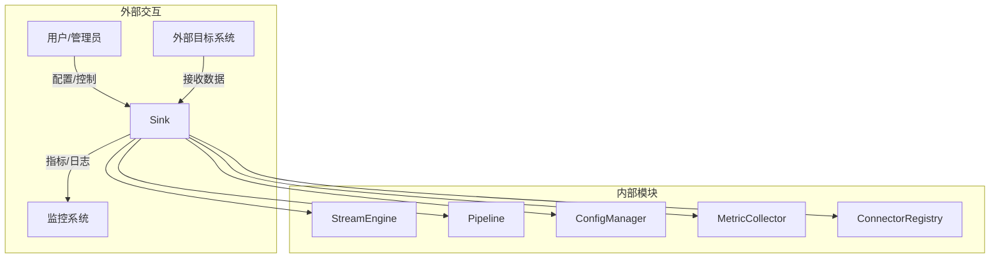
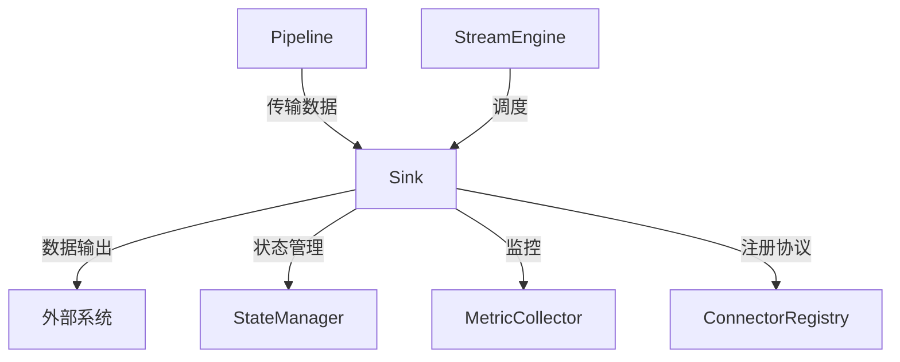
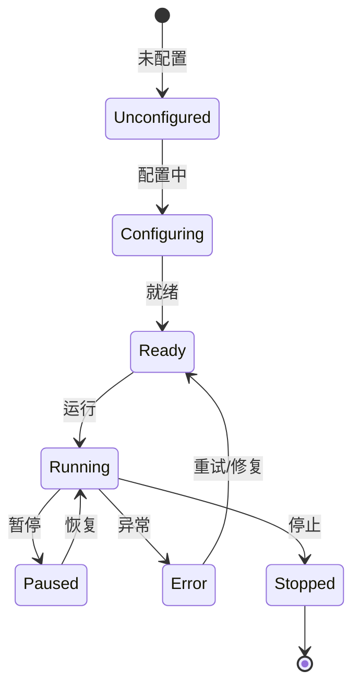
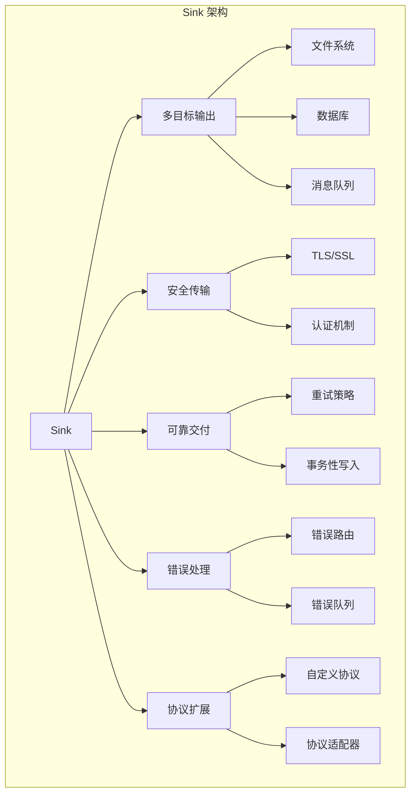

# Apache NiFi Sink 深度技术分析

## 1. 模块概述

### 1.1 模块定位
Sink 是 Apache NiFi 数据流转的"出口通道"，负责将处理后的数据输出到外部目标系统的底层模块。它是整个数据流处理系统的数据出口，提供了安全、可靠、高性能的数据输出能力。

### 1.2 关键职责详细分析

#### 1.2.1 多目标数据输出
提供对多种目标系统的数据输出支持。

##### 数据输出机制
1. **输出接口定义**
```java
public interface MultiTargetSink {
    // 文件系统输出
    void writeToFileSystem(FlowFile flowFile, Path outputPath);
    
    // 数据库输出
    void writeToDatabaseRecord(FlowFile flowFile, DatabaseConnection connection);
    
    // 消息队列输出
    void publishToMessageQueue(FlowFile flowFile, MessageQueueConfig config);
    
    // 自定义目标系统输出
    <T> void writeToCustomTarget(FlowFile flowFile, T targetConfig);
}
```

2. **输出目标适配器**
```java
public abstract class AbstractTargetAdapter {
    protected Properties config;
    
    public void initialize(Properties outputConfig) {
        this.config = outputConfig;
    }
    
    public abstract void write(FlowFile flowFile);
    
    protected void logOutputActivity(String message) {
        // 记录输出活动日志
    }
}

// 具体实现示例：文件系统输出适配器
public class FileSystemOutputAdapter extends AbstractTargetAdapter {
    @Override
    public void write(FlowFile flowFile) {
        Path outputPath = Paths.get(config.getProperty("output.directory"), 
                                    flowFile.getAttribute("filename"));
        try {
            Files.write(outputPath, flowFile.getContent(), 
                        StandardOpenOption.CREATE, 
                        StandardOpenOption.TRUNCATE_EXISTING);
        } catch (IOException e) {
            // 错误处理
        }
    }
}
```

#### 1.2.2 安全数据传输
提供多层次的安全输出机制。

##### 安全传输实现
1. **安全协议支持**
```java
public interface SecureTransferManager {
    // 配置 TLS/SSL
    void configureTLS(TLSContext context);
    
    // 配置认证
    void configureAuthentication(AuthenticationCredentials credentials);
    
    // 加密数据传输
    byte[] encryptData(byte[] data, EncryptionContext context);
}

public class SecureTransferConfiguration {
    private SecurityProtocol protocol;
    private AuthenticationMethod authMethod;
    private EncryptionAlgorithm encryptionAlgorithm;
    
    // 安全配置构建器
    public static class Builder {
        public SecureTransferConfiguration build() {
            SecureTransferConfiguration config = new SecureTransferConfiguration();
            config.protocol = SecurityProtocol.TLS;
            config.authMethod = AuthenticationMethod.OAUTH2;
            config.encryptionAlgorithm = EncryptionAlgorithm.AES_256;
            return config;
        }
    }
}
```

2. **认证机制**
```java
public class SecureOutputAuthenticator {
    public boolean authenticateOutput(OutputTarget target, Credentials credentials) {
        switch (target.getAuthenticationType()) {
            case OAUTH2:
                return validateOAuth2Token(credentials);
            case CLIENT_CERTIFICATE:
                return validateClientCertificate(credentials);
            case USERNAME_PASSWORD:
                return validateUsernamePassword(credentials);
            default:
                throw new UnsupportedAuthenticationException();
        }
    }
    
    private boolean validateOAuth2Token(Credentials credentials) {
        OAuth2Service service = new OAuth2Service();
        return service.validateToken(credentials.getToken());
    }
}
```

#### 1.2.3 可靠交付机制
确保数据成功传输到目标系统。

##### 可靠性实现
1. **重试机制**
```java
public class ReliableOutputManager {
    private static final int MAX_RETRIES = 3;
    private static final long BASE_RETRY_DELAY = 1000; // 1秒
    
    public boolean attemptOutput(OutputOperation operation) {
        int retryCount = 0;
        
        while (retryCount < MAX_RETRIES) {
            try {
                operation.execute();
                return true; // 成功
            } catch (TransientOutputException e) {
                // 可恢复的临时错误
                long delay = calculateExponentialBackoff(retryCount);
                Thread.sleep(delay);
                retryCount++;
            }
        }
        
        return false; // 最终失败
    }
    
    private long calculateExponentialBackoff(int retryCount) {
        // 指数退避策略
        return BASE_RETRY_DELAY * (long) Math.pow(2, retryCount);
    }
}

// 使用示例
public class KafkaOutputOperation implements OutputOperation {
    @Override
    public void execute() throws TransientOutputException {
        try {
            kafkaProducer.send(record);
        } catch (KafkaException e) {
            throw new TransientOutputException(e);
        }
    }
}
```

2. **事务性写入**
```java
public class TransactionalOutputManager {
    public void writeWithTransaction(OutputTarget target, List<FlowFile> flowFiles) {
        Transaction transaction = target.beginTransaction();
        
        try {
            for (FlowFile flowFile : flowFiles) {
                target.write(flowFile);
            }
            transaction.commit();
        } catch (Exception e) {
            transaction.rollback();
            // 错误处理
        } finally {
            transaction.close();
        }
    }
}
```

#### 1.2.4 错误处理与路由
提供灵活的错误处理和路由机制。

##### 错误处理策略
```java
public class SinkErrorHandler {
    private static final Relationship SUCCESS = new Relationship.Builder()
        .name("success")
        .description("Successful output")
        .build();
    
    private static final Relationship FAILURE = new Relationship.Builder()
        .name("failure")
        .description("Output failed")
        .build();
    
    private static final Relationship RETRY = new Relationship.Builder()
        .name("retry")
        .description("Retry output")
        .build();
    
    public void handleOutputError(FlowFile flowFile, Throwable error) {
        if (isTransientError(error)) {
            // 可恢复错误，路由到重试队列
            routeToRetry(flowFile);
        } else {
            // 不可恢复错误，路由到失败队列
            routeToFailure(flowFile, error);
        }
    }
    
    private void routeToRetry(FlowFile flowFile) {
        // 将 FlowFile 放入重试队列
        flowFile.setAttribute("retry.count", 
            String.valueOf(Integer.parseInt(
                flowFile.getAttribute("retry.count", "0")) + 1)
        );
    }
    
    private void routeToFailure(FlowFile flowFile, Throwable error) {
        // 记录错误详情
        flowFile.setAttribute("error.message", error.getMessage());
        flowFile.setAttribute("error.type", error.getClass().getName());
    }
}
```

#### 1.2.5 自定义输出协议扩展
提供灵活的输出协议注册和扩展机制。

##### 协议扩展实现
```java
public interface OutputProtocolAdapter {
    void initialize(Properties config);
    void write(FlowFile flowFile);
    void close();
}

public class CustomOutputProtocolRegistry {
    private Map<String, Class<? extends OutputProtocolAdapter>> registeredProtocols 
        = new ConcurrentHashMap<>();
    
    public void registerProtocol(String protocolName, 
                                  Class<? extends OutputProtocolAdapter> adapterClass) {
        registeredProtocols.put(protocolName, adapterClass);
    }
    
    public OutputProtocolAdapter createAdapter(String protocolName) throws Exception {
        Class<? extends OutputProtocolAdapter> adapterClass = 
            registeredProtocols.get(protocolName);
        
        if (adapterClass == null) {
            throw new UnsupportedProtocolException(protocolName);
        }
        
        return adapterClass.getDeclaredConstructor().newInstance();
    }
}
```

### 1.3 技术关键词详细分析

#### 1.3.1 多目标输出
支持多种目标系统的数据输出。

```java
public enum OutputTargetType {
    FILE_SYSTEM,    // 文件系统
    DATABASE,       // 数据库
    MESSAGE_QUEUE,  // 消息队列
    SEARCH_ENGINE,  // 搜索引擎
    REST_API,       // REST API
    CUSTOM          // 自定义目标
}
```

#### 1.3.2 安全传输协议
提供多种安全传输协议支持。

```java
public enum SecurityProtocol {
    TLS,        // 传输层安全
    HTTPS,      // 安全 HTTP
    SFTP,       // 安全文件传输
    SSL         // 安全套接字层
}
```

#### 1.3.3 可靠交付策略
定义数据输出的可靠性保障机制。

```java
public enum ReliabilityStrategy {
    AT_MOST_ONCE,       // 最多一次
    AT_LEAST_ONCE,      // 至少一次
    EXACTLY_ONCE        // 精确一次
}
```

#### 1.3.4 错误路由机制
提供灵活的错误处理和路由策略。

```java
public enum ErrorRoutingStrategy {
    RETRY,          // 重试
    ROUTE_TO_ERROR, // 路由到错误队列
    DROP,           // 丢弃
    DEAD_LETTER     // 发送到死信队列
}
```

#### 1.3.5 输出协议扩展接口
定义输出协议扩展的标准接口。

```java
public interface OutputProtocolExtension {
    String getName();
    void register(CustomOutputProtocolRegistry registry);
    OutputProtocolAdapter createAdapter();
}
```

#### 1.3.6 输出目标元数据
记录输出目标的详细信息。

```java
public class OutputTargetMetadata {
    private String id;
    private OutputTargetType type;
    private String connectionString;
    private Map<String, String> additionalProperties;
    private SecurityConfiguration securityConfig;
}
```

## 2. 系统上下文图



## 3. 组件交互图



## 4. 状态机设计



## 5. 性能指标

| 指标           | 目标值        | 说明                   |
|---------------|---------------|------------------------|
| 数据输出延迟    | <50ms         | 数据写入目标系统耗时     |
| 并发输出能力    | 100+          | 支持的最大并发输出连接   |
| 重试开销        | <100ms        | 重试机制额外耗时         |
| 事务提交性能    | <200ms        | 事务性写入耗时           |

## 6. 架构可视化

### 6.1 Sink 架构组件关系图



## 7. 代码与使用结合

### 7.1 自定义 Redis 输出适配器示例

```java
public class RedisOutputAdapter implements OutputProtocolAdapter {
    private RedisClient redisClient;
    
    @Override
    public void initialize(Properties config) {
        String host = config.getProperty("redis.host", "localhost");
        int port = Integer.parseInt(config.getProperty("redis.port", "6379"));
        
        redisClient = RedisClient.create(
            RedisURI.create(host, port)
        );
    }
    
    @Override
    public void write(FlowFile flowFile) {
        try (StatefulRedisConnection<String, String> connection = 
                redisClient.connect()) {
            
            RedisCommands<String, String> commands = connection.sync();
            
            String key = flowFile.getAttribute("redis.key");
            String value = new String(flowFile.getContent());
            String dataType = flowFile.getAttribute("redis.data.type", "string");
            
            switch (dataType.toLowerCase()) {
                case "string":
                    commands.set(key, value);
                    break;
                case "hash":
                    Map<String, String> hashData = parseHashData(value);
                    commands.hmset(key, hashData);
                    break;
                case "list":
                    commands.rpush(key, value.split("\n"));
                    break;
                default:
                    throw new IllegalArgumentException("Unsupported Redis data type");
            }
        }
    }
    
    @Override
    public void close() {
        if (redisClient != null) {
            redisClient.shutdown();
        }
    }
}
```

### 7.2 动态注册自定义输出协议

```java
public class RedisOutputProtocolExtension implements OutputProtocolExtension {
    @Override
    public String getName() {
        return "redis";
    }
    
    @Override
    public void register(CustomOutputProtocolRegistry registry) {
        registry.registerProtocol(getName(), RedisOutputAdapter.class);
    }
    
    @Override
    public OutputProtocolAdapter createAdapter() {
        return new RedisOutputAdapter();
    }
}
```

## 8. 总结与展望

### 8.1 核心优势
1. 多目标数据输出
2. 灵活的安全传输机制
3. 可靠的数据交付能力
4. 强大的错误处理
5. 可扩展的输出协议

### 8.2 未来发展方向
- 更智能的目标系统适配
- 机器学习辅助的输出优化
- 更细粒度的性能监控
- 云原生和边缘计算支持 