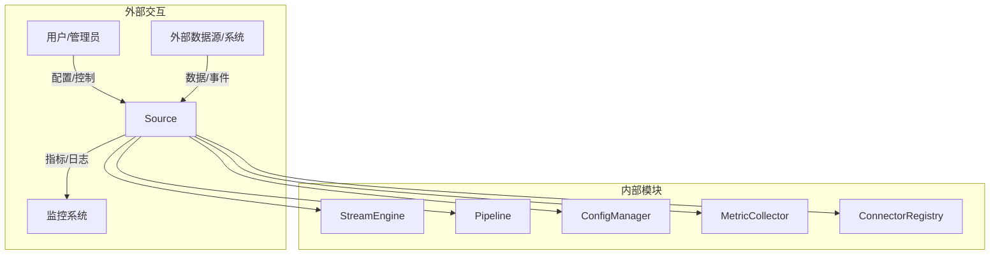
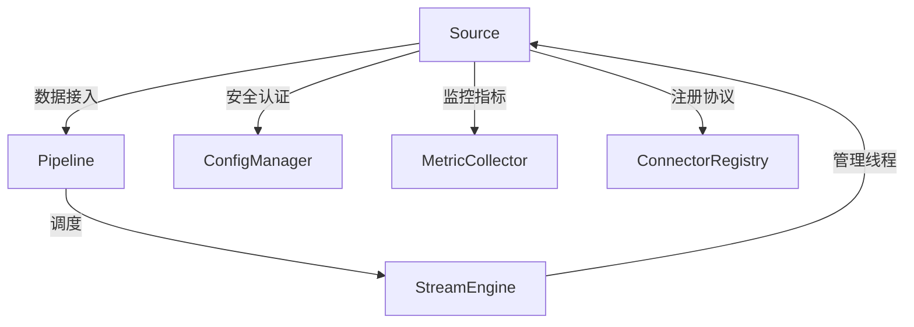
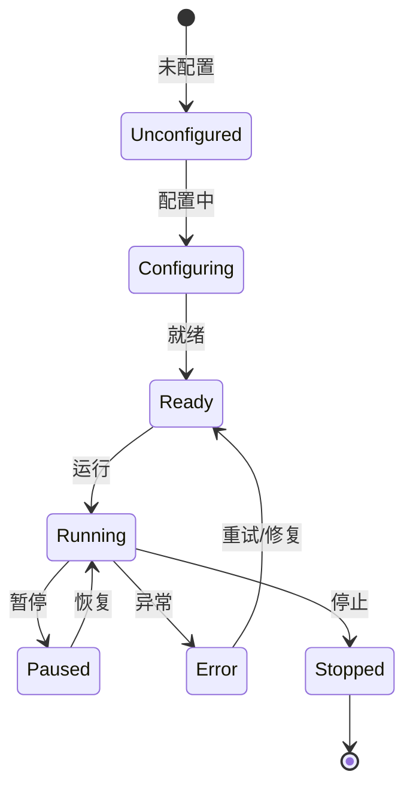
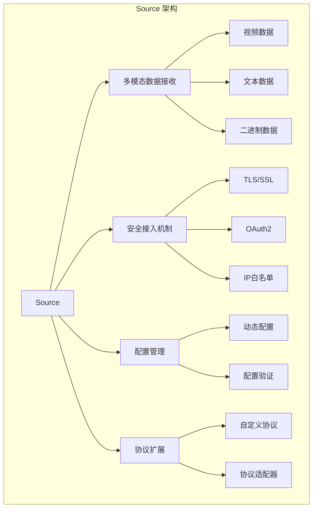

# Apache NiFi Source 深度技术分析

## 1. 模块概述

### 1.1 模块定位
Source 是 Apache NiFi 数据流转的"入口枢纽"，负责从外部系统接入各类数据并传递至 Pipeline 的底层模块。它是整个数据流处理系统的数据入口，提供了灵活、安全、高性能的数据接入能力。

### 1.2 关键职责详细分析

#### 1.2.1 多模态数据接收
提供对多种数据类型和格式的接入支持。

##### 数据类型处理机制
1. **接口定义**
```java
public interface MultiModalSource {
    // 视频数据接收
    void receiveVideo(VideoPacket packet);
    
    // 文本数据接收
    void receiveText(TextPacket packet);
    
    // 二进制数据接收
    void receiveBinary(BinaryPacket packet);
    
    // 自定义数据类型接收
    <T> void receiveCustom(CustomDataPacket<T> packet);
}
```

2. **数据包装器**
```java
public class VideoPacket {
    private byte[] frameData;
    private long timestamp;
    private VideoCodec codec; // H.264/H.265
    private Dimension resolution;
    
    // 帧类型（I帧/P帧/B帧）
    private FrameType frameType;
}

public class TextPacket {
    private String content;
    private Charset encoding; // UTF-8/GBK
    private Map<String, String> metadata;
}
```

3. **编码检测与转换**
```java
public class EncodingDetector {
    public Charset detectEncoding(byte[] data) {
        // 自动检测文本编码
        CharsetDetector detector = new CharsetDetector();
        detector.setText(data);
        return detector.detect();
    }
    
    public byte[] convertEncoding(byte[] data, Charset sourceEncoding, Charset targetEncoding) {
        return new String(data, sourceEncoding)
            .getBytes(targetEncoding);
    }
}
```

#### 1.2.2 安全数据接收
提供多层次的安全接入机制。

##### 安全机制实现
1. **加密协议支持**
```java
public interface SecureSource {
    // 配置 TLS/SSL
    void configureTLS(TLSContext context);
    
    // OAuth2 认证
    void authenticate(OAuth2Token token);
    
    // IP 白名单
    void configureIPWhitelist(List<String> allowedIPs);
}

public class TLSContextBuilder {
    public TLSContext build() {
        return new TLSContext.Builder()
            .setProtocol("TLS")
            .setKeyStore("/path/to/keystore.jks")
            .setTrustStore("/path/to/truststore.jks")
            .build();
    }
}
```

2. **认证机制**
```java
public class AuthenticationManager {
    public boolean validateOAuth2Token(OAuth2Token token) {
        // 调用外部 OAuth2 服务验证
        OAuthService service = new OAuthService();
        return service.validateToken(token);
    }
    
    public boolean checkIPWhitelist(String clientIP) {
        Set<String> allowedIPs = loadAllowedIPs();
        return allowedIPs.contains(clientIP);
    }
}
```

#### 1.2.3 接入参数配置
提供灵活的数据源配置能力。

##### 配置管理机制
1. **配置解析**
```java
public class SourceConfigParser {
    public SourceConfiguration parse(Properties properties) {
        SourceConfiguration config = new SourceConfiguration();
        
        // 协议相关配置
        config.setProtocol(properties.getProperty("protocol"));
        config.setHost(properties.getProperty("host"));
        config.setPort(Integer.parseInt(properties.getProperty("port")));
        
        // 安全配置
        config.setSecurityMode(properties.getProperty("security.mode"));
        
        // 高级配置
        config.setMaxConnections(Integer.parseInt(properties.getProperty("max.connections", "10")));
        config.setConnectTimeout(Integer.parseInt(properties.getProperty("connect.timeout", "5000")));
        
        return config;
    }
}
```

2. **动态配置更新**
```java
public class DynamicSourceConfigurator {
    public void updateConfiguration(String sourceId, Map<String, String> newConfig) {
        SourceConfiguration currentConfig = getSourceConfiguration(sourceId);
        currentConfig.update(newConfig);
        
        // 通知相关组件配置已变更
        notifyConfigurationChange(sourceId, currentConfig);
    }
}
```

#### 1.2.4 数据源验证
确保数据源的可用性和合法性。

##### 验证机制
```java
public class DataSourceValidator {
    public ValidationResult validate(SourceConfiguration config) {
        ValidationResult result = new ValidationResult();
        
        // 连接性检查
        if (!checkConnectivity(config)) {
            result.addError("无法建立连接");
        }
        
        // 权限检查
        if (!checkPermissions(config)) {
            result.addError("权限不足");
        }
        
        // 数据格式检查
        if (!validateDataFormat(config)) {
            result.addError("数据格式不匹配");
        }
        
        return result;
    }
}
```

#### 1.2.5 自定义协议扩展
提供灵活的协议注册和扩展机制。

##### 协议扩展实现
```java
public interface ProtocolAdapter {
    void initialize(Properties config);
    DataPacket receive();
    void close();
}

public class CustomProtocolRegistry {
    private Map<String, Class<? extends ProtocolAdapter>> registeredProtocols = new ConcurrentHashMap<>();
    
    public void registerProtocol(String protocolName, Class<? extends ProtocolAdapter> adapterClass) {
        registeredProtocols.put(protocolName, adapterClass);
    }
    
    public ProtocolAdapter createAdapter(String protocolName) throws Exception {
        Class<? extends ProtocolAdapter> adapterClass = registeredProtocols.get(protocolName);
        if (adapterClass == null) {
            throw new UnsupportedProtocolException(protocolName);
        }
        return adapterClass.getDeclaredConstructor().newInstance();
    }
}
```

### 1.3 技术关键词详细分析

#### 1.3.1 多模态数据
支持多种数据类型的接入和处理。

```java
public enum DataType {
    VIDEO,   // 视频流
    TEXT,    // 文本数据
    BINARY,  // 二进制数据
    AUDIO,   // 音频流
    CUSTOM   // 自定义数据类型
}
```

#### 1.3.2 输入适配器（Adapter）
提供协议和数据格式的转换能力。

```java
public abstract class AbstractProtocolAdapter implements ProtocolAdapter {
    protected Properties config;
    
    public void initialize(Properties config) {
        this.config = config;
        // 初始化适配器
    }
    
    public abstract DataPacket receive();
    
    protected void logAdapterActivity(String message) {
        // 记录适配器活动日志
    }
}
```

#### 1.3.3 加密协议
支持多种安全传输协议。

```java
public enum SecurityProtocol {
    TLS,     // 传输层安全
    SSH,     // 安全外壳协议
    HTTPS,   // 安全HTTP
    SFTP     // 安全文件传输
}
```

#### 1.3.4 认证机制
提供多种身份认证方式。

```java
public interface AuthenticationStrategy {
    boolean authenticate(Credentials credentials);
}

public class OAuth2AuthStrategy implements AuthenticationStrategy {
    public boolean authenticate(Credentials credentials) {
        OAuth2Credentials oauthCreds = (OAuth2Credentials) credentials;
        return validateToken(oauthCreds.getAccessToken());
    }
}
```

#### 1.3.5 协议扩展接口
定义协议扩展的标准接口。

```java
public interface ProtocolExtension {
    String getName();
    void register(CustomProtocolRegistry registry);
    ProtocolAdapter createAdapter();
}
```

#### 1.3.6 数据源元数据
记录数据源的详细信息。

```java
public class SourceMetadata {
    private String id;
    private String type;
    private String protocol;
    private Map<String, String> connectionProperties;
    private SecurityConfiguration securityConfig;
    
    // Getters and setters
}
```

## 2. 系统上下文图



## 3. 组件交互图



## 4. 状态机设计



## 5. 性能指标

| 指标           | 目标值        | 说明                   |
|---------------|---------------|------------------------|
| 数据接入延迟    | <50ms         | 数据包处理耗时         |
| 并发连接数      | 100+          | 支持的最大并发连接     |
| 安全认证开销    | <20ms         | 认证耗时               |
| 协议转换性能    | <10ms         | 数据包转换耗时         |

## 6. 架构可视化

### 6.1 Source 架构组件关系图



## 7. 代码与使用结合

### 7.1 自定义 Modbus 协议数据源示例

```java
public class ModbusSourceAdapter implements ProtocolAdapter {
    private ModbusMaster modbusMaster;
    
    @Override
    public void initialize(Properties config) {
        String port = config.getProperty("serial.port");
        int baudRate = Integer.parseInt(config.getProperty("baud.rate"));
        
        // 初始化 Modbus 连接
        modbusMaster = new ModbusMasterFactory()
            .createRTUMaster(port, baudRate);
    }
    
    @Override
    public DataPacket receive() {
        try {
            // 读取传感器寄存器数据
            ReadHoldingRegistersRequest request = 
                new ReadHoldingRegistersRequest(0, 2);
            ReadHoldingRegistersResponse response = 
                (ReadHoldingRegistersResponse) modbusMaster.send(request);
            
            return new ModbusDataPacket(response.getData());
        } catch (Exception e) {
            // 错误处理
            return null;
        }
    }
}
```

### 7.2 动态注册自定义协议

```java
public class ModbusProtocolExtension implements ProtocolExtension {
    @Override
    public String getName() {
        return "modbus-rtu";
    }
    
    @Override
    public void register(CustomProtocolRegistry registry) {
        registry.registerProtocol(getName(), ModbusSourceAdapter.class);
    }
    
    @Override
    public ProtocolAdapter createAdapter() {
        return new ModbusSourceAdapter();
    }
}
```

## 8. 总结与展望

### 8.1 核心优势
1. 多模态数据接入
2. 灵活的安全机制
3. 动态配置能力
4. 可扩展的协议支持
5. 高性能数据转换

### 8.2 未来发展方向
- 更智能的数据格式识别
- 机器学习辅助的协议适配
- 更细粒度的性能监控
- 云原生和边缘计算支持 