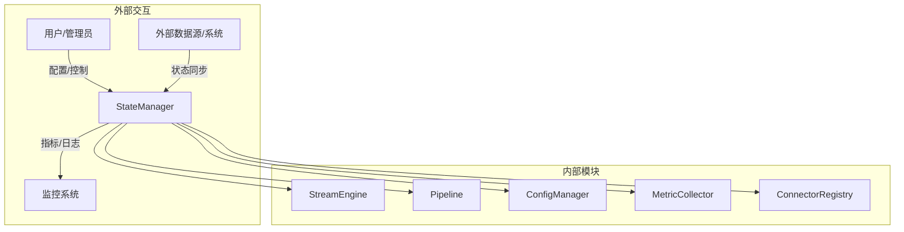
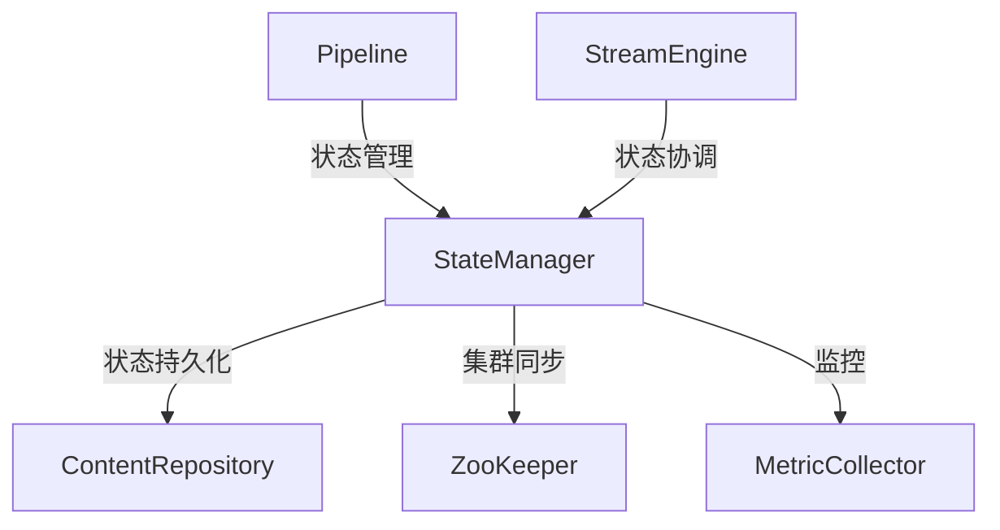
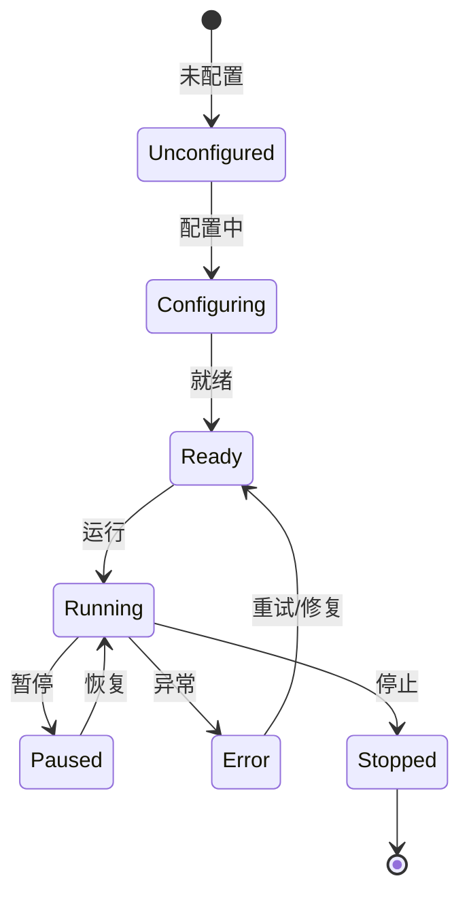
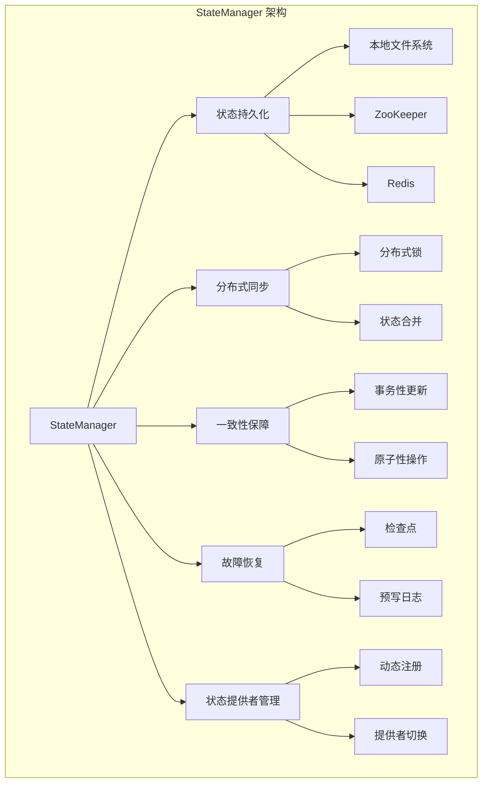

# Apache NiFi StateManager 深度技术分析

## 1. 模块概述

### 1.1 模块定位
StateManager 是 Apache NiFi 实现状态持久化与分布式协作的基础组件，负责管理处理器状态的存储、共享与恢复。它是整个数据流处理系统中确保数据处理一致性和可靠性的关键模块，提供了灵活、高效的状态管理能力。

### 1.2 关键职责详细分析

#### 1.2.1 状态持久化
提供多种持久化存储机制，确保组件状态可靠保存。

##### 持久化机制实现
1. **状态存储接口**
```java
public interface StateProvider {
    // 初始化提供者
    void initialize(ProviderConfiguration config);
    
    // 加载组件状态
    StateMap loadState(String componentId);
    
    // 持久化组件状态
    void persistState(String componentId, StateMap stateMap);
    
    // 关闭资源
    void shutdown();
}

// 标准状态映射实现
public class StandardStateMap implements StateMap {
    private final Map<String, String> stateValues;
    private final long timestamp;
    
    public StandardStateMap(Map<String, String> values, long timestamp) {
        this.stateValues = new HashMap<>(values);
        this.timestamp = timestamp;
    }
    
    @Override
    public String getValue(String key) {
        return stateValues.get(key);
    }
    
    @Override
    public Map<String, String> toMap() {
        return new HashMap<>(stateValues);
    }
}
```

2. **持久化提供者实现**
```java
public class FileSystemStateProvider implements StateProvider {
    private final Path stateDirectory;
    
    @Override
    public void persistState(String componentId, StateMap stateMap) {
        Path componentStatePath = stateDirectory.resolve(componentId + ".state");
        
        try (BufferedWriter writer = Files.newBufferedWriter(componentStatePath)) {
            for (Map.Entry<String, String> entry : stateMap.toMap().entrySet()) {
                writer.write(entry.getKey() + "=" + entry.getValue());
                writer.newLine();
            }
        } catch (IOException e) {
            // 错误处理
        }
    }
    
    @Override
    public StateMap loadState(String componentId) {
        Path componentStatePath = stateDirectory.resolve(componentId + ".state");
        
        if (!Files.exists(componentStatePath)) {
            return new StandardStateMap(Collections.emptyMap(), System.currentTimeMillis());
        }
        
        Map<String, String> stateValues = new HashMap<>();
        try (BufferedReader reader = Files.newBufferedReader(componentStatePath)) {
            String line;
            while ((line = reader.readLine()) != null) {
                String[] parts = line.split("=", 2);
                stateValues.put(parts[0], parts[1]);
            }
        } catch (IOException e) {
            // 错误处理
        }
        
        return new StandardStateMap(stateValues, System.currentTimeMillis());
    }
}
```

#### 1.2.2 分布式状态同步
通过分布式共识算法确保集群中各节点状态一致。

##### 同步机制实现
1. **分布式状态管理**
```java
public class ZooKeeperStateManager implements StateProvider {
    private final ZooKeeper zooKeeper;
    private static final String STATE_ROOT_PATH = "/nifi/state/";
    
    @Override
    public void persistState(String componentId, StateMap stateMap) {
        String path = STATE_ROOT_PATH + componentId;
        byte[] serializedState = serializeStateMap(stateMap);
        
        try {
            // 使用临时节点，确保节点故障时状态自动清理
            zooKeeper.create(
                path, 
                serializedState, 
                ZooDefs.Ids.OPEN_ACL_UNSAFE, 
                CreateMode.EPHEMERAL
            );
        } catch (Exception e) {
            // 错误处理
        }
    }
    
    @Override
    public StateMap loadState(String componentId) {
        String path = STATE_ROOT_PATH + componentId;
        
        try {
            byte[] data = zooKeeper.getData(path, false, null);
            return deserializeStateMap(data);
        } catch (KeeperException.NoNodeException e) {
            // 节点不存在，返回空状态
            return new StandardStateMap(Collections.emptyMap(), System.currentTimeMillis());
        } catch (Exception e) {
            // 错误处理
            throw new StateAccessException("Failed to load state", e);
        }
    }
}
```

2. **状态一致性保证**
```java
public class StateConsistencyManager {
    private final StateProvider localProvider;
    private final StateProvider clusterProvider;
    
    public void syncState(String componentId) {
        StateMap localState = localProvider.loadState(componentId);
        StateMap clusterState = clusterProvider.loadState(componentId);
        
        // 比较状态版本，选择最新状态
        StateMap mergedState = selectLatestState(localState, clusterState);
        
        // 更新本地和集群状态
        localProvider.persistState(componentId, mergedState);
        clusterProvider.persistState(componentId, mergedState);
    }
    
    private StateMap selectLatestState(StateMap local, StateMap cluster) {
        return local.getTimestamp() > cluster.getTimestamp() ? local : cluster;
    }
}
```

#### 1.2.3 跨节点数据一致性保障
提供分布式锁和事务机制，确保状态更新的原子性。

##### 一致性机制实现
1. **分布式锁**
```java
public class DistributedStateLock {
    private final ZooKeeper zooKeeper;
    private static final String LOCK_ROOT_PATH = "/nifi/locks/";
    
    public void acquireLock(String componentId) throws Exception {
        String lockPath = LOCK_ROOT_PATH + componentId;
        
        // 创建临时顺序节点
        String createdLockPath = zooKeeper.create(
            lockPath + "/lock-", 
            new byte[0], 
            ZooDefs.Ids.OPEN_ACL_UNSAFE, 
            CreateMode.EPHEMERAL_SEQUENTIAL
        );
        
        // 检查是否获得锁
        List<String> children = zooKeeper.getChildren(LOCK_ROOT_PATH + componentId, false);
        Collections.sort(children);
        
        if (createdLockPath.equals(LOCK_ROOT_PATH + componentId + "/" + children.get(0))) {
            // 获得锁
            return;
        }
        
        // 等待前一个锁释放
        waitForPreviousLock(children, createdLockPath);
    }
    
    public void releaseLock(String componentId) throws Exception {
        // 删除锁节点
        zooKeeper.delete(LOCK_ROOT_PATH + componentId, -1);
    }
}
```

2. **事务性状态更新**
```java
public class TransactionalStateManager {
    private final StateProvider stateProvider;
    private final DistributedStateLock stateLock;
    
    public void updateStateTransactionally(String componentId, StateUpdate update) {
        try {
            // 获取分布式锁
            stateLock.acquireLock(componentId);
            
            // 加载当前状态
            StateMap currentState = stateProvider.loadState(componentId);
            
            // 执行状态更新
            StateMap newState = update.apply(currentState);
            
            // 持久化新状态
            stateProvider.persistState(componentId, newState);
        } catch (Exception e) {
            // 回滚或错误处理
            throw new StateUpdateException("Failed to update state", e);
        } finally {
            // 释放锁
            stateLock.releaseLock(componentId);
        }
    }
}
```

#### 1.2.4 故障恢复
提供状态检查点和预写日志机制，确保系统故障后能恢复到一致状态。

##### 恢复机制实现
1. **检查点管理**
```java
public class StateCheckpointManager {
    private final ContentRepository contentRepository;
    private static final String CHECKPOINT_PREFIX = "state_checkpoint_";
    
    public void createCheckpoint(String componentId, StateMap stateMap) {
        byte[] serializedState = serializeStateMap(stateMap);
        
        // 在 Content Repository 创建检查点
        ResourceClaim checkpointClaim = new ResourceClaim(
            CHECKPOINT_PREFIX + componentId + "_" + System.currentTimeMillis()
        );
        
        contentRepository.create(checkpointClaim, serializedState);
    }
    
    public StateMap restoreLatestCheckpoint(String componentId) {
        // 查找最新检查点
        List<ResourceClaim> checkpoints = findCheckpointsForComponent(componentId);
        ResourceClaim latestCheckpoint = selectLatestCheckpoint(checkpoints);
        
        byte[] serializedState = contentRepository.read(latestCheckpoint);
        return deserializeStateMap(serializedState);
    }
}
```

2. **预写日志（WAL）**
```java
public class WriteAheadLogManager {
    private final Path walDirectory;
    
    public void logStateUpdate(String componentId, StateMap previousState, StateMap newState) {
        Path logFile = walDirectory.resolve(componentId + ".wal");
        
        try (BufferedWriter writer = Files.newBufferedWriter(logFile, StandardOpenOption.APPEND)) {
            writer.write("TIMESTAMP=" + System.currentTimeMillis());
            writer.newLine();
            writer.write("PREVIOUS_STATE=" + serializeStateMap(previousState));
            writer.newLine();
            writer.write("NEW_STATE=" + serializeStateMap(newState));
            writer.newLine();
            writer.write("---");
            writer.newLine();
        } catch (IOException e) {
            // 错误处理
        }
    }
    
    public List<StateUpdate> recoverUpdates(String componentId) {
        Path logFile = walDirectory.resolve(componentId + ".wal");
        List<StateUpdate> recoveredUpdates = new ArrayList<>();
        
        // 解析日志文件，重建状态更新序列
        // 实现省略
        
        return recoveredUpdates;
    }
}
```

#### 1.2.5 状态提供者管理
提供灵活的状态存储后端注册和切换机制。

##### 提供者管理实现
```java
public class StateProviderRegistry {
    private final Map<String, Class<? extends StateProvider>> registeredProviders = new ConcurrentHashMap<>();
    
    public void registerProvider(String providerName, Class<? extends StateProvider> providerClass) {
        registeredProviders.put(providerName, providerClass);
    }
    
    public StateProvider createProvider(String providerName, ProviderConfiguration config) throws Exception {
        Class<? extends StateProvider> providerClass = registeredProviders.get(providerName);
        
        if (providerClass == null) {
            throw new IllegalArgumentException("Unknown state provider: " + providerName);
        }
        
        StateProvider provider = providerClass.getDeclaredConstructor().newInstance();
        provider.initialize(config);
        
        return provider;
    }
}
```

### 1.3 技术关键词详细分析

#### 1.3.1 状态提供者（StateProvider）
定义状态存储和检索的标准接口。

```java
public enum StateProviderType {
    LOCAL_FILE_SYSTEM,   // 本地文件系统
    ZOOKEEPER,           // ZooKeeper 分布式存储
    REDIS,               // Redis 缓存
    JDBC,                // 关系型数据库
    CUSTOM               // 自定义提供者
}
```

#### 1.3.2 状态范围（Scope）
定义状态的作用域和可见性。

```java
public enum StateScope {
    LOCAL,      // 本地处理器状态
    CLUSTER,    // 集群共享状态
    GLOBAL      // 全局系统状态
}
```

#### 1.3.3 状态一致性级别
定义状态同步的一致性保证。

```java
public enum ConsistencyLevel {
    EVENTUAL,       // 最终一致性
    STRONG,         // 强一致性
    READ_COMMITTED, // 读已提交
    SERIALIZABLE    // 串行化
}
```

#### 1.3.4 状态更新策略
定义状态更新的原子性和幂等性。

```java
public enum StateUpdateStrategy {
    REPLACE,        // 完全替换
    MERGE,          // 合并更新
    CONDITIONAL     // 条件更新
}
```

#### 1.3.5 状态提供者扩展接口
定义状态提供者的标准扩展机制。

```java
public interface StateProviderExtension {
    String getName();
    void register(StateProviderRegistry registry);
    StateProvider createProvider();
}
```

#### 1.3.6 状态元数据
记录状态的详细信息和生命周期。

```java
public class StateMetadata {
    private String componentId;
    private long creationTimestamp;
    private long lastModifiedTimestamp;
    private StateScope scope;
    private int version;
    private Map<String, String> additionalMetadata;
}
```

## 2. 系统上下文图



## 3. 组件交互图



## 4. 状态机设计



## 5. 性能指标

| 指标           | 目标值        | 说明                   |
|---------------|---------------|------------------------|
| 状态读取延迟    | <10ms         | 状态读取耗时           |
| 状态写入开销    | <20ms         | 状态持久化耗时         |
| 集群同步延迟    | <50ms         | 状态在集群间同步耗时   |
| 并发状态操作    | 100+          | 支持的最大并发状态操作 |

## 6. 架构可视化

### 6.1 StateManager 架构组件关系图



## 7. 代码与使用结合

### 7.1 自定义状态提供者示例

```java
public class RedisStateProvider implements StateProvider {
    private final RedisClient redisClient;
    
    @Override
    public void initialize(ProviderConfiguration config) {
        String host = config.getProperty("redis.host", "localhost");
        int port = Integer.parseInt(config.getProperty("redis.port", "6379"));
        
        redisClient = RedisClient.create(
            RedisURI.create(host, port)
        );
    }
    
    @Override
    public void persistState(String componentId, StateMap stateMap) {
        try (StatefulRedisConnection<String, String> connection = redisClient.connect()) {
            RedisCommands<String, String> commands = connection.sync();
            
            for (Map.Entry<String, String> entry : stateMap.toMap().entrySet()) {
                commands.hset(componentId, entry.getKey(), entry.getValue());
            }
            
            // 设置过期时间
            commands.expire(componentId, 24 * 60 * 60);
        }
    }
    
    @Override
    public StateMap loadState(String componentId) {
        try (StatefulRedisConnection<String, String> connection = redisClient.connect()) {
            RedisCommands<String, String> commands = connection.sync();
            Map<String, String> stateValues = commands.hgetall(componentId);
            
            return new StandardStateMap(stateValues, System.currentTimeMillis());
        }
    }
}
```

### 7.2 动态注册状态提供者

```java
public class RedisStateProviderExtension implements StateProviderExtension {
    @Override
    public String getName() {
        return "redis";
    }
    
    @Override
    public void register(StateProviderRegistry registry) {
        registry.registerProvider(getName(), RedisStateProvider.class);
    }
    
    @Override
    public StateProvider createProvider() {
        return new RedisStateProvider();
    }
}
```

## 8. 总结与展望

### 8.1 核心优势
1. 灵活的状态持久化机制
2. 强大的分布式状态同步能力
3. 可靠的故障恢复机制
4. 高性能的状态管理
5. 可扩展的状态提供者架构

### 8.2 未来发展方向
- 更智能的状态同步算法
- 机器学习辅助的状态优化
- 更细粒度的性能监控
- 云原生和边缘计算支持 