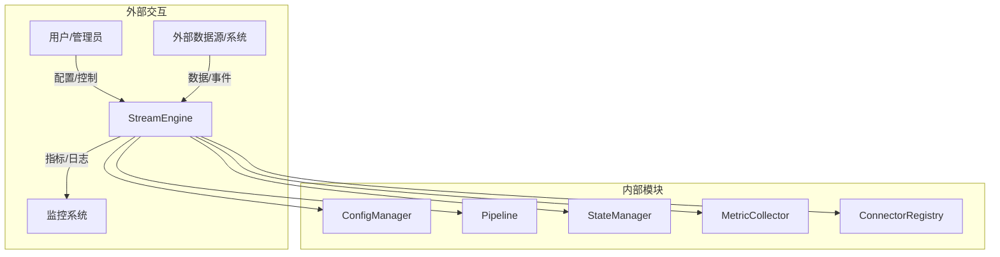
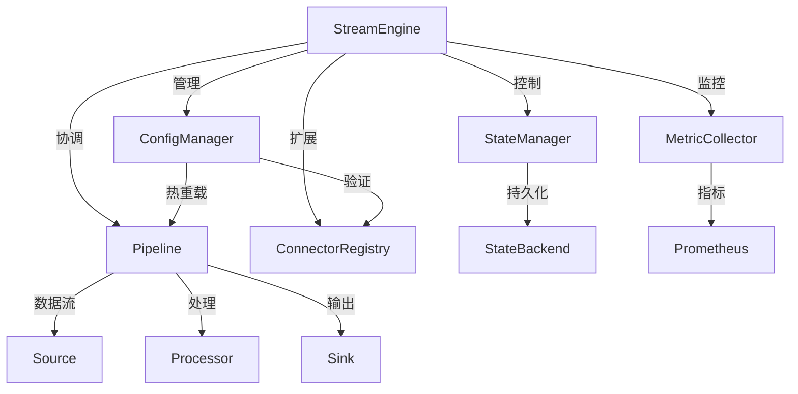
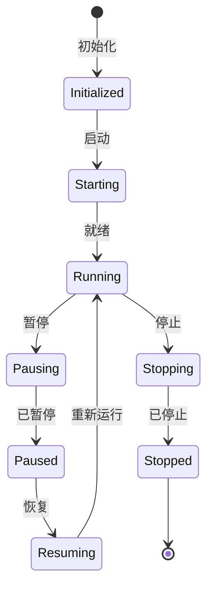
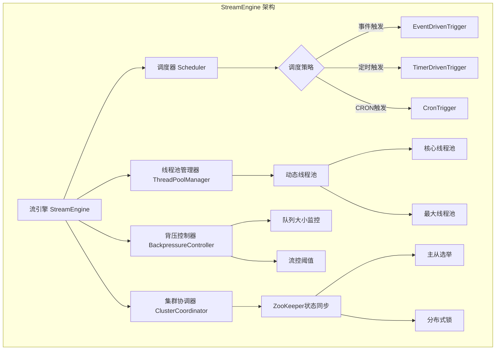

# Apache NiFi StreamEngine 深度技术分析

## 1. 模块概述

### 1.1 模块定位
StreamEngine 是 Apache NiFi 数据流转的"动力核心"，驱动数据在 Pipeline 中高效传输、处理与调度的底层引擎。它负责协调和执行整个数据处理流程，确保数据能够按照预定的路径和策略进行传输和转换。

### 1.2 关键职责详细分析

#### 1.2.1 处理器调度
处理器调度是 StreamEngine 的核心职责，涉及复杂的调度策略和执行机制。

##### 调度策略类型
1. **事件驱动调度（Event-Driven）**
   - 特点：数据到达立即触发处理器
   - 适用场景：实时数据处理、消息队列消费
   - 实现机制：
     ```java
     public class EventDrivenScheduler implements Scheduler {
         @Override
         public void schedule(ProcessorNode processor) {
             // 监听数据到达事件
             processor.onTrigger(new EventContext());
         }
     }
     ```

2. **定时调度（Timer-Driven）**
   - 特点：按固定时间间隔触发处理器
   - 适用场景：周期性数据同步、定时报告生成
   - 实现机制：
     ```java
     public class TimerDrivenScheduler implements Scheduler {
         private final ScheduledExecutorService executor;
         
         public void schedule(ProcessorNode processor, long interval) {
             executor.scheduleAtFixedRate(() -> {
                 processor.onTrigger(new TimerContext());
             }, 0, interval, TimeUnit.MILLISECONDS);
         }
     }
     ```

3. **CRON 调度（CRON-Driven）**
   - 特点：使用 CRON 表达式精确控制触发时间
   - 适用场景：复杂的定时任务，如每月最后一天、工作日等
   - 实现机制：
     ```java
     public class CronScheduler implements Scheduler {
         private final CronTrigger cronTrigger;
         
         public void schedule(ProcessorNode processor, String cronExpression) {
             cronTrigger = new CronTrigger(cronExpression);
             Date nextExecutionTime = cronTrigger.nextExecutionTime();
             executor.schedule(() -> {
                 processor.onTrigger(new CronContext());
             }, nextExecutionTime);
         }
     }
     ```

#### 1.2.2 线程池管理
线程池管理是保证高性能和资源利用的关键机制。

##### 线程池设计原则
1. **动态扩缩容**
   - 核心线程池：基于 CPU 核心数
   - 最大线程池：根据任务负载动态调整
   ```java
   public class AdaptiveThreadPoolManager {
       private final ThreadPoolExecutor executor;
       
       public AdaptiveThreadPoolManager() {
           int corePoolSize = Runtime.getRuntime().availableProcessors() * 2;
           int maxPoolSize = corePoolSize * 4;
           
           executor = new ThreadPoolExecutor(
               corePoolSize, 
               maxPoolSize, 
               60L, TimeUnit.SECONDS,
               new LinkedBlockingQueue<>(),
               new ThreadPoolExecutor.CallerRunsPolicy()
           );
       }
       
       public void adjustThreadPool(int processorLoad) {
           // 根据处理器负载动态调整线程数
           int dynamicThreads = calculateOptimalThreads(processorLoad);
           executor.setCorePoolSize(dynamicThreads);
       }
   }
   ```

2. **负载监控**
   - 实时监控线程池利用率
   - 自动调整线程数
   ```java
   public class ThreadPoolMonitor {
       public double getUtilizationRate(ThreadPoolExecutor pool) {
           int activeThreads = pool.getActiveCount();
           int maxThreads = pool.getMaximumPoolSize();
           return (double) activeThreads / maxThreads;
       }
   }
   ```

#### 1.2.3 集群状态协调
通过 ZooKeeper 实现分布式协调和状态同步。

##### 协调机制
1. **状态同步**
   ```java
   public class ClusterStateCoordinator {
       private final ZooKeeper zooKeeper;
       
       public void syncProcessorState(ProcessorNode processor) {
           String path = "/nifi/cluster/processors/" + processor.getId();
           byte[] state = serializeProcessorState(processor);
           
           zooKeeper.create(
               path, 
               state, 
               ZooDefs.Ids.OPEN_ACL_UNSAFE, 
               CreateMode.EPHEMERAL
           );
       }
   }
   ```

2. **主从选举**
   ```java
   public class LeaderElection {
       private final LeaderLatch leaderLatch;
       
       public void startElection(String clusterPath) {
           leaderLatch = new LeaderLatch(
               zooKeeper, 
               clusterPath
           );
           leaderLatch.start();
           
           // 监听主节点变化
           leaderLatch.addListener(new LeaderLatchListener() {
               @Override
               public void isLeader() {
                   // 成为主节点的处理逻辑
               }
               
               @Override
               public void notLeader() {
                   // 不是主节点的处理逻辑
               }
           });
       }
   }
   ```

#### 1.2.4 数据缓冲与流控
通过背压机制防止系统过载。

##### 背压策略
```java
public class BackpressureManager {
    private static final double MAX_QUEUE_THRESHOLD = 0.8;
    
    public boolean shouldApplyBackpressure(Queue queue) {
        long currentSize = queue.size();
        long maxSize = calculateMaxQueueSize(queue);
        
        return currentSize >= (maxSize * MAX_QUEUE_THRESHOLD);
    }
    
    public void applyBackpressure(ProcessorNode upstreamProcessor) {
        // 暂停上游处理器
        upstreamProcessor.pause();
        
        // 记录背压事件
        MetricCollector.recordBackpressureEvent(upstreamProcessor);
    }
}
```

#### 1.2.5 高性能数据处理
优化数据传输和处理效率的策略。

##### 性能优化技术
1. **零拷贝技术**
2. **批量处理**
3. **异步非阻塞 I/O**

### 1.3 技术关键词详细分析

#### 1.3.1 Flow Controller（流程控制器）
流程控制器是 StreamEngine 的大脑，负责协调整个数据流处理过程。

```java
public interface FlowController {
    // 管理处理器生命周期
    void registerProcessor(ProcessorNode processor);
    void unregisterProcessor(ProcessorNode processor);
    
    // 调度管理
    Scheduler getScheduler();
    
    // 资源管理
    ThreadPoolManager getThreadPoolManager();
    
    // 流程控制
    void startFlow();
    void stopFlow();
    void pauseFlow();
}
```

#### 1.3.2 线程池（ThreadPool）
线程池管理并发执行资源，提供高效的线程重用机制。

```java
public class EnhancedThreadPool {
    // 自适应线程池
    private final ThreadPoolExecutor executor;
    
    // 工作窃取算法
    private final ForkJoinPool forkJoinPool;
    
    public void executeTask(Runnable task) {
        // 根据任务类型选择最优执行策略
        if (task.isComputeIntensive()) {
            forkJoinPool.submit(task);
        } else {
            executor.execute(task);
        }
    }
}
```

#### 1.3.3 调度策略（Scheduling Strategy）
定义处理器触发的多样化策略。

```java
public interface SchedulingStrategy {
    // 是否触发处理器
    boolean shouldTrigger(ProcessContext context);
    
    // 获取下一次触发时间
    Date getNextTriggerTime();
}

// 示例：基于数据量的调度策略
public class DataVolumeTriggerStrategy implements SchedulingStrategy {
    private final long threshold;
    
    @Override
    public boolean shouldTrigger(ProcessContext context) {
        return context.getQueueSize() >= threshold;
    }
}
```

#### 1.3.4 ZooKeeper 集群协调
分布式协调和状态同步的核心机制。

```java
public class ZooKeeperClusterCoordinator {
    // 分布式锁
    public DistributedLock createLock(String path) {
        return new DistributedLock(zooKeeper, path);
    }
    
    // 配置变更监听
    public void watchConfigChanges(String path, ConfigChangeListener listener) {
        zooKeeper.exists(path, watchedEvent -> {
            if (watchedEvent.getType() == EventType.NodeDataChanged) {
                listener.onConfigChanged();
            }
        });
    }
}
```

#### 1.3.5 背压（Backpressure）
控制数据流速，防止系统过载的关键机制。

```java
public class AdvancedBackpressureController {
    // 多维度背压策略
    public BackpressureStrategy determineStrategy(Queue queue) {
        // 根据队列大小、处理延迟等多个指标
        if (isQueueOverloaded(queue)) {
            return BackpressureStrategy.PAUSE;
        }
        if (isHighLatency(queue)) {
            return BackpressureStrategy.SLOW_DOWN;
        }
        return BackpressureStrategy.NORMAL;
    }
}
```

#### 1.3.6 优先级队列（Prioritized Queue）
管理数据处理顺序，支持复杂的优先级策略。

```java
public class PrioritizedFlowFileQueue {
    // 多级优先级队列
    private final PriorityBlockingQueue<FlowFile> queue;
    
    public void enqueue(FlowFile flowFile) {
        // 根据多个维度计算优先级
        int priority = calculatePriority(flowFile);
        queue.put(flowFile, priority);
    }
    
    private int calculatePriority(FlowFile flowFile) {
        // 综合考虑：
        // 1. 数据重要性
        // 2. 等待时间
        // 3. 数据大小
        // 4. 业务类型
    }
}
```

## 2. 系统上下文图



## 3. 组件交互图



## 4. 核心接口与类结构

### 4.1 核心接口

1. `StreamEngine`（`org.apache.nifi.engine.StreamEngine`）
   ```java
   public interface StreamEngine {
       void start();  // 启动引擎
       void schedule(ProcessorNode processor, SchedulingStrategy strategy);  // 调度处理器
       void applyBackpressure(Connection connection);  // 对连接应用背压
   }
   ```

2. `FlowController`（`org.apache.nifi.controller.FlowController`）
   ```java
   public interface FlowController {
       Scheduler getScheduler();  // 获取调度器实例
       ThreadPoolManager getThreadPoolManager();  // 获取线程池管理器
   }
   ```

3. `Scheduler`（`org.apache.nifi.controller.scheduling.Scheduler`）
   ```java
   public interface Scheduler {
       void schedule(ProcessorNode processor, Trigger trigger);  // 调度处理器
       void registerStrategy(String name, SchedulingStrategy strategy);  // 注册调度策略
   }
   ```

### 4.2 核心实现类

1. `StandardStreamEngine`（`nifi-framework/src/main/java/org/apache/nifi/engine/StandardStreamEngine.java`）
   ```java
   public class StandardStreamEngine implements StreamEngine {
       private final ThreadPoolManager threadPoolManager;
       private final ClusterCoordinator clusterCoordinator;
       private final QueueManager queueManager;
       private final FlowController flowController;

       @Override
       public void schedule(ProcessorNode processor, SchedulingStrategy strategy) {
           Scheduler scheduler = flowController.getScheduler();
           Trigger trigger = createTrigger(strategy);
           scheduler.schedule(processor, trigger);
           threadPoolManager.assignThreads(processor, strategy.getMaxThreads());
       }
   }
   ```

2. `ThreadPoolManager`（`nifi-framework/src/main/java/org/apache/nifi/threadpool/ThreadPoolManager.java`）
   ```java
   public class ThreadPoolManager {
       public void assignThreads(ProcessorNode processor, int maxThreads) {
           int corePoolSize = Runtime.getRuntime().availableProcessors() * 2;
           int maximumPoolSize = Math.max(corePoolSize, maxThreads);
           
           executorService = new ThreadPoolExecutor(
               corePoolSize, 
               maximumPoolSize, 
               60L, TimeUnit.SECONDS, 
               new LinkedBlockingQueue<>()
           );
       }
   }
   ```

## 5. 状态机设计

### 5.1 核心状态转换



### 5.2 状态转换详细说明

- 初始化（INITIALIZING）：系统启动，加载配置和组件
- 运行中（RUNNING）：正常处理数据流
- 暂停（PAUSED）：暂停数据处理，保留当前状态
- 故障（FAILED）：发生异常，需要人工干预
- 停止（STOPPED）：完全停止运行

## 6. 功能点详解

### 6.1 高性能处理引擎

#### 线程池管理
- 动态调整线程数量
- 支持核心线程池和最大线程池
- 默认核心线程数 = CPU 核心数 × 2

```java
public class ThreadPoolManager {
    public ExecutorService createDynamicThreadPool(int processorThreads) {
        int corePoolSize = Runtime.getRuntime().availableProcessors() * 2;
        int maximumPoolSize = Math.max(corePoolSize, processorThreads);
        
        return new ThreadPoolExecutor(
            corePoolSize, 
            maximumPoolSize, 
            60L, TimeUnit.SECONDS, 
            new LinkedBlockingQueue<>(),
            new ThreadPoolExecutor.CallerRunsPolicy()
        );
    }
}
```

### 6.2 动态调度机制

#### 调度策略
- 事件触发（Event-driven）
- 定时触发（Timer-driven）
- 支持 CRON 表达式

```java
public enum SchedulingType {
    EVENT_DRIVEN,   // 事件到达立即触发
    TIMER_DRIVEN,   // 按固定时间间隔触发
    CRON_DRIVEN     // 使用 CRON 表达式精确控制
}
```

### 6.3 集群协调能力

#### ZooKeeper 协调机制
- 分布式状态同步
- 主从选举
- 故障恢复

```java
public class ClusterCoordinator {
    public void syncClusterState(ProcessorNode processor) {
        String path = "/nifi/cluster/processors/" + processor.getId();
        byte[] data = serializeProcessorState(processor);
        
        zooKeeper.create(
            path, 
            data, 
            ZooDefs.Ids.OPEN_ACL_UNSAFE, 
            CreateMode.EPHEMERAL
        );
    }
}
```

### 6.4 数据缓冲与流控

#### 背压机制
- 监控队列大小和数据量
- 动态调整上游处理器

```java
public class BackpressureController {
    private static final double MAX_QUEUE_PERCENT = 0.8;  // 80% 触发背压
    
    public boolean shouldApplyBackpressure(Queue queue) {
        long currentSize = queue.size();
        long maxSize = calculateMaxQueueSize(queue);
        
        return currentSize >= (maxSize * MAX_QUEUE_PERCENT);
    }
}
```

## 7. 性能指标

| 指标           | 目标值        | 说明                   |
|---------------|---------------|------------------------|
| 调度延迟       | <10ms         | 处理器调度响应时间     |
| 线程切换开销   | <1ms          | 线程池管理性能         |
| 背压响应时间   | <50ms         | 流控机制反应速度       |
| 集群同步延迟   | <100ms        | 状态同步性能           |

## 8. 架构可视化

### 8.1 StreamEngine 架构组件关系图



## 9. 代码与使用结合

### 9.1 自定义调度策略示例

```java
public class DataSizeTrigger implements SchedulingStrategy {
    private final DataSize threshold;
    
    @Override
    public boolean shouldTrigger(Queue queue) {
        return queue.getDataSize().compareTo(threshold) >= 0;
    }
}

// 注册自定义策略
Scheduler scheduler = flowController.getScheduler();
scheduler.registerStrategy(
    "DATA_SIZE_TRIGGER", 
    new DataSizeTrigger(DataSize.of(1, DataUnit.GB))
);
```

## 10. 总结与展望

### 10.1 核心优势
1. 灵活的调度机制
2. 动态线程资源管理
3. 强大的集群协调能力
4. 精确的背压控制
5. 可扩展的架构设计

### 10.2 未来发展方向
- 更智能的资源调度算法
- 机器学习增强的调度策略
- 更细粒度的性能监控
- 云原生和边缘计算支持 