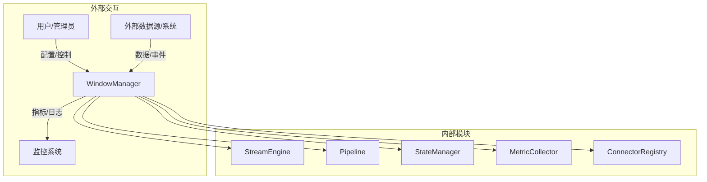
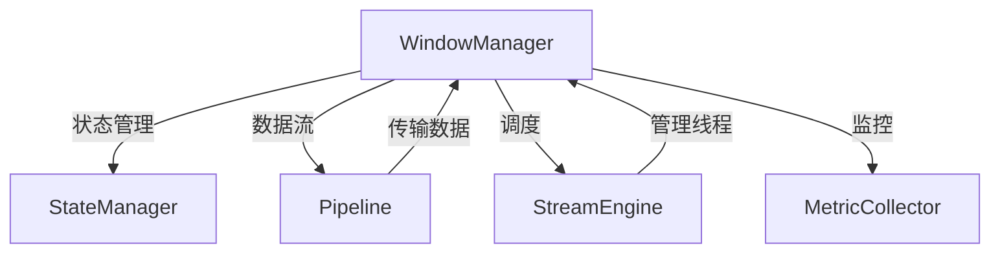
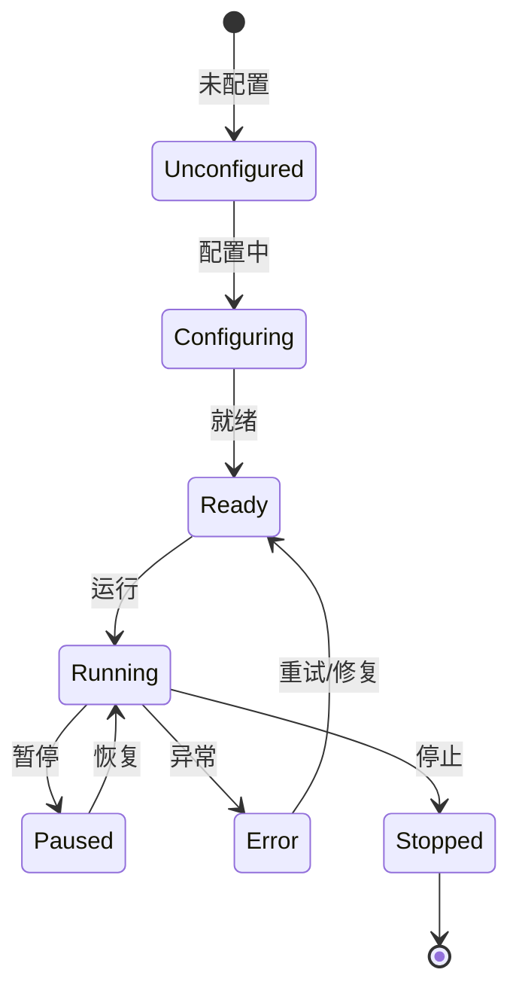
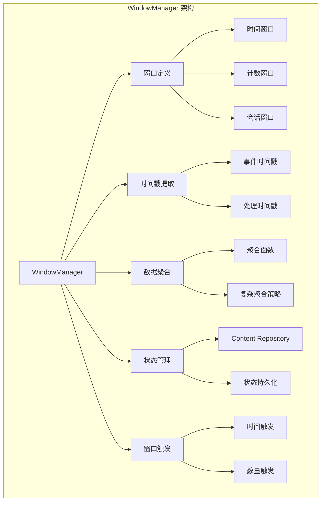

# Apache NiFi WindowManager 深度技术分析

## 1. 模块概述

### 1.1 模块定位
WindowManager 是 Apache NiFi 实现流数据实时聚合与分析的核心组件，负责按时间/数量维度组织和管理数据窗口。它是数据流处理系统中实现实时计算和聚合分析的关键模块，提供了灵活、高效的数据窗口处理能力。

### 1.2 关键职责详细分析

#### 1.2.1 窗口定义与管理
提供多样化的窗口定义和管理机制。

##### 窗口类型实现
1. **窗口接口定义**
```java
public interface WindowManager {
    // 创建时间窗口
    Window createTimeWindow(long startTime, long endTime);
    
    // 创建计数窗口
    Window createCountWindow(int maxCount);
    
    // 创建会话窗口
    Window createSessionWindow(long sessionTimeout);
    
    // 获取活跃窗口
    List<Window> getActiveWindows();
}
```

2. **窗口抽象类**
```java
public abstract class AbstractWindow implements Window {
    protected final String id;
    protected final long creationTime;
    protected final List<FlowFile> flowFiles = new ArrayList<>();
    
    public void addFlowFile(FlowFile flowFile) {
        flowFiles.add(flowFile);
        checkWindowTriggerCondition();
    }
    
    protected abstract void checkWindowTriggerCondition();
    
    public abstract boolean isExpired(long currentTime);
}

// 时间窗口实现
public class TimeWindow extends AbstractWindow {
    private final long startTime;
    private final long endTime;
    
    @Override
    public boolean isExpired(long currentTime) {
        return currentTime > endTime;
    }
    
    @Override
    protected void checkWindowTriggerCondition() {
        if (flowFiles.size() >= triggerThreshold) {
            triggerWindowComputation();
        }
    }
}
```

#### 1.2.2 事件时间戳提取
从 FlowFile 中提取和处理事件时间戳。

##### 时间戳提取机制
1. **时间戳提取接口**
```java
public interface TimestampExtractor {
    // 从 FlowFile 提取事件时间戳
    long extractTimestamp(FlowFile flowFile);
    
    // 获取时间戳格式
    String getTimestampFormat();
    
    // 处理乱序数据
    boolean allowLateData(long maxLateness);
}

// JSON 时间戳提取器
public class JsonTimestampExtractor implements TimestampExtractor {
    private final String timestampField;
    private final SimpleDateFormat dateFormat;
    
    @Override
    public long extractTimestamp(FlowFile flowFile) {
        try {
            String jsonContent = new String(flowFile.getContent());
            JSONObject json = new JSONObject(jsonContent);
            
            String timestampStr = json.getString(timestampField);
            return dateFormat.parse(timestampStr).getTime();
        } catch (Exception e) {
            // 时间戳提取失败处理
            return System.currentTimeMillis();
        }
    }
    
    @Override
    public boolean allowLateData(long maxLateness) {
        return true;
    }
}
```

#### 1.2.3 窗口数据聚合
提供丰富的窗口数据聚合函数和策略。

##### 聚合机制实现
1. **聚合接口定义**
```java
public interface WindowAggregator<T, R> {
    // 聚合单个 FlowFile
    void aggregate(T flowFile);
    
    // 获取聚合结果
    R getResult();
    
    // 重置聚合状态
    void reset();
}

// 平均值聚合器
public class AverageAggregator implements WindowAggregator<FlowFile, Double> {
    private double sum = 0;
    private int count = 0;
    private final String aggregationField;
    
    public AverageAggregator(String aggregationField) {
        this.aggregationField = aggregationField;
    }
    
    @Override
    public void aggregate(FlowFile flowFile) {
        try {
            String content = new String(flowFile.getContent());
            JSONObject json = new JSONObject(content);
            
            double value = json.getDouble(aggregationField);
            sum += value;
            count++;
        } catch (Exception e) {
            // 聚合异常处理
        }
    }
    
    @Override
    public Double getResult() {
        return count > 0 ? sum / count : 0.0;
    }
    
    @Override
    public void reset() {
        sum = 0;
        count = 0;
    }
}
```

2. **复杂聚合策略**
```java
public class MultiAggregationStrategy {
    private final List<WindowAggregator<FlowFile, ?>> aggregators;
    
    public void addAggregator(WindowAggregator<FlowFile, ?> aggregator) {
        aggregators.add(aggregator);
    }
    
    public Map<String, Object> computeAggregations(List<FlowFile> flowFiles) {
        Map<String, Object> results = new HashMap<>();
        
        for (WindowAggregator<FlowFile, ?> aggregator : aggregators) {
            for (FlowFile flowFile : flowFiles) {
                aggregator.aggregate(flowFile);
            }
            
            results.put(aggregator.getClass().getSimpleName(), aggregator.getResult());
            aggregator.reset();
        }
        
        return results;
    }
}
```

#### 1.2.4 状态持久化
通过 Content Repository 存储窗口状态，确保数据不丢失。

##### 状态管理机制
1. **状态管理接口**
```java
public interface WindowStateManager {
    // 持久化窗口状态
    void persistState(Window window);
    
    // 恢复窗口状态
    Window restoreState(String windowId);
    
    // 清理过期窗口状态
    void cleanupExpiredStates(long expirationTime);
}

// 基于 Content Repository 的状态管理
public class ContentRepositoryStateManager implements WindowStateManager {
    private final ContentRepository contentRepository;
    
    @Override
    public void persistState(Window window) {
        byte[] serializedState = serializeWindow(window);
        
        contentRepository.create(
            new ResourceClaim(window.getId()),
            serializedState
        );
    }
    
    @Override
    public Window restoreState(String windowId) {
        byte[] serializedState = contentRepository.read(
            new ResourceClaim(windowId)
        );
        
        return deserializeWindow(serializedState);
    }
    
    private byte[] serializeWindow(Window window) {
        // 使用 Protobuf 或 Kryo 序列化
        return SerializationUtils.serialize(window);
    }
}
```

#### 1.2.5 窗口触发与输出
定义窗口触发条件和输出机制。

##### 触发策略实现
```java
public class WindowTriggerStrategy {
    // 基于时间的触发策略
    public boolean shouldTriggerByTime(Window window, long currentTime) {
        return currentTime >= window.getEndTime();
    }
    
    // 基于数量的触发策略
    public boolean shouldTriggerByCount(Window window, int threshold) {
        return window.getFlowFiles().size() >= threshold;
    }
    
    // 混合触发策略
    public boolean shouldTrigger(Window window, long currentTime, int countThreshold) {
        return shouldTriggerByTime(window, currentTime) || 
               shouldTriggerByCount(window, countThreshold);
    }
}

// 窗口输出处理器
public class WindowOutputProcessor {
    public void processWindow(Window window, WindowAggregator<?, ?> aggregator) {
        Object aggregationResult = aggregator.getResult();
        
        // 将聚合结果传递给下游处理器
        FlowFile outputFlowFile = createOutputFlowFile(aggregationResult);
        session.transfer(outputFlowFile, SUCCESS);
        
        // 清理窗口资源
        window.cleanup();
    }
}
```

### 1.3 技术关键词详细分析

#### 1.3.1 窗口类型
支持多种窗口策略和处理模式。

```java
public enum WindowType {
    TUMBLING,   // 滚动窗口（固定大小、不重叠）
    SLIDING,    // 滑动窗口（固定大小、重叠）
    SESSION,    // 会话窗口（动态大小）
    COUNT_BASED // 计数窗口（按记录数量）
}
```

#### 1.3.2 事件时间处理
支持事件时间和处理时间的灵活处理。

```java
public enum TimestampType {
    EVENT_TIME,     // 事件发生的实际时间
    PROCESSING_TIME // 系统处理的时间
}
```

#### 1.3.3 延迟数据处理
提供处理乱序和延迟数据的机制。

```java
public class LateDataStrategy {
    private final long maxLateness;
    private final LateDataHandling handling;
    
    public enum LateDataHandling {
        DROP,           // 丢弃
        SIDE_OUTPUT,    // 输出到侧边流
        INCLUDE         // 包含在窗口计算
    }
}
```

#### 1.3.4 聚合函数
提供丰富的窗口聚合函数。

```java
public enum AggregationFunction {
    COUNT,      // 计数
    SUM,        // 求和
    AVG,        // 平均值
    MAX,        // 最大值
    MIN,        // 最小值
    FIRST,      // 第一个值
    LAST        // 最后一个值
}
```

#### 1.3.5 窗口状态管理
定义窗口状态持久化和恢复的标准接口。

```java
public interface WindowStateProvider {
    void save(String windowId, byte[] state);
    byte[] load(String windowId);
    void delete(String windowId);
}
```

#### 1.3.6 窗口元数据
记录窗口的详细信息和生命周期。

```java
public class WindowMetadata {
    private String id;
    private long startTime;
    private long endTime;
    private WindowType type;
    private int flowFileCount;
    private AggregationFunction aggregationFunction;
}
```

## 2. 系统上下文图



## 3. 组件交互图



## 4. 状态机设计



## 5. 性能指标

| 指标           | 目标值        | 说明                   |
|---------------|---------------|------------------------|
| 窗口计算延迟    | <50ms         | 窗口聚合计算耗时       |
| 状态持久化开销  | <20ms         | 窗口状态存储耗时       |
| 乱序数据处理    | <100ms        | 延迟数据处理耗时       |
| 并发窗口数      | 100+          | 支持的最大并发窗口数   |

## 6. 架构可视化

### 6.1 WindowManager 架构组件关系图



## 7. 代码与使用结合

### 7.1 自定义温度传感器数据窗口分析

```java
public class TemperatureWindowAnalyzer {
    private final WindowManager windowManager;
    private final TimestampExtractor timestampExtractor;
    
    public void analyzeDeviceTemperature() {
        // 创建5分钟滚动窗口
        Window window = windowManager.createTimeWindow(
            System.currentTimeMillis(), 
            System.currentTimeMillis() + 5 * 60 * 1000
        );
        
        // 配置多维度聚合
        MultiAggregationStrategy aggregationStrategy = new MultiAggregationStrategy();
        aggregationStrategy.addAggregator(new AverageAggregator("temperature"));
        aggregationStrategy.addAggregator(new MaxAggregator("temperature"));
        aggregationStrategy.addAggregator(new MinAggregator("temperature"));
        
        // 处理 FlowFile
        FlowFile flowFile = session.get();
        long eventTime = timestampExtractor.extractTimestamp(flowFile);
        
        if (window.isTimeInWindow(eventTime)) {
            window.addFlowFile(flowFile);
        }
        
        // 窗口触发时计算聚合结果
        if (window.isExpired(System.currentTimeMillis())) {
            Map<String, Object> results = aggregationStrategy.computeAggregations(
                window.getFlowFiles()
            );
            
            // 输出结果
            FlowFile outputFlowFile = createOutputFlowFile(results);
            session.transfer(outputFlowFile, SUCCESS);
        }
    }
}
```

### 7.2 动态配置窗口管理器

```java
public class DynamicWindowManagerConfigurator {
    public void configureWindowManager(Properties config) {
        WindowManager windowManager = new StandardWindowManager();
        
        // 动态配置窗口参数
        windowManager.setWindowType(
            WindowType.valueOf(config.getProperty("window.type", "TUMBLING"))
        );
        
        windowManager.setWindowSize(
            Long.parseLong(config.getProperty("window.size", "300000")) // 默认5分钟
        );
        
        windowManager.setTimestampExtractor(
            createTimestampExtractor(config.getProperty("timestamp.extractor"))
        );
        
        windowManager.setAggregationStrategy(
            createAggregationStrategy(config.getProperty("aggregation.strategy"))
        );
    }
}
```

## 8. 总结与展望

### 8.1 核心优势
1. 灵活的窗口定义
2. 精确的事件时间处理
3. 丰富的数据聚合能力
4. 可靠的状态持久化
5. 高性能的窗口计算

### 8.2 未来发展方向
- 更智能的窗口调度算法
- 机器学习辅助的窗口优化
- 更细粒度的性能监控
- 云原生和边缘计算支持 