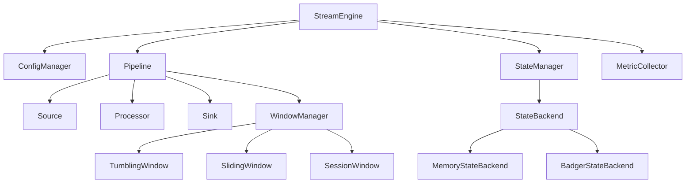
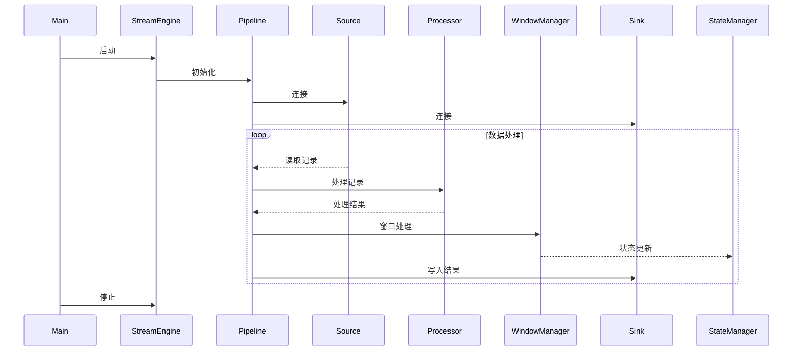

# EdgeStream Pro 技术架构设计报告

## 3. 架构参考图

### 3.1 系统组件交互图

### 3.2 数据处理流程序列图

## 附录：关键技术指标

| 指标           | 目标值        | 说明                   |
|---------------|---------------|------------------------|
| 内存占用       | <50MB         | 边缘设备适配            |
| 冷启动时间     | <100ms        | 快速响应                |
| 吞吐量         | 100K+记录/秒   | 高性能流处理            |
| 延迟           | <1ms          | 实时性能                |
| 支持架构       | ARM/x86       | 广泛兼容性              |
| 扩展性开销     | <5%           | 低成本扩展              | 