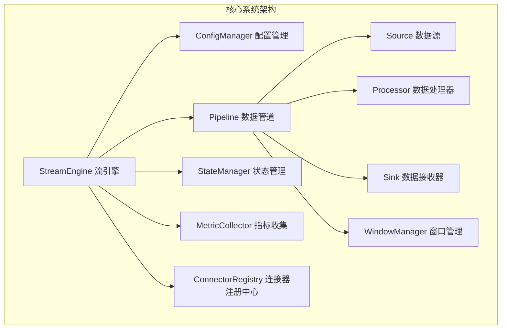

# EdgeStream Pro 系统架构总结

## 1. 系统架构概览

EdgeStream Pro是一个专为边缘计算和物联网场景设计的轻量级、高性能Go语言流处理框架。系统由多个紧密协作的模块组成，旨在提供低资源占用（<50MB）、毫秒级启动的数据处理能力。

### 1.1 系统组件交互总览图



## 2. 模块职责与交互详解

### 2.1 StreamEngine（流引擎）
#### 职责
- 系统生命周期管理
- 协调各模块交互
- 提供配置管理和热重载
- 控制系统启动和关闭

#### 关键实现
1. 生命周期控制
   - 优雅启动和关闭
   - 错误处理和恢复机制
2. 配置热重载
   - 动态更新组件配置
   - 最小化对运行中系统的影响

#### 核心接口
```go
type StreamEngine interface {
    Start() error
    Stop() error
    Restart() error
    GetMetrics() MetricSnapshot
    ReloadConfig(config Config) error
}
```

### 2.2 ConfigManager（配置管理器）
#### 职责
- 加载配置文件
- 验证配置合法性
- 监控配置变更
- 支持热重载
- 提供配置管理的统一接口

#### 关键特性
1. 多源配置支持
   - YAML文件
   - 环境变量
   - 命令行参数
   - 优先级管理

2. 配置解析
   - 结构化解析
   - 类型安全
   - 默认值处理

#### 核心接口
```go
type ConfigManager interface {
    LoadConfig(path string) (Config, error)
    ReloadConfig(path string) error
    ValidateConfig(config Config) error
    GetConfig() Config
    WatchConfig() <-chan ConfigChange
}
```

### 2.3 Pipeline（数据管道）
#### 职责
- 定义数据处理流程
- 管理数据源、处理器和接收器
- 控制数据流转
- 提供数据处理拓扑

#### 关键实现
1. 数据流控制
   - 基于Channel的数据传输
   - 最小化锁竞争
2. 背压处理
   - 动态缓冲区大小
   - 流量控制机制

#### 核心接口
```go
type Pipeline interface {
    AddSource(source Source) error
    AddProcessor(processor Processor) error
    AddSink(sink Sink) error
    Process(ctx context.Context) error
    GetTopology() Topology
}
```

### 2.4 Source（数据源）
#### 职责
- 连接外部数据源
- 读取数据记录
- 支持多种数据源类型

#### 支持的数据源
- 文件源（CSV/JSON）
- 消息队列（MQTT/Kafka）
- 数据库
- HTTP/gRPC
- 自定义协议

#### 核心接口
```go
type Source interface {
    Connect() error
    Read(ctx context.Context) <-chan Record
    Close() error
    GetConfig() SourceConfig
}
```

### 2.5 Processor（数据处理器）
#### 职责
- 数据转换
- 数据过滤
- SQL查询处理
- 复杂事件处理

#### 关键功能
1. 数据转换
   - 映射转换
   - 类型转换
   - 值计算

2. SQL处理
   - 词法分析
   - 语法解析
   - 查询优化
   - 增量执行

#### 核心接口
```go
type Processor interface {
    Process(record Record) ([]Record, error)
    ProcessBatch(records []Record) ([]Record, error)
    GetConfig() ProcessorConfig
    Initialize(config ProcessorConfig) error
}
```

### 2.6 WindowManager（窗口管理器）
#### 职责
- 管理不同类型窗口
- 执行窗口聚合
- 处理窗口触发和过期

#### 窗口类型
1. 滚动窗口（TumblingWindow）
2. 滑动窗口（SlidingWindow）
3. 会话窗口（SessionWindow）

#### 关键实现
1. 窗口优化
   - 环形缓冲区
   - 懒计算
   - 增量聚合

#### 核心接口
```go
type Window interface {
    Add(record Record) error
    Trigger() WindowResult
    IsExpired(currentTime time.Time) bool
    GetSize() int
}
```

### 2.7 Sink（数据接收器）
#### 职责
- 连接外部数据目标
- 写入处理后的数据记录
- 支持多种数据目标类型

#### 支持的数据目标
- 文件系统
- 数据库
- 消息队列
- HTTP/REST API
- Kafka
- Elasticsearch

#### 关键实现
1. 连接管理
   - 连接池
   - 自动重连
   - 连接超时处理

2. 数据写入
   - 批量写入
   - 异步写入
   - 背压控制

#### 核心接口
```go
type Sink interface {
    Connect() error
    Write(record Record) error
    WriteBatch(records []Record) error
    Close() error
    GetConfig() SinkConfig
}
```

### 2.8 StateManager（状态管理器）
#### 职责
- 管理系统状态
- 提供状态持久化
- 支持检查点机制

#### 后端实现
1. 内存后端（MemoryStateBackend）
2. 嵌入式数据库后端（BadgerStateBackend）

#### 关键实现
1. 状态存储
   - 内存后端（高速读写）
   - 持久化后端（高压缩率）

2. 检查点管理
   - 增量检查点
   - 压缩存储
   - 版本管理
   - 自动清理过期检查点

#### 核心接口
```go
type StateManager interface {
    Put(key string, value interface{}) error
    Get(key string) (interface{}, error)
    Delete(key string) error
    CreateCheckpoint() error
    RestoreFromCheckpoint(path string) error
}
```

### 2.9 MetricCollector（指标收集器）
#### 职责
- 收集系统运行指标
- 与Prometheus集成
- 提供性能监控

#### 关键实现
1. 高性能记录
   - 无锁设计
   - 批量记录
   - 最小化记录开销

2. 指标类型
   - 计数器
   - 直方图
   - 仪表盘
   - 摘要统计

#### 核心接口
```go
type MetricCollector interface {
    RecordLatency(duration time.Duration)
    RecordThroughput(count int64)
    RecordError(errorType string)
    GetSnapshot() MetricSnapshot
    RegisterCustomMetric(name string, metric Metric)
}
```

### 2.10 ConnectorRegistry（连接器注册中心）
#### 职责
- 管理数据源/接收器/处理器工厂
- 支持动态注册和创建
- 提供插件化扩展能力

#### 关键实现
1. 工厂模式
   - 解耦连接器创建
   - 支持动态注册
   - 类型安全

2. 插件支持
   - 运行时加载
   - 热插拔
   - 沙箱隔离

#### 核心接口
```go
type ConnectorRegistry interface {
    RegisterSource(name string, factory SourceFactory)
    RegisterSink(name string, factory SinkFactory)
    RegisterProcessor(name string, factory ProcessorFactory)
    CreateSource(name string, config SourceConfig) Source
    CreateSink(name string, config SinkConfig) Sink
    CreateProcessor(name string, config ProcessorConfig) Processor
}
```

## 3. 系统关键性能指标

| 指标           | 目标值        | 说明                   |
|---------------|---------------|------------------------|
| 内存占用       | <50MB         | 边缘设备适配            |
| 冷启动时间     | <100ms        | 快速响应                |
| 吞吐量         | 100K+记录/秒   | 高性能流处理            |
| 延迟           | <1ms          | 实时性能                |
| 支持架构       | ARM/x86       | 广泛兼容性              |
| 扩展性开销     | <5%           | 低成本扩展              |

## 4. 系统设计原则

1. 资源优化原则
   - 极致压缩内存占用
   - 减少运行时资源消耗
   - 针对边缘计算场景优化

2. 边缘原生设计
   - 原生支持ARM架构
   - 无JVM依赖
   - 单二进制部署

3. 并发处理原则
   - 无锁并发
   - 高效资源利用
   - 最小化并发开销

4. 可扩展架构
   - 插件化架构
   - 低耦合组件设计
   - 灵活的扩展机制

5. 实时性能原则
   - 亚毫秒级延迟
   - 高效数据处理
   - 实时性能优化

## 5. 总结

EdgeStream Pro通过精心设计的模块化架构，提供了一个轻量、高性能、可扩展的边缘计算流处理解决方案。各模块协同工作，确保系统在资源受限环境中也能高效、可靠地处理数据。 