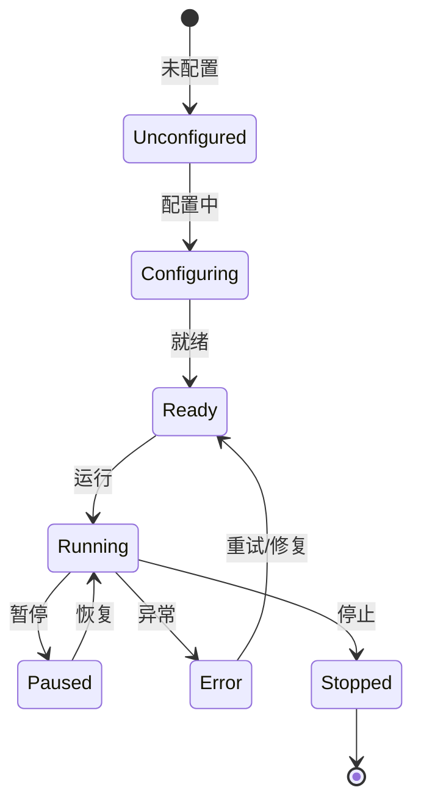

# EdgeStream Processor 模块

## 模块概述

Processor 是 EdgeStream 数据处理的"功能单元"，负责对 FlowFile 进行转换、路由、聚合等操作的核心组件。它是数据流处理系统中最灵活和强大的模块，提供了丰富的数据处理能力和高度可扩展的架构。

## 核心功能

### 1. 数据转换
- **格式转换**: 支持 JSON、XML、CSV 等多种格式之间的转换
- **内容修改**: 提供替换、追加、前置、正则替换等多种内容修改策略
- **记录转换**: 支持字段映射、类型转换等记录级转换操作

### 2. 路由决策
- **属性路由**: 基于 FlowFile 属性进行路由决策
- **内容路由**: 基于数据内容进行智能路由
- **多维度路由**: 支持高价值、紧急程度等多维度路由策略
- **优先级队列**: 提供高、中、低优先级队列管理

### 3. 语义提取
- **文本语义提取**: 支持身份证号、手机号、邮箱、银行卡号等信息的自动提取
- **结构化数据语义**: 支持 JSON、XML 等结构化数据的语义提取
- **自定义模式**: 支持用户自定义正则表达式模式

### 4. 错误处理
- **错误分类**: 自动识别网络、数据库、权限、格式等不同类型的错误
- **重试机制**: 提供指数退避的重试策略
- **错误路由**: 支持将错误路由到不同的处理队列
- **错误规则**: 支持用户自定义错误处理规则

### 5. 脚本处理
- **多语言支持**: 支持 JavaScript、Python、Lua、Groovy 等多种脚本语言
- **动态脚本**: 支持运行时动态执行脚本
- **脚本缓存**: 提供脚本编译缓存机制
- **超时控制**: 支持脚本执行超时控制

## 架构设计

### 核心接口

```go
// Processor 处理器接口
type Processor interface {
    Initialize(ctx context.Context) error
    Process(ctx processor.ProcessContext, flowFile *FlowFile) (*FlowFile, error)
    GetRelationships() []Relationship
    GetPropertyDescriptors() []PropertyDescriptor
    GetState() ProcessorState
}
```

### 状态机



## 快速开始

### 1. 创建处理器管理器

```go
import "github.com/edge-stream/internal/processor"

// 创建处理器管理器
manager := processor.NewProcessorManager()
```

### 2. 注册处理器

```go
import (
    "github.com/edge-stream/internal/processor/DataTransformer"
    "github.com/edge-stream/internal/processor/RouteProcessor"
)

// 注册数据转换处理器
manager.RegisterProcessor("record_transformer", DataTransformer.NewRecordTransformer())

// 注册路由处理器
manager.RegisterProcessor("route_processor", RouteProcessor.NewRouteProcessor())
```

### 3. 使用处理器

```go
// 获取处理器
processor, exists := manager.GetProcessor("record_transformer")
if !exists {
    log.Fatal("处理器不存在")
}

// 创建处理上下文
ctx := processor.ProcessContext{
    Properties: map[string]string{
        "source.format": "json",
        "target.format": "xml",
    },
    Session: &processor.ProcessSession{},
    State:   make(map[string]interface{}),
}

// 创建 FlowFile
flowFile := &processor.FlowFile{
    ID:         "test_001",
    Content:    []byte(`{"name": "test"}`),
    Attributes: make(map[string]string),
    Size:       15,
    Timestamp:  time.Now(),
    LineageID:  "lineage_001",
}

// 处理数据
result, err := processor.Process(ctx, flowFile)
if err != nil {
    log.Printf("处理失败: %v", err)
} else {
    log.Printf("处理成功，输出大小: %d", result.Size)
}
```

## 处理器类型

### 1. 数据转换处理器

#### RecordTransformer
用于记录级数据转换，支持字段映射和类型转换。

```go
transformer := DataTransformer.NewRecordTransformer()
ctx := processor.ProcessContext{
    Properties: map[string]string{
        "source.format":         "json",
        "target.format":         "json",
        "transformation.rules":  "field_mapping",
    },
}
```

#### ContentModifier
用于内容修改，支持多种修改策略。

```go
modifier := DataTransformer.NewContentModifier()
ctx := processor.ProcessContext{
    Properties: map[string]string{
        "modification.strategy": "replace",
        "modification.content":  "new content",
    },
}
```

#### FormatConverter
用于格式转换，支持 JSON、XML、CSV 等格式转换。

```go
converter := DataTransformer.NewFormatConverter()
ctx := processor.ProcessContext{
    Properties: map[string]string{
        "source.format": "json",
        "target.format": "xml",
    },
}
```

### 2. 路由处理器

#### RouteProcessor
基础路由处理器，支持基于属性和内容的路由。

```go
router := RouteProcessor.NewRouteProcessor()
ctx := processor.ProcessContext{
    Properties: map[string]string{
        "routing.rules": `[
            {
                "attribute_name": "priority",
                "condition": "high",
                "target_relationship": "high_priority"
            }
        ]`,
    },
}
```

#### AdvancedRouteProcessor
高级路由处理器，支持多维度路由和优先级队列。

```go
advancedRouter := RouteProcessor.NewAdvancedRouteProcessor()
ctx := processor.ProcessContext{
    Properties: map[string]string{
        "high_value.attribute":      "priority",
        "high_value.attribute_value": "high",
    },
}
```

### 3. 语义提取处理器

#### TextSemanticExtractor
文本语义提取器，支持多种信息的自动提取。

```go
extractor := SemanticExtractor.NewTextSemanticExtractor()
ctx := processor.ProcessContext{
    Properties: map[string]string{
        "extraction.patterns": "custom_patterns",
    },
}
```

#### StructuredDataSemanticExtractor
结构化数据语义提取器，支持 JSON、XML 等格式。

```go
structuredExtractor := SemanticExtractor.NewStructuredDataSemanticExtractor()
ctx := processor.ProcessContext{
    Properties: map[string]string{
        "data.format": "json",
    },
}
```

### 4. 错误处理处理器

#### ErrorHandler
错误处理器，支持错误分类和重试机制。

```go
errorHandler := ErrorHandler.NewErrorHandler()
ctx := processor.ProcessContext{
    Properties: map[string]string{
        "error.strategy": "retry",
        "retry.max_attempts": "3",
    },
}
```

#### ErrorHandlingProcessor
错误处理处理器，支持临时和永久错误的区分处理。

```go
errorProcessor := ErrorHandler.NewErrorHandlingProcessor()
ctx := processor.ProcessContext{
    Properties: map[string]string{
        "error.strategy": "fail_fast",
    },
}
```

### 5. 脚本处理器

#### ScriptProcessor
脚本处理器，支持多种脚本语言的动态执行。

```go
scriptProcessor := ScriptProcessor.NewScriptProcessor()
ctx := processor.ProcessContext{
    Properties: map[string]string{
        "script.language": "javascript",
        "script.content": `
            flowFile.attributes["processed"] = "true";
            flowFile.attributes["timestamp"] = new Date().toISOString();
        `,
        "script.cache.enabled": "true",
        "script.timeout": "30s",
    },
}
```

#### CustomProcessor
自定义处理器，支持用户自定义处理逻辑。

```go
customProcessor := ScriptProcessor.NewCustomProcessor()
ctx := processor.ProcessContext{
    Properties: map[string]string{
        "custom.script": "custom processing logic",
        "custom.language": "javascript",
    },
}
```

## 性能指标

| 指标           | 目标值        | 说明                   |
|---------------|---------------|------------------------|
| 数据转换延迟    | <50ms         | 数据处理耗时           |
| 路由决策性能    | <10ms         | 路由规则匹配耗时       |
| 错误处理开销    | <20ms         | 错误捕获和路由耗时     |
| 脚本执行性能    | <100ms        | 动态脚本执行耗时       |

## 扩展开发

### 自定义处理器开发

1. 继承 AbstractProcessor
2. 实现 Processor 接口
3. 定义属性和关系
4. 实现处理逻辑

```go
type CustomProcessor struct {
    *processor.AbstractProcessor
}

func NewCustomProcessor() *CustomProcessor {
    cp := &CustomProcessor{
        AbstractProcessor: &processor.AbstractProcessor{},
    }
    
    // 添加关系
    cp.AddRelationship("success", "处理成功")
    cp.AddRelationship("error", "处理失败")
    
    // 添加属性描述符
    cp.AddPropertyDescriptor("custom.property", "自定义属性", true)
    
    return cp
}

func (cp *CustomProcessor) Process(ctx processor.ProcessContext, flowFile *processor.FlowFile) (*processor.FlowFile, error) {
    // 实现自定义处理逻辑
    return flowFile, nil
}
```

### 脚本扩展

支持通过脚本实现自定义处理逻辑：

```javascript
// JavaScript 脚本示例
flowFile.attributes["processed"] = "true";
flowFile.attributes["timestamp"] = new Date().toISOString();

// 修改内容
var content = flowFile.content;
var newContent = content.replace(/old/g, "new");
flowFile.content = newContent;
```

```python
# Python 脚本示例
import json

data = json.loads(flow_file.content)
data["processed"] = True
data["timestamp"] = "2024-01-15T10:30:00Z"

flow_file.content = json.dumps(data)
```

## 配置说明

### 处理器配置

处理器支持通过属性进行配置：

```json
{
    "processor.name": "my_processor",
    "processor.type": "custom",
    "processor.properties": {
        "custom.property": "value",
        "timeout": "30s",
        "retry.count": "3"
    }
}
```

### 路由规则配置

```json
{
    "routing.rules": [
        {
            "name": "high_priority",
            "attribute_name": "priority",
            "operator": "equals",
            "value": "high",
            "target_relationship": "high_priority"
        },
        {
            "name": "urgent_content",
            "content.pattern": "urgent|critical|emergency",
            "target_relationship": "urgent_processing"
        }
    ]
}
```

### 错误规则配置

```json
{
    "error.rules": [
        {
            "name": "network_retry",
            "error_type": "network",
            "pattern": "connection.*timeout",
            "action": "retry",
            "max_retries": 3
        },
        {
            "name": "permission_fail",
            "error_type": "permission",
            "pattern": "permission.*denied",
            "action": "route_to_failure",
            "max_retries": 0
        }
    ]
}
```

## 最佳实践

### 1. 处理器设计原则

- **单一职责**: 每个处理器只负责一个特定的功能
- **可配置性**: 通过属性支持灵活配置
- **错误处理**: 提供完善的错误处理和重试机制
- **性能优化**: 合理使用缓存和并发处理

### 2. 路由设计

- **分层路由**: 先进行粗粒度路由，再进行细粒度路由
- **优先级管理**: 合理设置路由优先级
- **降级策略**: 提供路由降级机制

### 3. 错误处理

- **错误分类**: 正确识别和分类错误类型
- **重试策略**: 根据错误类型选择合适的重试策略
- **监控告警**: 对关键错误进行监控和告警

### 4. 脚本使用

- **安全性**: 限制脚本执行权限和资源使用
- **性能**: 避免在脚本中执行耗时操作
- **可维护性**: 保持脚本的简洁和可读性

## 故障排除

### 常见问题

1. **处理器初始化失败**
   - 检查配置参数是否正确
   - 确认依赖组件是否可用

2. **处理性能问题**
   - 检查数据量是否过大
   - 优化处理逻辑和算法
   - 考虑使用缓存机制

3. **脚本执行错误**
   - 检查脚本语法是否正确
   - 确认脚本语言是否支持
   - 检查脚本执行超时设置

4. **路由规则不生效**
   - 检查规则配置是否正确
   - 确认属性名称和值是否匹配
   - 验证目标关系是否存在

### 调试方法

1. **日志分析**: 查看处理器执行日志
2. **状态检查**: 检查处理器状态和属性
3. **性能监控**: 使用性能指标进行监控
4. **单元测试**: 编写单元测试验证功能

## 版本历史

- **v1.0.0**: 初始版本，支持基础数据处理功能
- **v1.1.0**: 增加脚本处理和错误处理功能
- **v1.2.0**: 优化性能和增加更多处理器类型
- **v1.3.0**: 增加语义提取和高级路由功能

## 贡献指南

欢迎贡献代码和提出建议！

1. Fork 项目
2. 创建功能分支
3. 提交更改
4. 推送到分支
5. 创建 Pull Request

## 许可证

本项目采用 MIT 许可证，详见 LICENSE 文件。 