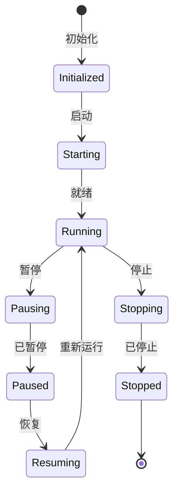

# StreamEngine 流引擎模块

## 概述

StreamEngine 是 EdgeStreamPro 数据流转的"动力核心"，驱动数据在 Pipeline 中高效传输、处理与调度的底层引擎。它负责协调和执行整个数据处理流程，确保数据能够按照预定的路径和策略进行传输和转换。

## 核心特性

### 1. 高性能处理引擎
- **动态线程池管理**：基于 CPU 核心数自动调整线程数量
- **自适应资源分配**：根据负载动态调整处理器线程分配
- **零拷贝技术**：优化数据传输效率
- **批量处理**：支持批量数据处理以提高吞吐量

### 2. 灵活的调度机制
- **事件驱动调度**：数据到达立即触发处理器
- **定时调度**：按固定时间间隔触发处理器
- **CRON 调度**：使用 CRON 表达式精确控制触发时间
- **自定义调度策略**：支持基于数据大小、队列大小等条件的调度

### 3. 集群协调能力
- **分布式状态同步**：通过 ZooKeeper 实现集群状态同步
- **主从选举**：自动选举集群领导者
- **故障恢复**：节点故障时自动恢复
- **分布式锁**：支持分布式锁机制

### 4. 精确的背压控制
- **多维度背压策略**：暂停、减速、丢弃、重定向
- **动态阈值调整**：根据系统负载动态调整背压阈值
- **实时监控**：实时监控队列状态和背压情况

### 5. 优先级队列管理
- **多级优先级**：支持复杂的优先级策略
- **动态优先级调整**：根据业务需求动态调整优先级
- **队列统计**：提供详细的队列统计信息

## 架构设计

### 核心组件

```mermaid
graph TD
    A[StreamEngine] --> B[Scheduler]
    A --> C[ThreadPoolManager]
    A --> D[BackpressureManager]
    A --> E[ClusterCoordinator]
    A --> F[FlowController]
    A --> G[QueueManager]
    
    B --> H[EventDrivenScheduler]
    B --> I[TimerScheduler]
    B --> J[CronScheduler]
    
    C --> K[AdaptiveThreadPoolManager]
    C --> L[ProcessorExecutor]
    C --> M[GlobalExecutor]
    
    D --> N[PauseStrategy]
    D --> O[SlowDownStrategy]
    D --> P[DropStrategy]
    D --> Q[RedirectStrategy]
    
    E --> R[ZooKeeperClusterCoordinator]
    E --> S[LocalClusterCoordinator]
    
    F --> T[StandardFlowController]
    
    G --> U[StandardQueueManager]
    G --> V[BoundedQueue]
    G --> W[PrioritizedQueue]
```



### 状态机设计



## 快速开始

### 1. 基础使用

```go
package main

import (
    "context"
    "log"
    "time"
    
    "github.com/edge-stream/internal/stream-engine"
)

func main() {
    // 创建引擎配置
    config := &stream_engine.EngineConfig{
        MaxThreads:           8,
        CoreThreads:          4,
        QueueCapacity:        1000,
        BackpressureThreshold: 0.8,
        ClusterEnabled:       false,
        SyncInterval:         time.Second * 5,
    }
    
    // 创建流引擎
    engine := stream_engine.NewStandardStreamEngine(config)
    
    // 创建上下文
    ctx, cancel := context.WithCancel(context.Background())
    defer cancel()
    
    // 启动引擎
    if err := engine.Start(ctx); err != nil {
        log.Fatalf("Failed to start engine: %v", err)
    }
    
    // 创建处理器
    processor := NewMyProcessor("my-proc", "我的处理器")
    
    // 创建调度策略
    strategy := NewMyStrategy(2, time.Second*5)
    
    // 调度处理器
    if err := engine.Schedule(processor, strategy); err != nil {
        log.Fatalf("Failed to schedule processor: %v", err)
    }
    
    // 运行一段时间
    time.Sleep(time.Second * 30)
    
    // 停止引擎
    if err := engine.Stop(ctx); err != nil {
        log.Fatalf("Failed to stop engine: %v", err)
    }
}
```

### 2. 自定义处理器

```go
type MyProcessor struct {
    *stream_engine.BaseProcessorNode
    counter int
}

func NewMyProcessor(id, name string) *MyProcessor {
    return &MyProcessor{
        BaseProcessorNode: stream_engine.NewBaseProcessorNode(id, name, "MyProcessor"),
        counter:           0,
    }
}

func (p *MyProcessor) OnTrigger(context stream_engine.ProcessContext) error {
    p.counter++
    log.Printf("Processor %s triggered, counter: %d", p.GetID(), p.counter)
    
    // 实现具体的处理逻辑
    // ...
    
    return nil
}
```

### 3. 自定义调度策略

```go
type MyStrategy struct {
    maxThreads int
    interval   time.Duration
}

func NewMyStrategy(maxThreads int, interval time.Duration) *MyStrategy {
    return &MyStrategy{
        maxThreads: maxThreads,
        interval:   interval,
    }
}

func (s *MyStrategy) GetType() stream_engine.SchedulingType {
    return stream_engine.SchedulingTypeTimerDriven
}

func (s *MyStrategy) GetMaxThreads() int {
    return s.maxThreads
}

func (s *MyStrategy) ShouldTrigger(context stream_engine.ProcessContext) bool {
    // 实现自定义触发条件
    return false
}

func (s *MyStrategy) GetNextTriggerTime() time.Time {
    return time.Now().Add(s.interval)
}
```

## 配置说明

### EngineConfig 配置项

| 配置项 | 类型 | 默认值 | 说明 |
|--------|------|--------|------|
| MaxThreads | int | CPU核心数×4 | 最大线程数 |
| CoreThreads | int | CPU核心数×2 | 核心线程数 |
| QueueCapacity | int | 10000 | 队列容量 |
| BackpressureThreshold | float64 | 0.8 | 背压阈值 |
| ClusterEnabled | bool | false | 是否启用集群 |
| ZooKeeperConnect | string | "" | ZooKeeper连接地址 |
| SyncInterval | time.Duration | 5s | 同步间隔 |

### 调度策略类型

1. **事件驱动调度（Event-Driven）**
   - 特点：数据到达立即触发处理器
   - 适用场景：实时数据处理、消息队列消费

2. **定时调度（Timer-Driven）**
   - 特点：按固定时间间隔触发处理器
   - 适用场景：周期性数据同步、定时报告生成

3. **CRON 调度（CRON-Driven）**
   - 特点：使用 CRON 表达式精确控制触发时间
   - 适用场景：复杂的定时任务

### 背压策略类型

1. **暂停策略（Pause）**
   - 适用场景：严重过载时
   - 阈值：队列利用率 ≥ 95%

2. **减速策略（Slow Down）**
   - 适用场景：过载时
   - 阈值：队列利用率 ≥ 80%

3. **丢弃策略（Drop）**
   - 适用场景：轻微过载时
   - 阈值：队列利用率 ≥ 70%

4. **重定向策略（Redirect）**
   - 适用场景：接近过载时
   - 阈值：队列利用率 ≥ 70%

## 性能指标

| 指标 | 目标值 | 说明 |
|------|--------|------|
| 调度延迟 | <10ms | 处理器调度响应时间 |
| 线程切换开销 | <1ms | 线程池管理性能 |
| 背压响应时间 | <50ms | 流控机制反应速度 |
| 集群同步延迟 | <100ms | 状态同步性能 |

## 监控和调试

### 获取引擎状态

```go
status := engine.GetStatus()
fmt.Printf("引擎状态: %s\n", status)
```

### 获取线程池统计

```go
stats := engine.GetThreadPoolManager().GetThreadPoolStats()
fmt.Printf("线程池利用率: %.2f%%\n", stats.UtilizationRate*100)
```

### 获取集群状态

```go
clusterState := engine.(*StandardStreamEngine).clusterCoordinator.GetClusterState()
fmt.Printf("集群节点数: %d\n", clusterState.TotalNodes)
```

### 获取队列统计

```go
queueStats := engine.(*StandardStreamEngine).queueManager.GetQueueStats()
for name, stats := range queueStats {
    fmt.Printf("队列 %s: 大小=%d, 利用率=%.2f%%\n", 
        name, stats.Size, stats.UtilizationRate*100)
}
```

## 最佳实践

### 1. 线程池配置

```go
// 根据 CPU 核心数配置线程池
cpuCount := runtime.NumCPU()
config := &EngineConfig{
    MaxThreads:   cpuCount * 4,
    CoreThreads:  cpuCount * 2,
    // ...
}
```

### 2. 背压阈值设置

```go
// 根据业务需求设置背压阈值
config := &EngineConfig{
    BackpressureThreshold: 0.7, // 70% 时开始背压
    // ...
}
```

### 3. 集群配置

```go
// 生产环境启用集群
config := &EngineConfig{
    ClusterEnabled:   true,
    ZooKeeperConnect: "zk1:2181,zk2:2181,zk3:2181",
    // ...
}
```

### 4. 错误处理

```go
// 实现错误处理和重试机制
func (p *MyProcessor) OnTrigger(context ProcessContext) error {
    defer func() {
        if r := recover(); r != nil {
            log.Printf("Processor panic: %v", r)
        }
    }()
    
    // 实现处理逻辑
    return nil
}
```

## 扩展开发

### 1. 自定义触发器

```go
type CustomTrigger struct {
    stream_engine.EventDrivenTrigger
    customCondition func() bool
}

func (t *CustomTrigger) ShouldFire(context ProcessContext) bool {
    return t.customCondition() && t.EventDrivenTrigger.ShouldFire(context)
}
```

### 2. 自定义背压策略

```go
type CustomBackpressureStrategy struct{}

func (s *CustomBackpressureStrategy) ShouldApply(queue Queue) bool {
    // 实现自定义背压条件
    return queue.UtilizationRate() >= 0.6
}

func (s *CustomBackpressureStrategy) Apply(connection Connection) error {
    // 实现自定义背压处理
    return connection.SetRateLimit(500)
}

func (s *CustomBackpressureStrategy) Release(connection Connection) error {
    // 实现自定义背压释放
    return connection.SetRateLimit(1000)
}

func (s *CustomBackpressureStrategy) GetType() BackpressureType {
    return BackpressureTypeSlowDown
}
```

## 故障排除

### 常见问题

1. **引擎启动失败**
   - 检查配置参数是否正确
   - 确认依赖服务（如 ZooKeeper）是否可用

2. **处理器调度失败**
   - 检查处理器状态是否为 RUNNING
   - 确认调度策略配置是否正确

3. **背压频繁触发**
   - 调整背压阈值
   - 检查下游处理能力
   - 优化处理器性能

4. **集群同步问题**
   - 检查 ZooKeeper 连接
   - 确认网络连通性
   - 查看集群日志

### 日志级别

```go
// 设置日志级别
log.SetLevel(log.DebugLevel)
```

## 版本历史

- **v1.0.0** - 初始版本，支持基础流引擎功能
- **v1.1.0** - 添加集群支持和背压控制
- **v1.2.0** - 优化性能，添加监控功能

## 贡献指南

欢迎提交 Issue 和 Pull Request 来改进 StreamEngine 模块。

## 许可证

本项目采用 MIT 许可证。 